import Mermaid from '@theme/Mermaid';

You just built an amazing AI agent. It works perfectly locally. You've tested it with your team. Now comes the question that keeps you up at night:

**"How do I actually deploy this thing to production?"**

You Google it. You find 47 different opinions. Some say "use Kubernetes." Others say "just use serverless." One person mentions "you definitely need a custom FastAPI server." Another says you absolutely don't.

What you need is clarity. Not complexity. That's what this guide gives you.

<!-- truncate -->

---

## Why Deployment Matters (And Why You're Overthinking It)

Here's the thing about AI agent deployment: **It's not as complicated as the internet makes it seem.**

The reason? **Platforms have gotten really good at security.**

### The Old Way (Still Happening)

You had to worry about:
- ❌ Managing certificates (HTTPS/TLS)
- ❌ DDoS protection
- ❌ Server hardening
- ❌ Load balancing
- ❌ Auto-scaling infrastructure
- ❌ Encryption keys
- ❌ Compliance certifications

It was exhausting. You needed a DevOps engineer just to stay alive.

### The New Way (Where We Are Now)

Pick a platform. Deploy. Done.

- ✅ Certificates? Automatic.
- ✅ DDoS protection? Included.
- ✅ Auto-scaling? Built-in.
- ✅ Compliance? Available.
- ✅ DevOps? Managed by Google.

**The insight**: Google Cloud's platforms provide **platform-first security**. That means security is the foundation, not something you add on top. Your job is just to deploy your agent code. Everything else is handled.

So if you're feeling overwhelmed by deployment, take a breath. You're probably way more prepared than you think.

---

## The Simple Truth About Agent Deployment

Before we dive into platforms, you need to know one thing:

**You probably don't need a custom server.**

Seriously. About 80% of teams don't. Here's why:

### ADK's Built-In Server is Intentionally Minimal

When you deploy an agent with ADK, you get:
- ✅ Basic `/health` endpoint
- ✅ `/invoke` endpoint for queries
- ✅ Session management
- ✅ Error handling
- ✅ That's it.

**Why so minimal?** Because platforms are handling everything else. HTTPS, authentication, DDoS, encryption—it's all platform-provided. Your code doesn't need to worry about it.

### When You DO Need a Custom Server

If you fall into one of these categories:
- You need custom authentication (LDAP, Kerberos, custom OAuth)
- You have additional business logic endpoints
- You're not using Google Cloud infrastructure
- You need advanced observability beyond platform defaults

Then yes, build a custom FastAPI server. But only then.

**How many people actually need this?** About 20%. If you're reading this thinking "that might be me," it's probably not.

---

## The Decision Framework: Which Platform for You?

Here's a flowchart that will answer your question in 60 seconds:

```mermaid
flowchart TD
    A[Need to Deploy an Agent?] --> B{What's your situation?}
    B -->|Moving fast, limited budget| C["✅ Cloud Run<br/>5 min setup<br/>~$40/mo"]
    B -->|Enterprise, need compliance| D["✅✅ Agent Engine<br/>10 min setup<br/>~$50/mo<br/>FedRAMP ready"]
    B -->|Already use Kubernetes| E["✅ GKE<br/>20 min setup<br/>$200-500/mo"]
    B -->|Need custom authentication| F["⚙️ Custom + Cloud Run<br/>2 hour setup<br/>~$60/mo"]
    B -->|Just developing locally| G["⚡ Local Dev<br/>1 min setup<br/>Free"]
    
    C --> C1["Cloud Run is best for:<br/>Startups, MVPs<br/>Most production apps<br/>Best ROI"]
    D --> D1["Agent Engine is best for:<br/>Government projects<br/>Regulated industries<br/>Enterprise needs"]
    E --> E1["GKE is best for:<br/>Complex deployments<br/>Existing K8s shops<br/>Advanced networking"]
    F --> F1["Custom + Cloud Run for:<br/>Special auth needs<br/>Non-Google infrastructure<br/>Niche requirements"]
    G --> G1["Local Dev for:<br/>Development only<br/>Before production<br/>Testing patterns"]
    
    style C fill:#90EE90
    style D fill:#87CEEB
    style E fill:#FFB6C1
    style F fill:#FFE4B5
    style G fill:#D3D3D3
```



**Read the flowchart**:
1. Find your situation
2. That box is your answer
3. Done.

---

## Real-World Scenarios: What Actually Happens

Let's make this concrete. Here are 5 real teams deploying agents:

### Scenario 1: The Startup (Moving Fast)

**Your situation**: 
- Small founding team
- Want to launch this week
- Budget is tight
- Need to iterate quickly

**Your platform**: ✅ **Cloud Run**

**Why**:
- Deploy in 5 minutes
- Costs ~$40/month (pay per request)
- Built-in security (don't need to think about it)
- Auto-scales from 0 to 1000 requests
- Can iterate without ops overhead

**The command**:
```bash
adk deploy cloud_run \
  --project your-project-id \
  --region us-central1
```

**Real cost after 1 year**: ~$500-600 including data storage. Affordable for a startup.

---

### Scenario 2: The Enterprise (Need Compliance)

**Your situation**:
- Building for regulated industry
- Customers ask about compliance
- Need FedRAMP or HIPAA certifications
- Can't compromise on security

**Your platform**: ✅✅ **Agent Engine (Only Platform with FedRAMP)**

**Why**:
- Only Google Cloud platform with FedRAMP compliance built-in
- Compliance already done (seriously, no forms to fill out)
- SOC 2 Type II certified
- Immutable audit logs
- Sandboxed execution

**The command**:
```bash
adk deploy agent_engine \
  --project your-project-id \
  --region us-central1 \
  --agent-name my-agent
```

**Real value**: Peace of mind. Your customers' security teams will stop asking questions.

---

### Scenario 3: The Kubernetes Shop

**Your situation**:
- Company already runs Kubernetes
- Want to deploy agents in same infrastructure
- DevOps team knows K8s well
- Need advanced networking

**Your platform**: ✅ **GKE (Google Kubernetes Engine)**

**Why**:
- Leverage existing infrastructure
- Full control over networking
- Can use advanced features (NetworkPolicy, RBAC, etc.)
- Ops team already knows this

**The command**:
```bash
kubectl apply -f deployment.yaml
```

**Real cost**: $200-500+/month. Expensive, but you're paying for control and consolidation.

---

### Scenario 4: The Special Case (Custom Authentication)

**Your situation**:
- Company uses internal Kerberos authentication
- Can't use standard OAuth
- Need special business logic endpoints
- Customers need API keys, not IAM

**Your platform**: ⚙️ **Custom FastAPI + Cloud Run**

**Why**:
- Cloud Run provides platform security
- Your custom server adds authentication logic
- Best of both worlds
- But... definitely overkill if you don't actually need it

**The effort**: 2+ hours to build a production server

**The question before you start**: "Are we SURE our customers can't use Cloud Run IAM?" Usually the answer is "we didn't try."

---

### Scenario 5: The Developer (Local Testing)

**Your situation**:
- Building locally
- Want to test the agent before production
- No infrastructure yet
- Learning how agents work

**Your platform**: ⚡ **Local Dev**

**Why**:
- Zero setup
- Instant feedback
- Free
- Perfect for iteration

**The command**:
```bash
adk api_server --port 8000
```

**Next step**: Once you like it, move to Cloud Run (same code, just deployed).

---

## The Cost Reality Check

Let's talk money. Here's what it actually costs:


**Important notes**:
- Based on 1M requests/month (typical startup volume)
- Includes compute + storage
- Doesn't include model API costs (those are separate, ~$0.30-2.00 per request depending on model)
- Actual costs vary by region (prices shown are US)

**What about model costs?**
That's separate from deployment. Whether you use Cloud Run or GKE, using `gemini-2.0-flash` costs the same. Deployment platform doesn't affect model pricing.

**ROI Analysis**:
- **Cloud Run**: Start here. $40/mo. If you succeed, upgrade to Agent Engine later.
- **Agent Engine**: Only if compliance is mandatory. Extra $10/mo for peace of mind.
- **GKE**: Only if you already have K8s. Consolidation savings justify cost.
- **Custom Server**: Only if you've tried standard auth and failed.

---

## Security: The Part That Used to Be Hard

Here's what's beautiful about modern platforms:

### What Cloud Run Handles (Automatically)

- ✅ HTTPS/TLS certificates (managed by Google)
- ✅ DDoS protection (always on)
- ✅ Encryption in transit
- ✅ Encryption at rest
- ✅ Non-root container execution (forced)
- ✅ Binary vulnerability scanning
- ✅ Network isolation

**What you don't do**: Nothing. It's automatic.

### What You Must Do

```
Agent Code
├── ✅ Validate inputs (don't trust user data)
├── ✅ Use Secret Manager for API keys
├── ✅ Set resource limits (memory, CPU)
├── ✅ Log important events
└── ✅ Monitor error rates
```

That's it. Five things. If you do these five things, you're secure.

### Secret Management (The One Thing People Get Wrong)

**❌ Don't do this:**
```python
API_KEY = "sk-12345"  # Hardcoded, bad!
```

**✅ Do this instead:**
```python
from google.cloud import secretmanager

secret = secretmanager.SecretManagerServiceClient()
project = os.environ['GOOGLE_CLOUD_PROJECT']
name = f"projects/{project}/secrets/api-key/versions/latest"
response = secret.access_secret_version(request={"name": name})
API_KEY = response.payload.data.decode('UTF-8')
```

Google Cloud's Secret Manager is free for your first 6 secrets. Use it.

---

## Getting Started: The Fast Path

### You want to deploy right now?

```bash
# 1. Have your agent code ready
cd your-agent-directory

# 2. Deploy to Cloud Run (pick one)
adk deploy cloud_run \
  --project your-project-id \
  --region us-central1

# 3. Done! You have a public HTTPS URL
```

**What happens behind the scenes:**
1. ADK builds a Docker container
2. Pushes to Google Container Registry
3. Deploys to Cloud Run
4. Gives you a public URL
5. Sets up auto-scaling

**Total time**: 5 minutes

### Need more details?

**Before deploying**:
- [ ] Set `GOOGLE_CLOUD_PROJECT` environment variable
- [ ] Ensure you have gcloud CLI installed
- [ ] Have your `GOOGLE_API_KEY` ready (in Secret Manager, not hardcoded!)

**After deploying**:
- [ ] Test the `/health` endpoint
- [ ] Test invoking your agent
- [ ] Set up monitoring (Cloud Logging + Cloud Monitoring)
- [ ] Configure authentication if needed

---

## The Decision Tree (If You Still Can't Decide)

```
Do you need compliance (FedRAMP/HIPAA)?
├─ Yes → Agent Engine ✅✅
└─ No → Continue...

Do you already use Kubernetes?
├─ Yes → GKE ✅
└─ No → Continue...

Do you need custom authentication?
├─ Yes → Custom + Cloud Run ⚙️
└─ No → Cloud Run ✅

Cloud Run. You're done. Deploy now.
```

---

## Resources: Everything You Need

### Main Tutorial
- 📖 [**Tutorial 23: Production Deployment Strategies**](https://github.com/raphaelmansuy/adk_training/blob/main/docs/tutorial/23_production_deployment.md)
  - Complete guide with all deployment options
  - Real-world scenarios and examples
  - Best practices and patterns

### Guides & Checklists
- 🔐 [**Security Verification Guide**](https://github.com/raphaelmansuy/adk_training/blob/main/tutorial_implementation/tutorial23/SECURITY_VERIFICATION.md) - Step-by-step for each platform
- 🚀 [**Migration Guide**](https://github.com/raphaelmansuy/adk_training/blob/main/tutorial_implementation/tutorial23/MIGRATION_GUIDE.md) - How to safely move between platforms
- 💰 [**Cost Breakdown Analysis**](https://github.com/raphaelmansuy/adk_training/blob/main/tutorial_implementation/tutorial23/COST_BREAKDOWN.md) - Detailed pricing breakdown
- ✅ [**Deployment Checklist**](https://github.com/raphaelmansuy/adk_training/blob/main/tutorial_implementation/tutorial23/DEPLOYMENT_CHECKLIST.md) - Pre/during/post deployment verification
- 📖 [**FastAPI Best Practices**](https://github.com/raphaelmansuy/adk_training/blob/main/tutorial_implementation/tutorial23/FASTAPI_BEST_PRACTICES.md) - 7 production patterns

### Security Research
- 📋 [**Security Research Summary**](https://github.com/raphaelmansuy/adk_training/blob/main/tutorial_implementation/tutorial23/SECURITY_RESEARCH_SUMMARY.md) - Executive summary (5 min read) - What ADK provides, what platforms provide
- 🔍 [**Detailed Security Analysis**](https://github.com/raphaelmansuy/adk_training/blob/main/tutorial_implementation/tutorial23/SECURITY_ANALYSIS_ALL_DEPLOYMENT_OPTIONS.md) - Per-platform breakdown - Deep dive into each deployment option

### Platform Documentation
- 🌐 [Cloud Run Docs](https://cloud.google.com/run/docs) - Official Google documentation
- 🤖 [Agent Engine Docs](https://cloud.google.com/vertex-ai/docs/agent-engine) - Managed agent infrastructure
- ⚙️ [GKE Docs](https://cloud.google.com/kubernetes-engine/docs) - Kubernetes Engine
- 🔐 [Secret Manager](https://cloud.google.com/secret-manager/docs) - Secure secrets storage

### Code Examples
- 🔧 [**Full Implementation (GitHub)**](https://github.com/raphaelmansuy/adk_training/tree/main/tutorial_implementation/tutorial23)
  - Complete FastAPI server example (488 lines)
  - 40 comprehensive tests (93% coverage)
  - Production patterns and examples

---

## The Bottom Line

**Deploying an AI agent to production is easier than you think.**

Choose your platform:
- **Startup/MVP** → Cloud Run (5 min, ~$40/mo)
- **Enterprise/Compliance** → Agent Engine (10 min, ~$50/mo, FedRAMP)
- **Kubernetes shop** → GKE (20 min, $200-500+/mo)
- **Special needs** → Custom + Cloud Run (2 hrs, ~$60/mo)
- **Just learning** → Local Dev (1 min, free)

Deploy. Monitor. Scale. Done.

You've already built the hard part (the agent itself). The infrastructure is now commoditized. Let platforms handle security, scaling, and compliance. Focus on your agent.

---

## Next Steps

**Ready to deploy?**

1. Read [Tutorial 23: Production Deployment Strategies](https://github.com/raphaelmansuy/adk_training/blob/main/docs/tutorial/23_production_deployment.md)
2. Check [Deployment Checklist](https://github.com/raphaelmansuy/adk_training/blob/main/tutorial_implementation/tutorial23/DEPLOYMENT_CHECKLIST.md)
3. Pick your platform from the decision framework
4. Deploy with `adk deploy <platform>`
5. Monitor with Cloud Logging

**Questions?** Check the [FAQ in the implementation guide](https://github.com/raphaelmansuy/adk_training/tree/main/tutorial_implementation/tutorial23).

---

## You've Got This 🚀

Agent deployment isn't magic. It's just:
1. Write code ✅ (you did this)
2. Pick a platform ✅ (this guide helped)
3. Deploy ✅ (one command)
4. Monitor ✅ (platforms make this easy)

That's it. Your agent is about to serve real users. Congratulations.

Now go deploy that agent. The world is waiting.

---

## See Also

### Quick Reference

**Optimize Your Deployment with TILs:**

- **[TIL: Pause & Resume Invocations](/blog/til-pause-resume)** -
  Build resilient, fault-tolerant workflows
- **[TIL: Context Compaction](/blog/til-context-compaction)** -
  Reduce costs in long-running production agents

**Related Tutorials:**

- [Tutorial 23: Production Deployment Strategies](/docs/production_deployment)
- [Tutorial 22: Advanced Observability](/docs/advanced_observability)

---

**Psst**: Stuck between Cloud Run and Agent Engine? Start with Cloud Run. It's
faster to deploy and cheaper. You can always migrate to Agent Engine later if
you need compliance. The upgrade path is smooth.
