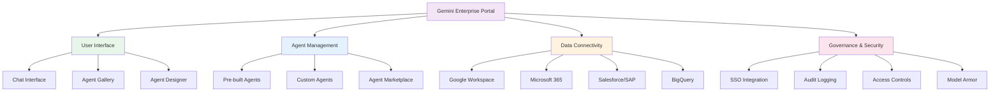
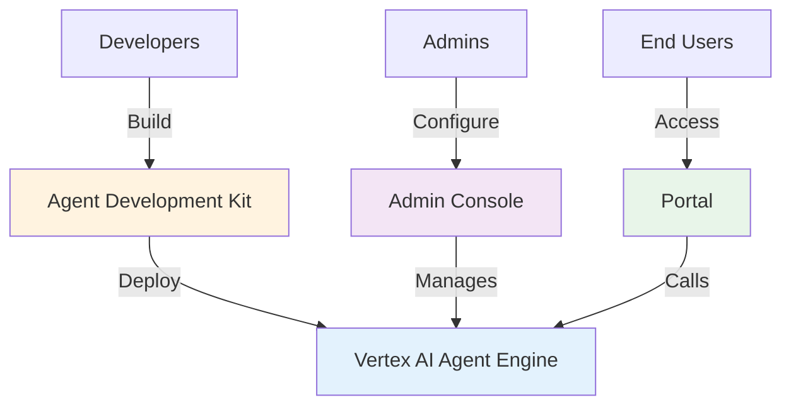
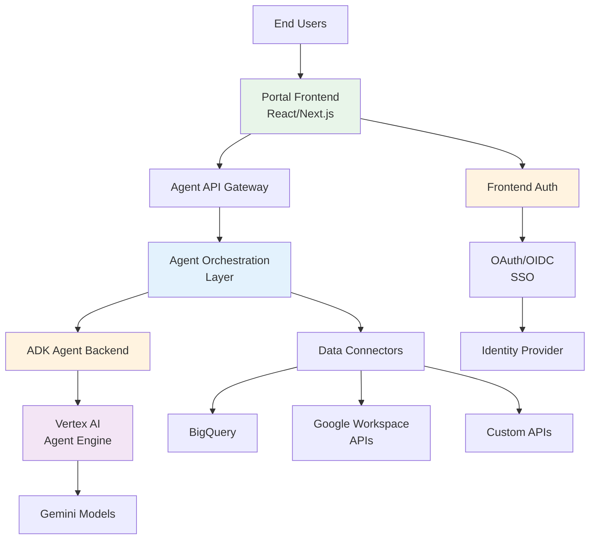

## The BIG Question: Why Should You Care?

Your AI agents work great in development. They handle complex workflows, reason through
problems, and integrate with your tools. In production, you face scale, security,
compliance, and reliability demands that standard setups cannot guarantee.

**Gemini Enterprise changes this.**

When building AI agents for enterprises with data privacy concerns or for regulated
industries, you need to understand the gap between standard AI models and enterprise-grade
solutions.

## Why Gemini Enterprise Matters: Starting with WHY

### The Core Problem

Most teams building AI agents face this progression:

1. **Development Phase**: Everything works great with standard APIs
2. **Pilot Phase**: A customer asks "Where is my data stored?"
3. **Production Phase**: Compliance requirements emerge you didn't anticipate
4. **Crisis Phase**: You're scrambling to meet SOC 2, HIPAA, or GDPR requirements

Gemini Enterprise exists to eliminate this crisis.

### The Enterprise Reality Check

When you deploy AI agents in an enterprise context, you're no longer just delivering
functionality. You're responsible for:

- **Data sovereignty**: Where data physically resides and who accesses it
- **Compliance**: Meeting industry-specific regulations (HIPAA, FINRA, SOC 2, GDPR)
- **Security**: Advanced threat protection, data encryption, audit trails
- **Performance**: Predictable latency, guaranteed availability, SLA commitments
- **Control**: Fine-grained access management, data retention policies

Standard APIs weren't designed with these constraints in mind.


## Quick Clarification: Agentspace → Gemini Enterprise

**Note for those familiar with Google's agent platform**: Google Agentspace has been
superseded by **Gemini Enterprise**. If you were evaluating Agentspace, Gemini
Enterprise is the modern, production-ready evolution with enhanced compliance,
security, and governance capabilities [²].

## Understanding Google's AI Agent Ecosystem

If you've explored Google's agent offerings, you've probably encountered these terms:
Vertex AI Agent Builder, Vertex AI Agent Engine, Agent Development Kit (ADK),
Agent Garden, Gemini Enterprise, and Agent2Agent Protocol. Let's clarify
how they fit together [⁶].

### The Product Landscape

Google's AI agent ecosystem consists of complementary products that work together:

**1. Vertex AI Agent Builder** [⁶]

The umbrella platform for discovering, building, and deploying AI agents at
enterprise scale. It's the end-to-end solution for agent development.

**2. Vertex AI Agent Engine** [⁶]

The **managed runtime** within Agent Builder that handles deployment, scaling, and
infrastructure management. This is where you deploy agents to production. Agent
Engine features:

- Automatic scaling and infrastructure management
- Support for multiple frameworks (ADK, LangChain, LangGraph, Crew.ai)
- Memory and context management for stateful conversations
- VPC-SC and CMEK support for enterprise security

**3. Agent Development Kit (ADK)** [⁶]

An **open-source Python framework** for building agents with code-first development.
ADK emphasizes:

- Precise control over agent reasoning and behavior
- Support for bidirectional audio and video streaming
- Integration with Model Context Protocol (MCP) for diverse data sources
- Full compatibility with frameworks like LangChain and LangGraph
- Deployment to Vertex AI Agent Engine or on-premises infrastructure

**4. Agent Garden** [⁶]

A collection of ready-to-use samples, templates, and patterns accessible within
Vertex AI Agent Builder. Use these to jumpstart your agent development.

**5. Agent2Agent (A2A) Protocol** [⁶]

An open protocol (co-founded by Google but community-managed) that enables
agents built with different frameworks and from different vendors to
communicate and collaborate. Unlike ADK and Agent Builder which are Google
products, A2A is an open standard under Apache 2.0 license managed by the
open-source community. This means you can build interoperable multi-agent
systems without vendor lock-in.

### Gemini Enterprise Integration

The enterprise-grade AI platform layer that integrates with agents. It provides
compliance controls, data sovereignty, and governance for production deployments.

### How They Work Together: The Development-to-Deployment Pipeline

Here's the typical workflow:

```text
┌──────────────────────────────────────────────────────────────────────────┐
│                   GOOGLE'S AI AGENT DEVELOPMENT PIPELINE                 │
└──────────────────────────────────────────────────────────────────────────┘

    DEVELOPMENT LAYER               BUILD LAYER              DEPLOYMENT LAYER
    ─────────────────               ───────────              ────────────────

    ┌──────────────────┐         ┌──────────────────┐      ┌──────────────────┐
    │   Developer      │         │ Vertex AI Agent  │      │ Vertex AI Agent  │
    │   Skills         │         │    Builder       │      │    Engine        │
    │   ─────────────  │    ┌───>│  ─────────────  │ ───>  │  ─────────────   │
    │ • Python expert  │    │    │ • Multi-agent   │       │ • Managed        │
    │ • Framework      │    │    │   orchestration │       │   runtime        │
    │   knowledge      │    │    │ • Visual design │       │ • Auto-scaling   │
    └──────────────────┘    │    │ • Integration   │       │ • Monitoring     │
              │             │    │   tools         │       │ • VPC-SC support │
              │             │    └──────────────────┘      └──────────────────┘
        Choose framework    │              │                         │
              │             │         Agent Garden                   │
        ┌─────────────┬─────┴──┐       (Templates)                   │
        │             │        │       ┌─────────┐                   │
    ┌───▼────┐  ┌────▼────┐  ┌─▼─────┐ │ Samples │                   │
    │  ADK   │  │LangChain│  │Crew.ai│ │ Patterns│                   │
    │(Python)│  │         │  │       │ │Templates│                   │
    │        │  │LangGraph│  │Custom │ └─────────┘                   │
    └────────┘  └─────────┘  └───────┘                               │
         │            │            │                                 │
         └────────────┴────────────┘                                 │
                │                                                    │
                └────────────────────────┬───────────────────────────┘
                                         │
                                    ┌────▼──────────┐
                                    │ Gemini        │
                                    │ Enterprise    │
                                    │ ────────────  │
                                    │ • Model API   │
                                    │ • Compliance  │
                                    │ • Governance  │
                                    └───────────────┘
                                         │
                    ┌────────────────────┴────────────────────┐
                    │                                         │
                ┌───▼──────┐                         ┌──────▼──────┐
                │Production│                         │ A2A Protocol│
                │  Agent   │                         │ (Agents     │
                │ Service  │                         │  collaborate)
                └──────────┘                         └─────────────┘
```


### When You Need Each Component

| Your Situation | What You Need |
|---|---|
| Building simple agents with full control | Agent Development Kit (ADK) |
| Designing enterprise agent workflows | Vertex AI Agent Builder |
| Deploying agents to production at scale | Vertex AI Agent Engine |
| Grounding agents with your enterprise data | Agent Garden templates + ADK |
| Managing compliance and audit requirements | Gemini Enterprise integration |
| Enabling agent-to-agent communication | A2A Protocol support in Agent Engine |
| Starting from templates | Agent Garden samples |

### The Key Insight: Framework Flexibility

A powerful aspect of Google's ecosystem is **framework flexibility**. You can:

- Build with ADK, LangChain, LangGraph, Crew.ai, or custom frameworks
- Deploy any of these to Vertex AI Agent Engine
- Mix frameworks in the same system using A2A Protocol
- Never be locked into a single vendor or framework

This is revolutionary because it means your team can use what they're most productive
with while still getting enterprise deployment, scaling, and governance.

## The Enterprise Portal: Agent Delivery Platform

One critical component of Gemini Enterprise that differentiates it from pure model
APIs is the **enterprise portal** - a managed user interface where end-users discover,
access, and interact with deployed agents.

### What Is Gemini Enterprise's Portal?

**Gemini Enterprise Portal** (at `business.gemini.google`) is a unified interface
for enterprise employees to discover and use AI agents without technical setup or
development knowledge.

#### Portal Capabilities



**Key Portal Features:**

| Feature | Benefit |
|---------|---------|
| **Chat Interface** | One tool for all AI agents |
| **Agent Gallery** | Discover pre-built and custom agents |
| **Agent Designer** | Non-technical users build agents |
| **Data Grounding** | Connect real enterprise data |
| **Permissions Search** | Results respect user access levels |
| **SSO Integration** | Company identity integration |
| **Audit Trails** | Compliance logging (HIPAA, etc.) |
| **Admin Controls** | Centralized agent management |
| **Model Armor** | Safety screening for interactions |

### Is This Portal Unique?

**Technically, no** - similar solutions exist:

- **CopilotKit**: Open-source framework for agent portals
- **ADK Web**: Built-in development UI for agents
- **Custom Portals**: Any team can build with modern frameworks

**What Makes Gemini Enterprise Unique:**

- ✅ Proprietary integration with Google infrastructure
- ✅ Pre-built agents ready to use
- ✅ Pre-built connectors to 100+ enterprise systems
- ✅ Managed infrastructure (no deployment burden)
- ✅ Enterprise compliance built-in
- ✅ Zero setup for end users
- ❌ Not open-source

### Why the Portal Matters: Problems It Solves

#### Problem 1: Agent Sprawl & Shadow AI

**Without Portal:**

```text
Employee 1 → ChatGPT
Employee 2 → Claude
Employee 3 → Custom LLM app
Employee 4 → Manual work

Result: No governance, data leakage
```

**With Portal:**

```text
All Employees → Gemini Enterprise Portal
             ├─ Deep Research Agent
             ├─ Code Assistant
             ├─ Custom HR Agent
             └─ Custom Sales Agent

Result: Centralized, governed, audited
```

#### Problem 2: Data Compliance & Grounding

**Standard APIs:**

- Model trained on public internet data
- No visibility into model training data
- Cannot guarantee data stays in organization
- Employees may share sensitive data
- Violates data residency requirements

**Portal:**

- Agents only see explicitly connected data
- Permissions-aware (respects row-level access)
- Data residency in your specified region
- Complete audit trails of access
- Model Armor screens for sensitive data

#### Problem 3: User Enablement Without Training

**Before Portal:**

- Users need training for complex tools
- Non-technical employees cannot use effectively
- Requires developers to build interfaces

**With Portal:**

- No-code Agent Designer for business users
- Pre-built agents work without configuration
- Familiar chat interface
- Agent marketplace for discovery

#### Problem 4: Enterprise Control & Visibility

**Without Portal:**

- No visibility into agent usage
- Cannot enforce compliance policies
- No audit trails for regulated industries
- Cannot prevent malicious agents
- No cost tracking

**With Portal:**

- Centralized admin dashboard
- Usage analytics and cost tracking
- Granular access controls
- Complete audit logs
- Model Armor safety
- Compliance reporting

### Portal Integration with Google's Agent Stack



**The Complete Pipeline:**

1. Developer builds agent with ADK
2. Developer deploys to Vertex AI Agent Engine
3. Admin configures in Gemini Enterprise:
   - Sets access controls
   - Connects enterprise data
   - Configures compliance policies
4. End user discovers agent in Portal
5. End user uses agent with enterprise data
6. System records every interaction for compliance

### Portal vs. Alternatives

```text
┌────────────────────────────────────────────────────────┐
│          AGENT DELIVERY: COMPARING OPTIONS             │
└────────────────────────────────────────────────────────┘

GEMINI ENTERPRISE PORTAL (Proprietary)
──────────────────────────────────────
Build:         ✗ Not open-source
Cost:          $$$$ (managed infrastructure)
Deployment:    Deploy to Agent Engine, admin configures
Integration:   Pre-built 100+ system connectors
Compliance:    HIPAA, FedRAMP, SOC 2 built-in
Time-to-value: 1-2 weeks
Control:       Medium (limited customization)
Best for:      Enterprises wanting turnkey solution


CUSTOM PORTAL WITH ADK/COPILOTKIT (Open-Source)
─────────────────────────────────────────────────
Build:         ✓ Full control
Cost:          $$ (infrastructure only)
Deployment:    Deploy agent + custom UI
Integration:   Build connectors with ADK tools
Compliance:    Your responsibility
Time-to-value: 4-8 weeks
Control:       ✓ Full control
Best for:      Teams with dev resources


ADK WEB UI (Development Only)
────────────────────────────
Build:         ✓ Built-in, no coding
Cost:          $$ (infrastructure only)
Deployment:    Run adk web locally or deploy
Integration:   Limited (development focus)
Compliance:    Your responsibility
Time-to-value: < 1 week
Control:       Medium (configurable)
Best for:      Developers testing locally
```

**Comparison Matrix:**

| Capability | Enterprise | Custom ADK | ADK Web |
|-----------|-----------|-----------|---------|
| Pre-built agents | ✓ Yes | ✗ No | ✗ No |
| Pre-built connectors | ✓ 100+ | ✗ DIY | ✗ DIY |
| Enterprise compliance | ✓ Built-in | ✗ DIY | ✗ DIY |
| End-user experience | ✓ Managed | ✓ Custom | ✓ Basic |
| No-code agent builder | ✓ Yes | ✗ Code | ✗ Code |
| Audit logging | ✓ Full | ✗ DIY | ✗ DIY |
| SSO support | ✓ Yes | ✓ Yes | ✓ Yes |
| Data residency | ✓ Yes | ✓ Yes | ✓ Yes |
| Open source | ✗ No | ✓ Yes | ✓ Yes |
| Full customization | ✗ Limited | ✓ Yes | ✓ Yes |
| Setup time | 1-2w | 4-8w | <1w |
| Ops burden | Minimal | High | Low |

## Gemini Enterprise vs. Vertex AI Agents: The Real Difference

This is where many teams get confused. These two services solve different problems.

Let me break this down clearly:

### What is Vertex AI Agents?

**Vertex AI Agents** provide managed infrastructure for running agentic workflows:

- **Purpose**: Orchestrate multi-step agent tasks at scale
- **Focus**: Agent composition, tool routing, state management
- **Infrastructure**: Fully managed, auto-scaling Google Cloud infrastructure
- **Cost Model**: Usage-based pricing
- **Best For**: Teams building complex agent workflows that need reliable execution

### What is Gemini Enterprise?

**Gemini Enterprise** is enterprise-grade access to Gemini models with compliance
controls and governance [¹]:

- **Purpose**: Provide production-ready AI capabilities with regulatory compliance
- **Focus**: Data privacy, security, compliance, performance guarantees
- **Infrastructure**: Isolated Google Cloud resources with VPC-SC and CMEK support
- **Cost Model**: Capacity-based pricing with enterprise support
- **Best For**: Enterprises requiring data sovereignty and regulatory compliance
- **Compliance**: Supports HIPAA and FedRAMP High [¹]

### They're Complementary, Not Competing

Here's the critical insight: **you use both Vertex AI Agents and Gemini Enterprise
together for production agents.**


## Feature Comparison: Gemini Enterprise vs. Standard Gemini

| Capability | Standard Gemini | Gemini Enterprise |
|-----------|-----------------|-------------------|
| **Data Storage** | Multi-tenant Google Cloud | Configurable region [¹] |
| **Data Retention** | Google's retention policy | Custom policies [¹] |
| **Encryption** | Standard TLS | TLS + customer-managed keys [¹] |
| **Audit Logging** | Limited | Comprehensive audit trails [¹] |
| **Compliance** | General | HIPAA, FedRAMP High [¹] |
| **Access Control** | Standard IAM | Advanced role-based access [¹] |
| **VPC Integration** | Not available | VPC-SC support [¹] |
| **Support** | Community | Enterprise support |

Note: [¹] Features available in Gemini Enterprise Standard and Plus editions

## Real-World Scenarios: Where Gemini Enterprise Wins

### Scenario 1: Healthcare AI Agent

You're building an AI agent that processes patient records and assists with treatment
recommendations.

#### Healthcare: Standard Gemini Problem

- Patient data passes through Google's multi-tenant infrastructure
- No guarantees about where it's stored
- Audit trails are insufficient for HIPAA compliance
- Customers won't approve it

#### Healthcare: Gemini Enterprise Solution

- Data stays within customer's VPC
- Complete audit trails for every API call
- HIPAA compliance certified
- Customers approve immediately

### Scenario 2: Financial Services Trading Agent

You're deploying an agent that analyzes market data and suggests trading strategies.

#### Trading: Standard Gemini Problem

- FINRA requires detailed audit logs
- No way to enforce data retention requirements
- Latency unpredictable during market hours
- Broker customers demand performance guarantees

#### Trading: Gemini Enterprise Solution

- Detailed audit logs for every decision [¹]
- Enforced data retention and deletion policies
- Dedicated capacity ensures consistent performance
- Contractual support for compliance requirements

### Scenario 3: Enterprise Data Analysis Agent

You're building an internal AI agent that analyzes sensitive company data.

#### Analysis: Standard Gemini Problem

- Data isolation concerns with multi-tenant infrastructure
- Limited transparency on data handling practices
- Compliance team blocks the deployment
- Information security team raises concerns

#### Analysis: Gemini Enterprise Solution

- Configurable infrastructure isolation with VPC-SC [¹]
- Comprehensive audit trails and transparency [¹]
- Compliance team can approve with proper controls [¹]
- Information security team gets required visibility

## Architecture: How Gemini Enterprise Integrates with Vertex AI Agents

Here's how you'd architect a production agent system:


## The Economics: When Gemini Enterprise Makes Sense

### Pricing Model Comparison

```text
STANDARD GEMINI PRICING                   GEMINI ENTERPRISE PRICING
───────────────────────────────────────   ──────────────────────────────────

┌──────────────────────────────────┐      ┌──────────────────────────────┐
│  Cost = Pay-Per-Use              │      │  Cost = Capacity Commitment  │
│                                  │      │                              │
│  ┌────────────────────────────┐  │      │  ┌────────────────────────┐  │
│  │ Each request billed        │  │      │  │ Monthly base cost      │  │
│  │ • Input tokens × rate      │  │      │  │ • Fixed vCPU-hours     │  │
│  │ • Output tokens × rate     │  │      │  │ • Support tier         │  │
│  │ Total: $0.10-$0.50/k       │  │      │  │ Total: $5k-$50k/month  │  │
│  └────────────────────────────┘  │      │  └────────────────────────┘  │
│                                  │      │                              │
│  ┌─────────────┐  GOOD FOR:      │      │  ┌─────────────┐  GOOD FOR:  │
│  │ Upside ✓    │  • Testing      │      │  │ Upside ✓    │  • Scale    │
│  │ • Flexible  │  • Low volume   │      │  │ • Predictable
│  │ • No commit │  • Startups     │      │  │ • SLA backed              │
│  │ • Cost-low  │                 │      │  │ • Performance             │
│  │   at scale  │                 │      │  │ • Compliance              │
│  └─────────────┘                 │      │  └─────────────┘             │
│                                  │      │                              │
│  ┌─────────────┐  Downside       │      │  ┌─────────────┐  Downside:  │
│  │ • Unpredictable
│  │ • Cost explodes
│  │   at scale   │                │      │  │ • Min commit│             │
│  │ • No SLA     │                │      │  │ • Requires  │             │
│  │ • Limited    │                │      │  │   planning  │             │
│  │   audit      │                │      │  └─────────────┘             │
│  └─────────────┘                 │      │                              │
└──────────────────────────────────┘      └──────────────────────────────┘

COST COMPARISON: Small vs. Large Scale
────────────────────────────────────────

1K requests/day (Small Scale)          1M requests/day (Large Scale)
────────────────────────────────────   ──────────────────────────────
Standard: ~$10/month ✓                 Standard: ~$10,000/month ✗
Enterprise: ~$10,000/month ✗           Enterprise: ~$15,000/month ✓
Winner: STANDARD GEMINI                Winner: GEMINI ENTERPRISE
```

## Decision Matrix: Should You Use Gemini Enterprise?

Before deciding, visualize your decision path:

```text
                START: DEPLOYMENT DECISION
                          │
                          ▼
        ┌─────────────────────────────────┐
        │  Is this for enterprise         │
        │      customers?                 │
        └─────────────────────────────────┘
                │                 │
              NO│                 │YES
                │                 │
        ┌───────▼────────┐        │
        │ STANDARD       │        │
        │ GEMINI         │        │
        │ ✓ Works well   │        │
        │   for internal │        ▼
        │   projects     │  ┌──────────────────────────┐
        └────────────────┘  │ Does data need to stay   │
                            │ in specific region?      │
                            └──────────────────────────┘
                                    │        │
                                  NO│        │YES
                                    │        │
                                    │      ┌─▼──────────────────┐
                                    │      │ GEMINI ENTERPRISE  │
                                    │      │ ✓ Data sovereignty │
                                    │      │ ✓ Regional control │
                                    │      └────────────────────┘
                                    │
                                    ▼
        ┌──────────────────────────────────┐
        │ Are there compliance             │
        │ requirements?                    │
        └──────────────────────────────────┘
                    │           │
                  NO│           │YES
                    │           │
        ┌───────────▼────────┐  │
        │ STANDARD           │  ▼
        │ GEMINI             │  ┌──────────────────────────┐
        │ ✓ Cost-effective   │  │ Must meet HIPAA, FINRA,  │
        │ ✓ Flexible         │  │ SOC 2, or GDPR?          │
        └────────────────────┘  └──────────────────────────┘
                                        │        │
                                      NO│        │YES
                                        │        │
                                    ┌───▼────┐   │
                                    │STANDARD│   │
                                    │GEMINI  │   ▼
                                    └────────┘  ┌──────────────────┐
                                                │ GEMINI           │
                                                │ ENTERPRISE ✓     │
                                                │ ✓ Full compliance│
                                                │ ✓ Audit logs     │
                                                │ ✓ Enterprise SLA │
                                                └──────────────────┘
```

## Migration Path: From Standard to Enterprise

Here's how to approach this strategically:

```text
┌────────────────────────────────────────────────────────────────────────────┐
│                    PHASED MIGRATION: 4-WEEK JOURNEY                        │
└────────────────────────────────────────────────────────────────────────────┘

WEEK 1-2: DESIGN PHASE                          ┌─────────────────────────┐
┌─────────────────────────────────┐             │ Outcome:                │
│ Phase 1: Multi-Model Support    │──────────>  │ • Agent config ready    │
│ • Design flexible architecture  │             │ • Endpoints switchable  │
│ • Build agent_config.py class   │             │ • Ready for testing     │
│ • Support both endpoints        │             └─────────────────────────┘
└─────────────────────────────────┘
          │
          ▼

WEEK 2-3: TEST PHASE                            ┌─────────────────────────┐
┌─────────────────────────────────┐             │ Outcome:                │
│ Phase 2: Sandbox Testing        │──────────>  │ • Compliance verified   │
│ • Request sandbox access        │             │ • Performance tested    │
│ • Deploy to staging             │             │ • Audit logs validated  │
│ • Validate compliance features  │             │ • Load tested           │
│ • Performance testing           │             └─────────────────────────┘
└─────────────────────────────────┘
          │
          ▼

WEEK 3-4: PILOT PHASE                           ┌─────────────────────────┐
┌─────────────────────────────────┐             │ Outcome:                │
│ Phase 3: Customer Pilot         │──────────>  │ • Customer approval     │
│ • Roll to friendly customer     │             │ • Performance metrics   │
│ • Monitor live performance      │             │ • SLA confirmation      │
│ • Collect user feedback         │             │ • Business case proven  │
│ • Document SLA metrics          │             └─────────────────────────┘
└─────────────────────────────────┘
          │
          ▼

WEEK 4+: PRODUCTION PHASE                       ┌─────────────────────────┐
┌─────────────────────────────────┐             │ Outcome:                │
│ Phase 4: Full Rollout           │──────────>  │ • 10% → 25% → 50% →     │
│ • Gradual traffic migration     │             │   75% → 100%            │
│ • 10% traffic on Enterprise     │             │ • Zero downtime         │
│ • Monitor, increase, repeat     │             │ • Full Enterprise SLA   │
│ • Maintain fallback to Standard │             │   met                   │
└─────────────────────────────────┘             └─────────────────────────┘
```

Build your agent code to support different model endpoints:

```python
# agent_config.py - Multi-model support
class AgentConfig:
    def __init__(self, environment: str):
        if environment == "production":
            self.model_endpoint = "gemini-enterprise.googleapis.com"
        else:
            self.model_endpoint = "gemini-api.googleapis.com"

    def get_client(self):
        return gemini.Client(endpoint=self.model_endpoint)
```

### Phase 2: Test in Sandbox (Week 2-3)

Request Gemini Enterprise sandbox access for testing:

- Deploy agent to staging environment
- Connect to Gemini Enterprise endpoints
- Validate compliance and audit logging
- Performance test under production load

### Phase 3: Pilot with One Customer (Week 3-4)

Roll out to a friendly enterprise customer:

- Deploy agent with Gemini Enterprise backend
- Monitor performance and compliance
- Collect feedback on audit trails and controls
- Document SLA metrics

### Phase 4: Full Production Migration (Week 4+)

Gradually migrate production traffic:

- Start with 10% of traffic
- Monitor performance and costs
- Gradually increase to 100%
- Maintain fallback to standard Gemini if needed

## Building Equivalent with Google's Core Agent Technologies

You can build a Gemini Enterprise-like portal using open-source Google
technologies. Here's what you need:

### The Architecture Stack



### Technology Choices

**Backend Agent Runtime:**

- **Primary**: Vertex AI Agent Engine (managed, production-ready)
- **Alternative**: Cloud Run (more control, manage scaling yourself)
- **Development**: Local with `adk web` development UI

**Frontend Portal:**

- **Recommended**: React + Next.js with CopilotKit
- **Pre-built**: Use ADK Web UI as starting point
- **Alternative**: Angular, Vue, or custom framework

**Authentication & Authorization:**

- **SSO**: Google Cloud Identity, Okta, or OIDC provider
- **Permissions**: Implement role-based access control (RBAC)
- **Audit**: Cloud Logging and Audit Logging for compliance

**Data Connectivity:**

- **Google Workspace**: Use ADK's built-in Google Workspace tools
- **BigQuery**: Use Vertex AI Search or BigQuery connectors
- **Custom APIs**: Build ADK function tools or OpenAPI tools
- **Integration**: Use Google Cloud Application Integration

### Step-by-Step Implementation

#### Phase 1: Build Core Portal (2-3 weeks)

```bash
# 1. Set up Next.js + CopilotKit
npx create-next-app@latest agent-portal
cd agent-portal
npm install copilotkit

# 2. Create agent backend with ADK
pip install google-adk
# Build your agent following ADK patterns

# 3. Deploy backend to Vertex AI Agent Engine or Cloud Run
gcloud run deploy agent-service \
  --source . \
  --platform managed \
  --region us-central1

# 4. Set up authentication
# Add OAuth2/OIDC integration to portal
# Implement user identity verification
```

#### Phase 2: Add Data Connectivity (1-2 weeks)

```python
# In your ADK agent, add data connectors

from google.adk.agents import Agent
from google.adk.tools import google_search
from google.genai.tools import GoogleWorkspaceTools, BigQueryTools

# Add enterprise data connectors
workspace_tools = GoogleWorkspaceTools()
bq_tools = BigQueryTools()

root_agent = Agent(
    name="enterprise_agent",
    model="gemini-2.5-flash",
    instruction="Help users with enterprise data...",
    tools=[
        google_search,
        workspace_tools.docs_search,
        workspace_tools.drive_search,
        bq_tools.query,
        # Add custom tools here
    ]
)
```

#### Phase 3: Implement Access Controls (1 week)

```python
# Implement permission checking in agent tools

from functools import wraps

def permission_gate(required_permission: str):
    """Decorator to check user permissions before tool execution."""
    def decorator(func):
        @wraps(func)
        def wrapper(*args, session=None, **kwargs):
            # Check user permission from session
            user_permissions = session.get('user:permissions', [])
            if required_permission not in user_permissions:
                return {
                    'status': 'error',
                    'error': 'Insufficient permissions',
                    'report': f'User lacks {required_permission}'
                }
            return func(*args, session=session, **kwargs)
        return wrapper
    return decorator

@permission_gate('read_bigquery')
def query_data(dataset: str, query: str) -> dict:
    """Query BigQuery with permission checking."""
    # Implementation here
    pass
```

#### Phase 4: Add Audit Logging (1 week)

```python
# Implement comprehensive audit logging

from google.cloud import logging as cloud_logging
import json

client = cloud_logging.Client()
logger = client.logger('agent-audit')

def log_agent_interaction(session_id: str,
                         user_id: str,
                         agent_name: str,
                         action: str,
                         status: str):
    """Log agent interactions for audit compliance."""
    log_entry = {
        'timestamp': datetime.now().isoformat(),
        'session_id': session_id,
        'user_id': user_id,
        'agent_name': agent_name,
        'action': action,
        'status': status,
    }
    logger.log_struct(log_entry, severity='INFO')

# Hook into agent execution
@root_agent.on_execution_start
def log_start(session, invocation):
    log_agent_interaction(
        session.id,
        session.get('user:id'),
        root_agent.name,
        'execution_start',
        'started'
    )
```

### Complete Example: AI Research Portal

Here's a practical example building a research assistant portal:

```python
# agent.py - Backend agent
from google.adk.agents import Agent
from google.adk.tools import google_search, code_execution

def search_research_topic(topic: str, depth: str) -> dict:
    """Search and synthesize research on a topic."""
    # Implementation using Google Search grounding
    pass

def generate_report(research: dict, format: str) -> dict:
    """Generate formatted research report."""
    # Implementation
    pass

root_agent = Agent(
    name="research_assistant",
    model="gemini-2.5-flash",
    instruction="""You are a research assistant. Help users research
        topics by searching online, synthesizing information,
        and generating comprehensive reports.""",
    tools=[
        google_search,
        search_research_topic,
        generate_report,
        code_execution  # For data analysis
    ]
)
```

```typescript
// portal.tsx - Frontend portal
import { CopilotKit } from "copilotkit/react";
import { CopilotSidebar } from "copilotkit/react-ui";

export default function ResearchPortal() {
  return (
    <CopilotKit
      runtimeUrl="/api/copilotkit"
      agent="research_assistant"
    >
      <div className="flex h-screen">
        <main className="flex-1">
          <h1>AI Research Assistant</h1>
          <p>Explore topics with AI-powered research</p>
        </main>
        <CopilotSidebar
          defaultOpen={true}
          labels={{
            title: "Research Assistant",
            initial: "What would you like to research?",
          }}
        />
      </div>
    </CopilotKit>
  );
}
```

### Advantages of Building Your Own

✅ **Full control** over UI/UX and user experience  
✅ **Custom integrations** specific to your business  
✅ **Open-source** - you own the codebase  
✅ **Data remains yours** - no vendor lock-in  
✅ **Extensible** - add features as needed  
✅ **Cost-effective** for small to medium scale  

### Disadvantages vs. Gemini Enterprise

❌ **Development effort** - requires engineering resources (4-8 weeks)  
❌ **Operational burden** - you manage scaling, security, updates  
❌ **No pre-built agents** - must build everything  
❌ **No pre-built connectors** - build integrations yourself  
❌ **Compliance responsibility** - you implement audit logging, etc.  
❌ **Smaller connector ecosystem** - vs. Gemini's 100+ pre-built  

### When to Build vs. Buy

| Scenario | Recommendation |
|----------|-----------------|
| Enterprise needing quick deployment | Buy (Gemini Enterprise) |
| Need full customization + dev team | Build (ADK + CopilotKit) |
| Regulated industry with specific needs | Build (full control) |
| Rapid prototype/MVP | Build (faster iteration) |
| Production SLA guarantees needed | Buy (Gemini Enterprise) |
| Need non-standard data sources | Build (custom connectors) |
| Budget-conscious startup | Build (lower ongoing cost) |
| Large organization with compliance team | Buy (let Google handle) |

## Key Takeaways

1. **Gemini Enterprise Portal** is a complete end-user interface for
   consuming AI agents across the enterprise.

2. **It's not unique in function** - you can build similar portals with
   ADK, CopilotKit, or other frameworks.

3. **Value comes from integration** - pre-built agents, 100+ connectors,
   enterprise compliance, and managed infrastructure.

4. **You can build the equivalent** with open-source technologies if you
   have development resources.

5. **The trade-off is clear**:
   - **Gemini Enterprise**: Fast deployment, minimal ops, pre-built features
   - **DIY with ADK**: Full control, lower cost, more development work

6. **Choose based on your constraints**:
   - Time: Go with Gemini Enterprise
   - Budget: Build with ADK + CopilotKit
   - Control: Build custom portal
   - Compliance: Consider Gemini Enterprise's certifications

7. **Both approaches work** - the right choice depends on your specific
   situation and constraints.

## What's Next?

If you're building agents and thinking about enterprise deployment:

- Review your compliance requirements now
- Audit your data flows to understand sovereignty needs
- Plan your multi-model architecture early
- Request sandbox access for Gemini Enterprise testing

The best time to think about enterprise readiness is before your agent reaches
production. The second-best time is now.

---

**Have you deployed agents with Gemini Enterprise? Share your experiences in the
comments!**

## Sources & References

**[1] Gemini Enterprise Official Documentation**

- Product: [cloud.google.com/gemini-enterprise](https://cloud.google.com/gemini-enterprise)
- VPC-SC, Customer-Managed Encryption Keys, compliance features
  (HIPAA, FedRAMP High)
- Available in Gemini Enterprise Standard and Plus editions

**[2] Google Agentspace Deprecation**

- Agentspace has been superseded by Gemini Enterprise
- Gemini Enterprise is the evolved platform with enhanced compliance and governance
- Reference: Gemini Enterprise FAQ - "What happened to Google Agentspace?"

**[3] Google Cloud Security and Governance**

- Centralized visibility and control over all agents, permissions,
  and policies
- Proactive screening for malicious and unsafe interactions with
  Model Armor
- Granular control over data access and sovereignty with advanced
  capabilities

**[4] Google Cloud Compliance Support**

- Gemini Enterprise Standard and Plus editions support HIPAA and
  FedRAMP High workloads
- Data residency controls for sovereignty requirements
- Comprehensive audit logging and transparency controls

**[5] Vertex AI Agents**

- Google's platform for building and deploying agent applications
- Integrated with Google Cloud infrastructure for reliable execution

**[6] Google's AI Agent Ecosystem**

- Vertex AI Agent Builder: End-to-end platform for building and deploying agents
- Vertex AI Agent Engine: Managed runtime for production agent deployment
- Agent Development Kit (ADK): Open-source Python framework for agent development
- Agent Garden: Collection of templates and samples for agent building
- Agent2Agent Protocol: Open standard for agent interoperability
- Reference: [Vertex AI Agent Builder Overview](https://cloud.google.com/vertex-ai/generative-ai/docs/agent-builder/overview)
- Reference: [Agent Development Kit on GitHub](https://github.com/google/adk-python)

## Disclaimer

This article is based on Google Cloud public documentation as of October 2025. For
current information about Gemini Enterprise capabilities, compliance support, and
SLA terms, refer to the official Google Cloud documentation and contact Google Cloud
Sales for specific requirements.

