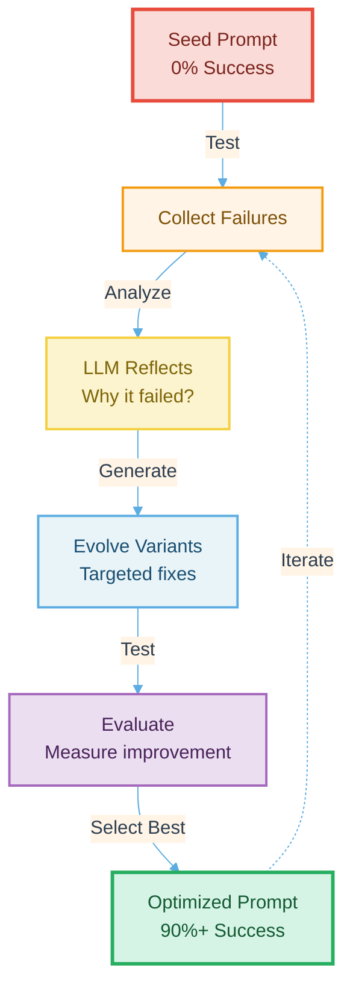

# Optimize Your Google ADK Agent's SOP with GEPA: Stop Manual Tweaking

Published: November 7, 2025

Your agent's instructions are its Standard Operating Procedure (SOP). In Google
ADK, this SOP lives in the agent's prompt—the detailed instructions that guide
every decision, every tool call, every response.

**The problem?** Writing the perfect SOP manually is nearly impossible. You add
rules to fix failures. Each new rule breaks something else. Your agent becomes
unpredictable. Your SOP becomes a mess of band-aids.

**The solution?** GEPA (Genetic Evolutionary Prompt Augmentation)—automatic SOP
optimization that learns from failures and evolves better instructions through
real testing.

<!-- truncate -->

## WHY: Your Agent's SOP Needs Systematic Optimization

### What is an Agent SOP?

In Google ADK, every agent has a Standard Operating Procedure defined in its
`instruction` parameter:

```python
agent = Agent(
    name="customer_support",
    model="gemini-2.5-flash",
    instruction="""
    You are a professional customer support agent.
    
    CRITICAL PROCEDURES:
    1. Always verify customer identity first
    2. Check the 30-day return policy window
    3. Only process refunds for verified orders
    4. Escalate suspicious activity to security
    
    [... hundreds more lines of procedures ...]
    """,
    tools=[verify_identity, check_policy, process_refund]
)
```

This instruction is your agent's SOP—it defines **how** the agent should behave,
**when** to use tools, **what** to prioritize, and **how** to handle edge cases.

### Why Manual SOP Development Fails

**1. Complexity Explosion**

Your SOP isn't just "verify identity." It's a complex decision tree:

- When to verify? (Before every action? Only for high-risk?)
- How to verify? (Email + order ID? Phone number?)
- What if verification fails? (Reject immediately? Ask for alternatives?)
- What about edge cases? (Typos in order ID? Multiple emails?)

Each decision spawns more decisions. A simple 10-rule SOP quickly becomes 100+
interconnected procedures.

**2. Contradicting Rules**

You add a rule: "Be helpful and flexible with customers."
Later: "Strictly enforce the 30-day policy, no exceptions."

Which wins? Your agent doesn't know. Different LLM calls interpret differently.
Your SOP becomes inconsistent.

**3. Invisible Failure Modes**

Your SOP works on your 10 test cases. Then production happens:

- Customer with multiple accounts
- International orders with timezone confusion
- Legitimate returns flagged as suspicious
- Edge cases you never imagined

Your carefully crafted SOP fails in ways you can't predict.

**4. The Band-Aid Spiral**

```text
Bug reported → Add specific rule → New bug appears → Add another rule
→ Original fix breaks → Add exception → More bugs → More rules...
```

Your SOP becomes an unmaintainable mess of patches. Nobody knows what's safe to
change anymore.

### GEPA: Systematic SOP Optimization

GEPA solves this by treating your agent's SOP as an **evolving system**, not a
static document:

**Traditional Approach:**
```text
You write SOP → Hope it works → Fix bugs manually → Repeat forever
```

**GEPA Approach:**
```text
Seed SOP → Test against real scenarios → LLM reflects on failures
→ Generates improved SOP → Tests improvements → Selects best
→ Iterates until optimal
```

**The key difference:** GEPA uses **data-driven evolution** guided by **LLM
intelligence** to optimize your SOP systematically, not randomly.

## WHY: Manual Prompt Engineering is Broken

### The Problem

Your prompt isn't just one instruction—it's dozens of rules interacting:

- "Verify identity FIRST" (security rule)
- "Check 30-day return window" (policy rule)
- "Ask clarifying questions only when needed" (UX rule)

Change one rule? You might break three others.

### You Can't Test All Cases

You test 5-10 scenarios. Real users generate hundreds of edge cases:

- Order numbers with typos
- Refunds requested 29 days after purchase
- Suspicious patterns that are actually legitimate

Your hand-crafted prompt works on test cases but fails in production.

## WHAT: GEPA is Evolution for Prompts

GEPA uses **genetic algorithms** to breed better prompts automatically:

1. **Start with a seed prompt** (baseline)
2. **Test it against real scenarios** (evaluation)
3. **Analyze what fails** (reflection)
4. **Create improved variants** (evolution)
5. **Test variants** (selection)
6. **Keep the best one** (iteration)
7. **Repeat** (convergence)

**Result:** Your prompt evolves from 0% to 100% success automatically.



### The Key Innovation: LLM-Based Reflection

Standard genetic algorithms use random mutations. GEPA is smarter—it uses **LLM
reflection**:

```text
❌ Random mutation:
Original: "Help customers with refunds"
Mutated:  "Xyzzy customers with zlurps"  (nonsense)

✅ LLM-guided mutation:
Agent fails: "Didn't verify customer identity"
LLM generates: "CRITICAL: Always verify identity FIRST"
Result: Targeted improvement addressing root cause
```

The LLM **understands why it failed** and generates intelligent improvements.

### Measurable Results

For the tutorial demo (customer support refund agent):

- Iteration 1: 0% success rate
- Iteration 2: 40% success rate
- Iteration 3: 90% success rate
- Result: Fully automated improvement ✅

## HOW: Getting Started (5 Minutes)

### Quick Demo (Simulated - Free & Instant)

```bash
cd tutorial_implementation/tutorial_gepa_optimization
make setup && make demo
```

See the evolution cycle:

- Weak seed prompt
- Tests fail (0/5 scenarios)
- LLM analyzes failures
- Evolved prompt generated
- Tests pass (5/5 scenarios)
- 0% → 100% improvement ✅

**Time:** 2 minutes | **Cost:** $0

### Real GEPA (Actual LLM Calls)

```bash
export GOOGLE_API_KEY="your-api-key"
make real-demo
```

See actual LLM-driven optimization:

- Real Gemini LLM analyzes failures
- Generates truly improved prompts
- Tests against evaluation scenarios

**Time:** 5-10 minutes | **Cost:** $0.05-0.10

### Full Tutorial

[Read the complete GEPA tutorial →](/docs/36_gepa_optimization_advanced)

Learn:

- The 5-step GEPA loop
- Genetic algorithms for prompts
- Building evaluation metrics
- Implementing LLM reflection
- Production deployment

## Why This Matters

**LLM agents are replacing traditional software**, but we're still using pre-LLM
practices:

- ❌ Manual prompt engineering
- ❌ Ad-hoc testing
- ❌ No systematic improvement

**GEPA brings systematic optimization:**

- ✅ Automated improvement
- ✅ Data-driven testing
- ✅ Reproducible results
- ✅ Production-grade quality

## What You Get

**1. Complete Implementation**

- Real GEPA optimizer with LLM reflection (535 lines)
- Production-ready code
- Async/await support
- Error handling and budget controls

**2. Working Demonstrations**

- Simulated demo (instant, free)
- Real demo with actual LLM calls
- 5 evaluation scenarios
- Phase-by-phase visualization

**3. Comprehensive Tests**

- 18 test cases covering all GEPA phases
- Integration tests
- Edge case validation
- All tests passing ✅

**4. Learning Materials**

- Why GEPA works
- How to apply it
- Production deployment patterns
- Research implementation comparison

## Next Steps

1. **Try the demo** (2 minutes)

   ```bash
   cd tutorial_implementation/tutorial_gepa_optimization
   make setup && make demo
   ```

2. **Read the tutorial** (30 minutes)

   [GEPA Optimization →](/docs/36_gepa_optimization_advanced)

3. **Apply to your agents**

   - Define evaluation scenarios
   - Set up optimization pipeline
   - Monitor improvements

4. **Share your results**
   - Tweet about it
   - Open an issue with use cases
   - Contribute improvements

## Learn More

- **[Full Tutorial](/docs/36_gepa_optimization_advanced)** — Complete guide with
  code
- **[GEPA Paper](https://arxiv.org/abs/2507.19457)** — Research details
- **[DSPy Framework](https://github.com/stanfordnlp/dspy)** — GEPA ecosystem
- **[Official Code](https://github.com/google/adk-python/tree/main/contributing/samples/gepa)**
  — Google's implementation

---

**Stop guessing on prompts. Start optimizing them systematically.**

[Get Started with GEPA →](/docs/36_gepa_optimization_advanced)
