import Comments from '@site/src/components/Comments';

# Tutorial 11: Built-in Tools & Grounding

**Goal**: Learn how to use Gemini 2.0+'s built-in tools for web grounding, location services, and enterprise search - enabling your agents to access current information from the internet.

**Prerequisites**:

- Tutorial 01 (Hello World Agent)
- Tutorial 02 (Function Tools)
- Gemini 2.0+ model access

**What You'll Learn**:

- Using `google_search` for web grounding
- Implementing location-based queries with `google_maps_grounding`
- Enterprise compliance search with `enterprise_web_search`
- Understanding `GoogleSearchAgentTool` workaround
- Tracking grounding metadata
- Building a production research assistant

**Time to Complete**: 45-60 minutes

---

## Why Built-in Tools Matter

Traditional AI models have a knowledge cutoff date - they don't know about recent events, current news, or real-time information. Built-in tools solve this by allowing models to **ground their responses in current web data**.

**Key Advantages**:

- ✅ **Current Information**: Access to up-to-date web content
- ✅ **No Local Execution**: Tools run inside the model (no infrastructure needed)
- ✅ **Automatic Integration**: Results seamlessly incorporated into responses
- ✅ **Gemini 2.0+ Feature**: Leverage latest model capabilities
- ✅ **Production Ready**: Used by real-world applications

**Important**: Built-in tools are **Gemini 2.0+ only** and raise errors with older models (1.5, 1.0).

---

## 1. Google Search Tool (Web Grounding)

### What is google_search?

`google_search` is a **built-in tool** that allows Gemini 2.0+ models to search the web and incorporate results into their responses. Unlike traditional tools, this executes **inside the model** - no local code runs.

### Basic Usage

```python
from google.adk.agents import Agent
from google.adk.tools import google_search
from google.adk.runners import Runner

# Create agent with google_search
agent = Agent(
    model='gemini-2.0-flash',  # Requires Gemini 2.0+
    name='web_researcher',
    instruction='You are a helpful assistant with access to current web information.',
    tools=[google_search]  # Add built-in search capability
)

# Run agent - it can now search the web
runner = Runner()
result = runner.run(
    "What are the latest developments in quantum computing in 2025?",
    agent=agent
)

print(result.content.parts[0].text)
# Model searches web automatically and provides current answer
```

**What Happens**:

1. Model receives question about current events
2. Model decides to use `google_search` tool
3. Search executes **inside model environment**
4. Results incorporated into response
5. Answer includes up-to-date information with sources

### How It Works Internally

**Source**: `google/adk/tools/google_search_tool.py`

```python
# Internal implementation (simplified)
class GoogleSearchTool:
    def process_llm_request(self, llm_request):
        """Adds google_search to model's tool list."""
        # Add built-in search tool
        llm_request.tools.append(
            types.Tool(google_search=types.GoogleSearch())
        )

        # Model now knows it can search the web
        return llm_request
```

**Key Details**:

- No actual function implementation needed
- Model handles search execution internally
- Results appear in `GroundingMetadata`
- Errors raised for Gemini 1.x models

### Grounding Metadata

When the model uses `google_search`, it stores metadata about the search:

```python
from google.adk.agents import Agent, Runner
from google.adk.tools import google_search

agent = Agent(
    model='gemini-2.0-flash',
    tools=[google_search]
)

runner = Runner()
result = runner.run(
    "What's the weather in San Francisco today?",
    agent=agent
)

# Access grounding metadata
# Temporarily stored in state during execution
# Key: temp:_adk_grounding_metadata
```

**GroundingMetadata Structure**:

```python
{
    'web_search_queries': [
        'San Francisco weather today',
        'current temperature San Francisco'
    ],
    # Other grounding info...
}
```

### Model Compatibility

```python
# ✅ Works with Gemini 2.0+
agent = Agent(model='gemini-2.0-flash', tools=[google_search])
agent = Agent(model='gemini-2.0-flash-exp', tools=[google_search])

# ❌ Raises error with Gemini 1.x
agent = Agent(model='gemini-1.5-flash', tools=[google_search])
# Error: google_search requires Gemini 2.0+
```

---

## 2. Google Maps Grounding Tool

### What is google_maps_grounding?

`google_maps_grounding` enables location-based queries - finding nearby places, getting directions, understanding geographic context.

### Basic Usage

```python
from google.adk.agents import Agent
from google.adk.tools import google_maps_grounding
from google.adk.runners import Runner

agent = Agent(
    model='gemini-2.0-flash',  # Gemini 2.0+ only
    name='location_assistant',
    instruction='Help users with location-based queries.',
    tools=[google_maps_grounding]
)

runner = Runner()
result = runner.run(
    "What are the best Italian restaurants within 5 miles of Times Square, NYC?",
    agent=agent
)

print(result.content.parts[0].text)
# Model uses maps grounding for current location data
```

### Use Cases

**Navigation**:

```python
result = runner.run(
    "How do I get from JFK Airport to Central Park using public transit?",
    agent=agent
)
```

**Local Discovery**:

```python
result = runner.run(
    "Find coffee shops open now near Stanford University.",
    agent=agent
)
```

**Geographic Context**:

```python
result = runner.run(
    "What's the distance between Los Angeles and San Diego?",
    agent=agent
)
```

### Important Constraints

**VertexAI API Only**:

```python
# ✅ Works with VertexAI
import os
os.environ['GOOGLE_GENAI_USE_VERTEXAI'] = '1'
os.environ['GOOGLE_CLOUD_PROJECT'] = 'my-project'
os.environ['GOOGLE_CLOUD_LOCATION'] = 'us-central1'

agent = Agent(
    model='gemini-2.0-flash',
    tools=[google_maps_grounding]
)

# ❌ Not available with AI Studio API
os.environ['GOOGLE_GENAI_USE_VERTEXAI'] = '0'
# Maps grounding requires VertexAI
```

### Conditional Environment Detection

For production applications, implement conditional tool loading based on environment:

```python
from google.adk.agents import Agent
from google.adk.tools import google_search, google_maps_grounding

def is_vertexai_enabled() -> bool:
    """Check if VertexAI is enabled via environment variable."""
    return os.environ.get('GOOGLE_GENAI_USE_VERTEXAI') == '1'

def get_available_grounding_tools():
    """Get available grounding tools based on environment."""
    tools = [google_search]  # Always available

    # Add maps grounding only if VertexAI is enabled
    if is_vertexai_enabled():
        tools.append(google_maps_grounding)

    return tools

def get_agent_capabilities_description() -> str:
    """Get description of agent capabilities based on available tools."""
    capabilities = ["web search for current information"]

    if is_vertexai_enabled():
        capabilities.append("location-based queries and maps grounding")

    return " and ".join(capabilities)

# Create agent with conditional tools
agent = Agent(
    model='gemini-2.0-flash',
    name='conditional_grounding_agent',
    instruction=f"""You are a research assistant with access to {get_agent_capabilities_description()}.

When asked questions:
1. Use google_search to find current, accurate information
{"2. Use google_maps_grounding for location-based queries when available" if is_vertexai_enabled() else ""}
{("3. " if is_vertexai_enabled() else "2. ")}Provide clear, factual answers based on search results
{("4. " if is_vertexai_enabled() else "3. ")}Always cite that information comes from web search
{("5. " if is_vertexai_enabled() else "4. ")}If information seems outdated or uncertain, mention this

Be helpful, accurate, and indicate when you're using search capabilities.""",
    tools=get_available_grounding_tools()
)
```

This approach ensures your agent works in both AI Studio (web search only) and VertexAI (web search + maps) environments automatically.

### Agent Selection Flow


### Environment Detection Logic

```mermaid
flowchart TD
    START([Start Application]) --> CHECK{os.environ.get<br/>'GOOGLE_GENAI_USE_VERTEXAI'<br/>== '1'?}

    CHECK -->|True| VERTEXAI[VertexAI Mode<br/>✅ Maps Available]
    CHECK -->|False| STUDIO[AI Studio Mode<br/>❌ Maps Unavailable]

    VERTEXAI --> LOAD_ADVANCED[Load advanced_grounding_agent<br/>Tools: search + maps + custom]
    STUDIO --> LOAD_BASIC[Load basic_grounding_agent<br/>Tools: search only]

    LOAD_ADVANCED --> CAPABILITIES_ADV[Capabilities:<br/>• Web search<br/>• Maps grounding<br/>• Content analysis<br/>• Research saving]
    LOAD_BASIC --> CAPABILITIES_BASIC[Capabilities:<br/>• Web search only]

    CAPABILITIES_ADV --> READY_ADV[🚀 Ready for advanced queries]
    CAPABILITIES_BASIC --> READY_BASIC[🔍 Ready for basic research]

    style START fill:#e1f5fe,stroke:#01579b,stroke-width:3px
    style CHECK fill:#fff3e0,stroke:#e65100,stroke-width:2px
    style VERTEXAI fill:#e8f5e8,stroke:#1b5e20,stroke-width:2px
    style STUDIO fill:#fce4ec,stroke:#880e4f,stroke-width:2px
    style LOAD_ADVANCED fill:#f3e5f5,stroke:#4a148c,stroke-width:2px
    style LOAD_BASIC fill:#e0f2f1,stroke:#004d40,stroke-width:2px
    style READY_ADV fill:#e8f5e8,stroke:#2e7d32,stroke-width:2px
    style READY_BASIC fill:#fff8e1,stroke:#f57f17,stroke-width:2px
```



---

## 3. Enterprise Web Search Tool

### What is enterprise_web_search?

`enterprise_web_search` provides **enterprise-compliant web grounding** with additional controls for corporate environments.

**Documentation**: [Web Grounding for Enterprise](https://cloud.google.com/vertex-ai/generative-ai/docs/grounding/web-grounding-enterprise)

### Basic Usage

```python
from google.adk.agents import Agent
from google.adk.tools import enterprise_web_search
from google.adk.runners import Runner

agent = Agent(
    model='gemini-2.0-flash',  # Gemini 2+ only
    name='enterprise_assistant',
    instruction='Provide information using enterprise-compliant sources.',
    tools=[enterprise_web_search]
)

runner = Runner()
result = runner.run(
    "What are the latest GDPR compliance requirements?",
    agent=agent
)

print(result.content.parts[0].text)
# Uses enterprise search with compliance controls
```

### When to Use Enterprise Search

**Use `enterprise_web_search` when**:

- Operating in corporate/regulated environments
- Need audit trails for information sources
- Require content filtering and compliance
- Want controlled web access
- Building enterprise applications

**Use `google_search` when**:

- Building consumer applications
- Need general web information
- Don't have enterprise compliance requirements
- Want simpler setup

---

### Agent Hierarchy & Tool Composition


## 4. GoogleSearchAgentTool (Workaround)

### The Problem

**Current Limitation**: Built-in tools (like `google_search`) **cannot be combined** with custom function tools in the same agent.

```python
# ❌ This doesn't work as expected
from google.adk.tools import google_search, FunctionTool

def my_custom_tool(query: str) -> str:
    return f"Custom result for: {query}"

agent = Agent(
    model='gemini-2.0-flash',
    tools=[
        google_search,  # Built-in tool
        FunctionTool(my_custom_tool)  # Custom tool
    ]
)
# Only one type of tool will work
```

### The Workaround: GoogleSearchAgentTool

`GoogleSearchAgentTool` creates a **sub-agent with google_search** and wraps it as a regular tool.

**Source**: `google/adk/tools/google_search_agent_tool.py`

```python
from google.adk.agents import Agent
from google.adk.tools import GoogleSearchAgentTool, FunctionTool
from google.adk.runners import Runner

# Custom tool
def calculate_tax(amount: float, rate: float) -> float:
    """Calculate tax on amount."""
    return amount * rate

# Create GoogleSearchAgentTool wrapper
search_tool = GoogleSearchAgentTool()

# Now you can combine them!
agent = Agent(
    model='gemini-2.0-flash',
    name='hybrid_assistant',
    instruction='Answer questions using both web search and calculations.',
    tools=[
        search_tool,  # Wrapped google_search
        FunctionTool(calculate_tax)  # Custom tool
    ]
)

runner = Runner()

# Use both tools
result = runner.run(
    "What's the current California sales tax rate, and how much tax on $100?",
    agent=agent
)

print(result.content.parts[0].text)
# Agent uses search for tax rate, calculation for amount
```

### How GoogleSearchAgentTool Works

```python
# Internal implementation (simplified)
class GoogleSearchAgentTool:
    def __init__(self):
        # Create sub-agent with google_search
        self.search_agent = Agent(
            model='gemini-2.0-flash',
            tools=[google_search]
        )

    async def _run_async_impl(self, query: str, tool_context):
        """Run search via sub-agent."""
        runner = Runner()
        result = await runner.run_async(query, agent=self.search_agent)

        # Forward grounding metadata to parent
        if 'temp:_adk_grounding_metadata' in result.state:
            tool_context.invocation_context.state[
                'temp:_adk_grounding_metadata'
            ] = result.state['temp:_adk_grounding_metadata']

        return result.content.parts[0].text
```

### Helper Function

```python
from google.adk.tools.google_search_agent_tool import create_google_search_agent

# Create preconfigured search agent
search_agent = create_google_search_agent()

# Use as sub-agent
main_agent = Agent(
    name='orchestrator',
    sub_agents=[search_agent],
    flow='sequential'
)
```

### When the Workaround Won't Be Needed

```python
# TODO(b/448114567): Remove once workaround no longer needed
# Google is working on allowing built-in + custom tools together
# Check ADK releases for updates
```

---

## 5. Real-World Example: Research Assistant

Let's build a production-ready research assistant that can search the web, process results, and provide citations.

### Research Workflow

```mermaid
sequenceDiagram
    participant U as User
    participant A as Agent
    participant S as google_search
    participant M as google_maps_grounding
    participant T1 as analyze_search_results
    participant T2 as save_research_findings

    U->>A: Research query
    A->>S: Search web for information
    S-->>A: Search results
    A->>M: Location-based queries (if VertexAI)
    M-->>A: Maps data (if available)
    A->>T1: Analyze search results
    T1-->>A: Analysis insights
    A->>T2: Save research findings
    T2-->>A: Saved artifact confirmation
    A-->>U: Comprehensive research response

    Note over S,M: Built-in tools (automatic)
    Note over T1,T2: Custom tools (manual implementation)

    style U fill:#e3f2fd,stroke:#1565c0
    style A fill:#f3e5f5,stroke:#6a1b9a
    style S fill:#e8f5e8,stroke:#2e7d32
    style M fill:#fff3e0,stroke:#ef6c00
    style T1 fill:#fce4ec,stroke:#c2185b
    style T2 fill:#e0f2f1,stroke:#00695c
```

### Complete Implementation

```python
"""
Research Assistant with Web Grounding
Searches web, extracts key information, provides citations.
"""

import asyncio
import os
from datetime import datetime
from google.adk.agents import Agent, Runner
from google.adk.tools import google_search, FunctionTool, GoogleSearchAgentTool
from google.adk.tools.tool_context import ToolContext
from google.genai import types

# Environment setup
os.environ['GOOGLE_GENAI_USE_VERTEXAI'] = '1'
os.environ['GOOGLE_CLOUD_PROJECT'] = 'your-project-id'
os.environ['GOOGLE_CLOUD_LOCATION'] = 'us-central1'


# Custom tool: Save research notes
async def save_research_notes(
    topic: str,
    findings: str,
    tool_context: ToolContext
) -> str:
    """Save research findings as artifact."""

    # Create research document
    timestamp = datetime.now().strftime('%Y-%m-%d %H:%M:%S')
    document = f"""
# Research Report: {topic}
Generated: {timestamp}

## Findings
{findings}

## Metadata
- Topic: {topic}
- Generated by: Research Assistant
- Model: gemini-2.0-flash
    """.strip()

    # Save as artifact
    filename = f"research_{topic.replace(' ', '_')}.md"
    version = await tool_context.save_artifact(
        filename=filename,
        part=types.Part.from_text(document)
    )

    return f"Research saved as {filename} (version {version})"


# Custom tool: Extract key facts
def extract_key_facts(text: str, num_facts: int = 5) -> list[str]:
    """Extract key facts from text (simplified)."""
    # In production, use more sophisticated extraction
    sentences = text.split('.')
    return sentences[:num_facts]


# Create search tool (using workaround for mixing with custom tools)
search_tool = GoogleSearchAgentTool()

# Create research assistant
research_assistant = Agent(
    model='gemini-2.0-flash',
    name='research_assistant',
    description='Conducts web research and compiles findings',
    instruction="""
You are an expert research assistant with access to:
1. Web search via search_tool
2. Fact extraction via extract_key_facts
3. Note saving via save_research_notes

When given a research topic:
1. Use search_tool to find current information
2. Extract key facts using extract_key_facts
3. Synthesize findings into clear summary
4. Save research using save_research_notes
5. Provide summary with key points

Be comprehensive but concise. Always cite your sources.
    """.strip(),
    tools=[
        search_tool,
        FunctionTool(extract_key_facts),
        FunctionTool(save_research_notes)
    ],
    generate_content_config=types.GenerateContentConfig(
        temperature=0.3,  # Lower for factual accuracy
        max_output_tokens=2048
    )
)


async def conduct_research(topic: str):
    """Conduct comprehensive research on topic."""

    print(f"\n{'='*60}")
    print(f"RESEARCH TOPIC: {topic}")
    print(f"{'='*60}\n")

    runner = Runner()

    # Run research
    result = await runner.run_async(
        f"Research this topic and provide a comprehensive summary: {topic}",
        agent=research_assistant
    )

    # Display results
    print("\n📊 RESEARCH RESULTS:\n")
    print(result.content.parts[0].text)

    # Check if grounding metadata available
    if 'temp:_adk_grounding_metadata' in result.state:
        metadata = result.state['temp:_adk_grounding_metadata']
        if 'web_search_queries' in metadata:
            print("\n\n🔍 SEARCH QUERIES USED:")
            for query in metadata['web_search_queries']:
                print(f"  - {query}")

    print(f"\n{'='*60}\n")


# Example usage
async def main():
    """Run research examples."""

    # Research recent technology
    await conduct_research(
        "Quantum computing breakthroughs in 2025"
    )

    await asyncio.sleep(2)

    # Research current events
    await conduct_research(
        "Latest developments in renewable energy technology"
    )

    await asyncio.sleep(2)

    # Research scientific topic
    await conduct_research(
        "CRISPR gene editing applications in medicine"
    )


if __name__ == '__main__':
    asyncio.run(main())
```

### Running the Research Assistant

**Setup**:

```bash
# Install dependencies
pip install google-adk

# Set environment
export GOOGLE_GENAI_USE_VERTEXAI=1
export GOOGLE_CLOUD_PROJECT=your-project-id
export GOOGLE_CLOUD_LOCATION=us-central1

# Run
python research_assistant.py
```

**Expected Output**:

```
============================================================
RESEARCH TOPIC: Quantum computing breakthroughs in 2025
============================================================

📊 RESEARCH RESULTS:

# Quantum Computing Breakthroughs in 2025

## Overview
Recent developments in quantum computing have shown significant progress...

## Key Developments
1. **Error Correction**: New quantum error correction codes...
2. **Qubit Scaling**: IBM announced a 1000+ qubit processor...
3. **Practical Applications**: Google demonstrated quantum advantage...

## Impact
These breakthroughs represent major steps toward practical quantum computers...

[Research saved as research_quantum_computing_breakthroughs_in_2025.md (version 1)]


🔍 SEARCH QUERIES USED:
  - quantum computing 2025 breakthroughs
  - latest quantum computer developments
  - quantum computing applications 2025

============================================================
```

---

## 6. Memory Tools - Persistent State Management

**Source**: `google/adk/tools/__init__.py`, `google/adk/tools/memory_tools.py`

ADK provides built-in tools for managing persistent memory across agent sessions. These tools enable agents to store, retrieve, and manage context that persists beyond single conversations.

### load_memory - Load Persistent Memory

Load previously saved memory state into the current session.

```python
from google.adk.agents import Agent
from google.adk.tools import load_memory
from google.adk.runners import Runner

agent = Agent(
    model='gemini-2.5-flash',
    name='memory_agent',
    instruction='You can remember information from previous conversations using load_memory.',
    tools=[load_memory]
)

runner = Runner()
result = runner.run(
    "Load my previous conversation history and summarize what we discussed.",
    agent=agent
)
```

**When to use**:

- Multi-session conversations
- Resuming previous work
- Accessing historical context
- Building long-term memory systems

### preload_memory - Initialize Memory

Preload memory state before agent execution starts.

```python
from google.adk.tools import preload_memory

agent = Agent(
    model='gemini-2.5-flash',
    name='preloaded_agent',
    instruction='You have access to preloaded user preferences and context.',
    tools=[preload_memory]
)

# Memory loads automatically before first turn
```

**When to use**:

- User preference initialization
- Session setup
- Context bootstrapping
- Pre-loading known information

### load_artifacts - Access Stored Data

Load previously saved artifacts (documents, files, data) into the conversation.

```python
from google.adk.tools import load_artifacts

agent = Agent(
    model='gemini-2.5-flash',
    name='artifact_agent',
    instruction='You can load and reference saved documents using load_artifacts.',
    tools=[load_artifacts]
)

runner = Runner()
result = runner.run(
    "Load the research document from last week and continue where we left off.",
    agent=agent
)
```

**When to use**:

- Document retrieval
- Data access
- File management
- Content continuation

---

## 7. Workflow Tools - Agent Control Flow

**Source**: `google/adk/tools/__init__.py`, `google/adk/tools/workflow_tools.py`

Workflow tools allow agents to control their own execution flow and interact with user orchestration.

### exit_loop - Terminate Execution

Allow the agent to decide when to stop execution in a loop.

```python
from google.adk.agents import Agent
from google.adk.tools import exit_loop

agent = Agent(
    model='gemini-2.5-flash',
    name='loop_agent',
    instruction="""
Process tasks until complete, then call exit_loop.
You decide when work is finished.
    """,
    tools=[exit_loop]
)

# Agent will call exit_loop when satisfied
```

**When to use**:

- Iterative processing
- Agent-controlled termination
- Dynamic execution length
- Self-directed workflows

### get_user_choice - Request User Input

Request explicit user input during execution.

```python
from google.adk.tools import get_user_choice

agent = Agent(
    model='gemini-2.5-flash',
    name='interactive_agent',
    instruction="""
When you need clarification, use get_user_choice to ask the user.
Wait for their response before proceeding.
    """,
    tools=[get_user_choice]
)

runner = Runner()
result = runner.run(
    "Help me plan a vacation.",
    agent=agent
)

# Agent may call: get_user_choice("What's your budget: high, medium, or low?")
# User provides answer
# Agent continues with that information
```

**When to use**:

- Ambiguity resolution
- User preference collection
- Interactive workflows
- Decision points requiring human input

### transfer_to_agent - Agent Handoff

Transfer control to another agent in a multi-agent system.

```python
from google.adk.agents import Agent
from google.adk.tools import transfer_to_agent

# Specialist agents
coding_agent = Agent(
    model='gemini-2.5-pro',
    name='coding_expert',
    instruction='You are an expert programmer.'
)

research_agent = Agent(
    model='gemini-2.5-flash',
    name='research_expert',
    instruction='You are a research specialist.'
)

# Router agent
router_agent = Agent(
    model='gemini-2.5-flash',
    name='router',
    instruction="""
Analyze the user's request and transfer to the appropriate specialist:
- For coding questions, transfer to coding_expert
- For research questions, transfer to research_expert
Use transfer_to_agent tool.
    """,
    sub_agents=[coding_agent, research_agent],
    tools=[transfer_to_agent]
)

runner = Runner()
result = runner.run(
    "Explain how quicksort works and implement it in Python.",
    agent=router_agent
)

# Router transfers to coding_expert automatically
```

**When to use**:

- Multi-agent orchestration
- Specialist agent routing
- Dynamic workflow routing
- Complex task delegation

---

## 8. Context Tools - External Data Access

**Source**: `google/adk/tools/url_context_tool.py`

Context tools enable agents to access external data sources during execution.

### url_context - Load Content from URLs

Fetch and incorporate content from URLs into the conversation.

```python
from google.adk.agents import Agent
from google.adk.tools import url_context
from google.adk.runners import Runner

agent = Agent(
    model='gemini-2.5-flash',
    name='url_agent',
    instruction='You can load content from URLs using url_context to answer questions.',
    tools=[url_context]
)

runner = Runner()
result = runner.run(
    "Summarize the content from https://example.com/article",
    agent=agent
)

# Agent calls url_context("https://example.com/article")
# Content loaded and analyzed
```

**When to use**:

- Document analysis
- Web content summarization
- External data integration
- Dynamic content loading

**Note**: Requires appropriate permissions and respects robots.txt.

---

## 9. Enterprise Tools - Production Systems

**Source**: `google/adk/tools/__init__.py`, `google/adk/tools/vertex_ai_search_tool.py`

Enterprise tools connect agents to Google Cloud production services.

### VertexAiSearchTool - Enterprise Search

Connect to Vertex AI Search (formerly Discovery Engine) for enterprise-grade search.

```python
from google.adk.agents import Agent
from google.adk.tools import VertexAiSearchTool
from google.adk.runners import Runner

# Create Vertex AI Search tool
search_tool = VertexAiSearchTool(
    project_id='your-project-id',
    location='global',
    data_store_id='your-datastore-id'
)

agent = Agent(
    model='gemini-2.5-flash',
    name='enterprise_search_agent',
    instruction='Search the enterprise knowledge base using vertex_ai_search.',
    tools=[search_tool]
)

runner = Runner()
result = runner.run(
    "Find company policies related to remote work.",
    agent=agent
)
```

**When to use**:

- Enterprise document search
- Internal knowledge bases
- Compliance requirements
- Corporate data access

**Requirements**:

- Google Cloud Project
- Vertex AI Search configured
- Data store created and populated
- Appropriate IAM permissions

### DiscoveryEngineSearchTool - Legacy Search

Older name for VertexAiSearchTool (same functionality).

```python
from google.adk.tools import DiscoveryEngineSearchTool

# Equivalent to VertexAiSearchTool
search_tool = DiscoveryEngineSearchTool(
    project_id='your-project-id',
    location='global',
    engine_id='your-engine-id'
)
```

**Migration**: Use `VertexAiSearchTool` for new projects.

---

## 10. Integration Wrappers - Third-Party Tools

**Source**: `google/adk/tools/__init__.py`

ADK provides wrappers to integrate third-party framework tools.

### LangchainTool - LangChain Integration

Wrap any LangChain tool for use in ADK agents.

```python
from google.adk.tools import LangchainTool
from google.adk.agents import Agent
from langchain_community.tools import TavilySearchResults

# Create LangChain tool
tavily = TavilySearchResults(max_results=5)

# Wrap for ADK
adk_tavily = LangchainTool(tool=tavily)

agent = Agent(
    model='gemini-2.5-flash',
    name='langchain_agent',
    instruction='Use tavily_search for web searches.',
    tools=[adk_tavily]
)
```

**When to use**:

- Leveraging LangChain ecosystem (100+ tools)
- Existing LangChain integrations
- Community-built tools
- Rapid prototyping with existing tools

**Installation**: `pip install langchain_community tavily-python`

### CrewaiTool - CrewAI Integration

Wrap CrewAI tools for ADK.

```python
from google.adk.tools import CrewaiTool
from crewai_tools import SerperDevTool

# Create CrewAI tool
serper = SerperDevTool(n_results=10)

# Wrap for ADK (must provide name and description!)
adk_serper = CrewaiTool(
    name="InternetNewsSearch",
    description="Searches the internet for news articles",
    tool=serper
)

agent = Agent(
    model='gemini-2.5-flash',
    name='crewai_agent',
    instruction='Use InternetNewsSearch for finding news.',
    tools=[adk_serper]
)
```

**Critical**: CrewAI tools require explicit name and description (unlike LangChain).

**When to use**:

- CrewAI tool ecosystem (20+ tools)
- Existing CrewAI workflows
- Specialized CrewAI integrations

**Installation**: `pip install crewai-tools`

---

## 11. Tool Classes & Toolsets

**Source**: `google/adk/tools/__init__.py`

ADK provides base classes and toolsets for advanced tool management.

### FunctionTool - Function Wrapper

Wrap regular Python functions as tools (covered in Tutorial 02).

```python
from google.adk.tools import FunctionTool

def calculate_tax(amount: float, rate: float) -> float:
    """Calculate tax on amount."""
    return amount * rate

# Wrap as tool
tax_tool = FunctionTool(calculate_tax)

agent = Agent(
    model='gemini-2.5-flash',
    tools=[tax_tool]
)
```

### AgentTool - Agent as Tool

Wrap an entire agent as a tool for another agent.

```python
from google.adk.tools import AgentTool
from google.adk.agents import Agent

# Specialist agent
math_agent = Agent(
    model='gemini-2.5-pro',
    name='math_expert',
    instruction='Solve complex math problems.'
)

# Wrap as tool
math_tool = AgentTool(agent=math_agent)

# Use in another agent
orchestrator = Agent(
    model='gemini-2.5-flash',
    name='orchestrator',
    instruction='Use math_expert for complex calculations.',
    tools=[math_tool]
)
```

**When to use**:

- Agent composition
- Specialist delegation
- Modular agent architectures

### MCPToolset - Model Context Protocol

Access external MCP servers (covered in Tutorial 16).

```python
from google.adk.tools import MCPToolset

# Connect to MCP server
mcp_tools = MCPToolset(
    server_uri='http://localhost:3000/mcp',
    description='External tool server'
)

agent = Agent(
    model='gemini-2.5-flash',
    name='mcp_agent',
    instruction='Use MCP tools for external capabilities.',
    tools=[mcp_tools]
)
```

**When to use**:

- External tool servers
- Third-party integrations
- Standardized tool protocols
- Microservice architectures

### OpenAPIToolset - REST API Integration

Automatically generate tools from OpenAPI specifications (covered in Tutorial 03).

```python
from google.adk.tools import OpenAPIToolset

# Load API from OpenAPI spec
api_tools = OpenAPIToolset.from_url(
    'https://api.example.com/openapi.json',
    allow_operations=['GetUser', 'CreateOrder']
)

agent = Agent(
    model='gemini-2.5-flash',
    name='api_agent',
    instruction='Use API tools to interact with external services.',
    tools=[api_tools]
)
```

**When to use**:

- REST API integration
- External service access
- Auto-generated tool interfaces
- API-first architectures

---

## 12. Complete Builtin Tools Reference

**Source**: `google/adk/tools/__init__.py`

Here's the comprehensive list of all ADK builtin tools:

### Grounding Tools (3)

- ✅ `google_search` - Web search grounding (Gemini 2.0+)
- ✅ `google_maps_grounding` - Location-based queries (VertexAI only)
- ✅ `enterprise_web_search` - Enterprise-compliant web search

### Memory Tools (3)

- ✅ `load_memory` - Load persistent memory state
- ✅ `preload_memory` - Preload memory before execution
- ✅ `load_artifacts` - Load saved artifacts/documents

### Workflow Tools (3)

- ✅ `exit_loop` - Agent-controlled termination
- ✅ `get_user_choice` - Request user input
- ✅ `transfer_to_agent` - Agent handoff

### Context Tools (1)

- ✅ `url_context` - Load content from URLs

### Enterprise Tools (2)

- ✅ `VertexAiSearchTool` - Enterprise search (Vertex AI Search)
- ✅ `DiscoveryEngineSearchTool` - Legacy name for VertexAiSearchTool

### Integration Wrappers (2)

- ✅ `LangchainTool` - Wrap LangChain tools
- ✅ `CrewaiTool` - Wrap CrewAI tools

### Tool Classes (5)

- ✅ `FunctionTool` - Wrap Python functions
- ✅ `AgentTool` - Wrap agents as tools
- ✅ `GoogleSearchAgentTool` - Wrapped google_search for mixing
- ✅ `Tool` - Base tool class
- ✅ `AsyncTool` - Base async tool class

### Toolsets (3)

- ✅ `MCPToolset` - Model Context Protocol integration
- ✅ `OpenAPIToolset` - REST API integration
- ✅ `Toolset` - Base toolset class

### Framework Integration (1)

- ✅ AG-UI Protocol - Agent-Human Interaction (via `research/ag-ui/`)

### Specialized Tools (2)

- ✅ `McpTool` - Individual MCP tool wrapper
- ✅ `OpenApiTool` - Individual OpenAPI endpoint wrapper

**Total: 30+ builtin tools and classes**

---

## 13. Real-World Example: Comprehensive Agent System

Let's build an agent that uses multiple builtin tool categories:

```python
"""
Comprehensive Multi-Tool Agent
Demonstrates: Grounding, Memory, Workflow, Context, Enterprise tools
"""

import os
import asyncio
from google.adk.agents import Agent, Runner
from google.adk.tools import (
    google_search,
    load_memory,
    load_artifacts,
    exit_loop,
    transfer_to_agent,
    url_context,
    FunctionTool
)
from google.genai import types

# Environment setup
os.environ['GOOGLE_GENAI_USE_VERTEXAI'] = '1'
os.environ['GOOGLE_CLOUD_PROJECT'] = 'your-project'
os.environ['GOOGLE_CLOUD_LOCATION'] = 'us-central1'

# Custom analysis function
def analyze_data(data: str) -> dict:
    """Analyze data and return insights."""
    # Simplified analysis
    word_count = len(data.split())
    return {
        "status": "success",
        "report": f"Analysis: {word_count} words, data quality: good"
    }

# Specialist: Research agent
research_agent = Agent(
    model='gemini-2.5-flash',
    name='research_specialist',
    instruction="""
You are a research specialist. Use google_search and url_context
to gather comprehensive information. Save important findings
using load_artifacts.
    """,
    tools=[google_search, url_context, load_artifacts]
)

# Specialist: Data analyst
analyst_agent = Agent(
    model='gemini-2.5-pro',
    name='data_analyst',
    instruction="""
You are a data analyst. Use analyze_data to process information.
Provide detailed insights and recommendations.
    """,
    tools=[FunctionTool(analyze_data)]
)

# Main orchestrator
orchestrator = Agent(
    model='gemini-2.5-flash',
    name='orchestrator',
    description='Multi-tool agent system',
    instruction="""
You coordinate research and analysis tasks:

1. Load previous context using load_memory if continuing work
2. For research tasks, transfer to research_specialist
3. For data analysis, transfer to data_analyst
4. When work is complete, call exit_loop

You decide the workflow based on user needs.
    """,
    sub_agents=[research_agent, analyst_agent],
    tools=[
        load_memory,
        transfer_to_agent,
        exit_loop
    ],
    generate_content_config=types.GenerateContentConfig(
        temperature=0.3
    )
)


async def main():
    """Run comprehensive agent system."""

    runner = Runner()

    print("="*60)
    print("COMPREHENSIVE AGENT SYSTEM")
    print("="*60 + "\n")

    query = """
Research the latest developments in quantum computing,
analyze the key technological breakthroughs,
and provide strategic recommendations.
    """

    result = await runner.run_async(query, agent=orchestrator)

    print("\n📊 RESULT:\n")
    print(result.content.parts[0].text)

    print("\n" + "="*60 + "\n")


if __name__ == '__main__':
    asyncio.run(main())
```

**Expected Workflow**:

1. Orchestrator receives query
2. Loads any previous memory (if continuing session)
3. Transfers to research_specialist
4. Research agent uses google_search for quantum computing news
5. Research agent uses url_context to load article content
6. Research agent saves findings with load_artifacts
7. Control returns to orchestrator
8. Orchestrator transfers to data_analyst
9. Analyst processes findings with analyze_data
10. Analyst provides strategic recommendations
11. Control returns to orchestrator
12. Orchestrator calls exit_loop when satisfied
13. Final response compiled

---

## 14. Advanced Patterns

### Pattern 1: Multi-Source Research

Combine multiple built-in tools for comprehensive research:

```python
from google.adk.agents import Agent
from google.adk.tools import google_search, google_maps_grounding

# Agent with multiple grounding sources
multi_source_agent = Agent(
    model='gemini-2.0-flash',
    name='multi_source_researcher',
    instruction="""
Use all available tools to provide comprehensive answers:
- google_search for web information
- google_maps_grounding for location data

Synthesize information from multiple sources.
    """,
    tools=[google_search, google_maps_grounding]
)

runner = Runner()
result = runner.run(
    "What are the top tech companies in Silicon Valley and where are they located?",
    agent=multi_source_agent
)
# Uses both web search and maps grounding
```

### Pattern 2: Fact-Checking Agent

Build an agent that verifies claims using web search:

```python
fact_checker = Agent(
    model='gemini-2.0-flash',
    name='fact_checker',
    instruction="""
You are a fact-checking assistant. For each claim:
1. Search the web for authoritative sources
2. Compare claim against found information
3. Provide verdict: TRUE, FALSE, or NEEDS_CONTEXT
4. Cite sources

Be objective and thorough.
    """,
    tools=[google_search],
    generate_content_config=types.GenerateContentConfig(
        temperature=0.1  # Very low for accuracy
    )
)

runner = Runner()
result = runner.run(
    "Check this claim: 'The Great Wall of China is visible from space.'",
    agent=fact_checker
)
```

### Pattern 3: Trend Analysis

Analyze current trends using time-based searches:

```python
trend_analyzer = Agent(
    model='gemini-2.0-flash',
    name='trend_analyzer',
    instruction="""
Analyze trends by searching for information from different time periods.
Compare current information with past data.
Identify patterns and changes over time.
    """,
    tools=[google_search]
)

runner = Runner()
result = runner.run(
    """
Analyze the trend of electric vehicle adoption:
- Current status (2025)
- Growth over past 3 years
- Projections for next 2 years
    """,
    agent=trend_analyzer
)
```

### Pattern 4: Competitive Intelligence

Research competitors using web search:

```python
competitive_intel = Agent(
    model='gemini-2.0-flash',
    name='competitive_intel',
    instruction="""
Research companies and provide competitive analysis:
- Products and services
- Recent news and announcements
- Market position
- Strengths and weaknesses

Focus on publicly available information only.
    """,
    tools=[google_search]
)

runner = Runner()
result = runner.run(
    "Provide competitive analysis of OpenAI, Anthropic, and Google DeepMind",
    agent=competitive_intel
)
```

---

## 7. Best Practices

### ✅ DO: Use Appropriate Model

```python
# ✅ Good - Gemini 2.0+
agent = Agent(
    model='gemini-2.0-flash',
    tools=[google_search]
)

# ❌ Bad - Wrong model version
agent = Agent(
    model='gemini-1.5-flash',  # Will raise error
    tools=[google_search]
)
```

### ✅ DO: Handle Mixed Tools Correctly

```python
# ✅ Good - Use GoogleSearchAgentTool for mixing
from google.adk.tools import GoogleSearchAgentTool, FunctionTool

agent = Agent(
    model='gemini-2.0-flash',
    tools=[
        GoogleSearchAgentTool(),  # Wrapped
        FunctionTool(my_custom_function)
    ]
)

# ❌ Bad - Direct mixing doesn't work
agent = Agent(
    model='gemini-2.0-flash',
    tools=[
        google_search,  # Built-in
        FunctionTool(my_custom_function)  # Custom
    ]
)
```

### ✅ DO: Set Low Temperature for Facts

```python
# ✅ Good - Low temperature for factual queries
agent = Agent(
    model='gemini-2.0-flash',
    tools=[google_search],
    generate_content_config=types.GenerateContentConfig(
        temperature=0.2  # More deterministic
    )
)

# ❌ Bad - High temperature for facts
agent = Agent(
    model='gemini-2.0-flash',
    tools=[google_search],
    generate_content_config=types.GenerateContentConfig(
        temperature=0.9  # Too creative for facts
    )
)
```

### ✅ DO: Provide Clear Instructions

```python
# ✅ Good - Clear search guidance
agent = Agent(
    model='gemini-2.0-flash',
    instruction="""
When answering questions:
1. Use web search for current information
2. Always cite sources
3. Verify facts from multiple sources
4. Indicate if information is uncertain
    """,
    tools=[google_search]
)

# ❌ Bad - Vague instructions
agent = Agent(
    model='gemini-2.0-flash',
    instruction="Answer questions",
    tools=[google_search]
)
```

### ✅ DO: Check VertexAI Requirements

```python
# ✅ Good - Check API type for maps
if os.environ.get('GOOGLE_GENAI_USE_VERTEXAI') == '1':
    agent = Agent(
        model='gemini-2.0-flash',
        tools=[google_maps_grounding]
    )
else:
    print("Maps grounding requires VertexAI")
```

---

## 8. Troubleshooting

### Error: "google_search requires Gemini 2.0+"

**Problem**: Using google_search with Gemini 1.x model

**Solution**:

```python
# ❌ This causes error
agent = Agent(
    model='gemini-1.5-flash',
    tools=[google_search]
)

# ✅ Use Gemini 2.0+
agent = Agent(
    model='gemini-2.0-flash',
    tools=[google_search]
)
```

### Error: "Built-in tools not working with custom tools"

**Problem**: Trying to mix built-in and custom tools directly

**Solution**:

```python
# ❌ Doesn't work
agent = Agent(
    model='gemini-2.0-flash',
    tools=[google_search, FunctionTool(my_func)]
)

# ✅ Use GoogleSearchAgentTool wrapper
agent = Agent(
    model='gemini-2.0-flash',
    tools=[GoogleSearchAgentTool(), FunctionTool(my_func)]
)
```

### Error: "Maps grounding not available"

**Problem**: Using AI Studio API instead of VertexAI

**Solution**:

```python
# ❌ AI Studio doesn't support maps
os.environ['GOOGLE_GENAI_USE_VERTEXAI'] = '0'
agent = Agent(
    model='gemini-2.0-flash',
    tools=[google_maps_grounding]  # Error
)

# ✅ Use VertexAI
os.environ['GOOGLE_GENAI_USE_VERTEXAI'] = '1'
os.environ['GOOGLE_CLOUD_PROJECT'] = 'your-project'
os.environ['GOOGLE_CLOUD_LOCATION'] = 'us-central1'

agent = Agent(
    model='gemini-2.0-flash',
    tools=[google_maps_grounding]  # Works
)
```

### Issue: "Search results not appearing in response"

**Problem**: Model not using search tool

**Solutions**:

1. **Make query require current information**:

```python
# ❌ Model might not search
result = runner.run("What is AI?", agent=agent)

# ✅ Requires current information
result = runner.run("What are the latest AI developments in 2025?", agent=agent)
```

2. **Explicitly instruct to search**:

```python
agent = Agent(
    model='gemini-2.0-flash',
    instruction="""
ALWAYS use web search for questions about:
- Current events
- Recent news
- Latest developments
- Real-time information
    """,
    tools=[google_search]
)
```

### Issue: "Grounding metadata not accessible"

**Problem**: Trying to access metadata after execution

**Solution**:

```python
# Grounding metadata is temporary
# Stored in: temp:_adk_grounding_metadata
# Only available during/immediately after execution

result = runner.run(query, agent=agent)

# ✅ Access immediately after
if 'temp:_adk_grounding_metadata' in result.state:
    metadata = result.state['temp:_adk_grounding_metadata']
    print(metadata)
```

---

## 9. Testing Your Agent

### Unit Test: Search Tool Integration

```python
import pytest
from google.adk.agents import Agent, Runner
from google.adk.tools import google_search

@pytest.mark.asyncio
async def test_search_agent_current_info():
    """Test agent can access current information."""

    agent = Agent(
        model='gemini-2.0-flash',
        tools=[google_search]
    )

    runner = Runner()
    result = await runner.run_async(
        "What year is it now?",
        agent=agent
    )

    # Should return current year (2025)
    assert '2025' in result.content.parts[0].text


@pytest.mark.asyncio
async def test_search_agent_with_citations():
    """Test agent provides sources."""

    agent = Agent(
        model='gemini-2.0-flash',
        instruction='Always cite sources for information.',
        tools=[google_search]
    )

    runner = Runner()
    result = await runner.run_async(
        "What are the latest developments in AI?",
        agent=agent
    )

    text = result.content.parts[0].text.lower()
    # Should mention sources or citations
    assert any(word in text for word in ['source', 'according to', 'based on'])


@pytest.mark.asyncio
async def test_mixed_tools_with_wrapper():
    """Test GoogleSearchAgentTool with custom tools."""

    from google.adk.tools import GoogleSearchAgentTool, FunctionTool

    def custom_tool(x: int) -> int:
        return x * 2

    agent = Agent(
        model='gemini-2.0-flash',
        tools=[
            GoogleSearchAgentTool(),
            FunctionTool(custom_tool)
        ]
    )

    runner = Runner()
    result = await runner.run_async(
        "What's 21 doubled? Also, what's the current date?",
        agent=agent
    )

    text = result.content.parts[0].text
    # Should use both tools
    assert '42' in text  # Custom tool result
    assert '2025' in text  # Search tool result
```

### Integration Test: Maps Grounding

```python
@pytest.mark.asyncio
@pytest.mark.skipif(
    os.environ.get('GOOGLE_GENAI_USE_VERTEXAI') != '1',
    reason="Maps grounding requires VertexAI"
)
async def test_maps_grounding():
    """Test location-based queries."""

    from google.adk.tools import google_maps_grounding

    agent = Agent(
        model='gemini-2.0-flash',
        tools=[google_maps_grounding]
    )

    runner = Runner()
    result = await runner.run_async(
        "What's near the Eiffel Tower?",
        agent=agent
    )

    text = result.content.parts[0].text.lower()
    # Should mention Paris or French landmarks
    assert any(word in text for word in ['paris', 'france', 'seine'])
```

---

## 10. Performance Considerations

### Latency

**Built-in tools add latency**:

- Web search: +2-5 seconds per query
- Maps grounding: +1-3 seconds per query
- Model decides when to use tools (adds thinking time)

**Optimization strategies**:

```python
# 1. Use specific queries
agent = Agent(
    model='gemini-2.0-flash',
    instruction='Ask focused questions to get targeted results.',
    tools=[google_search]
)

# 2. Set output limits
agent = Agent(
    model='gemini-2.0-flash',
    tools=[google_search],
    generate_content_config=types.GenerateContentConfig(
        max_output_tokens=1024  # Shorter = faster
    )
)

# 3. Use streaming for better UX
from google.adk.agents import RunConfig, StreamingMode

run_config = RunConfig(streaming_mode=StreamingMode.SSE)

runner = Runner()
async for event in runner.run_async(
    query,
    agent=agent,
    run_config=run_config
):
    # Show progress while waiting for search
    print(event.content.parts[0].text, end='', flush=True)
```

### Cost Implications

**Token usage increases** with built-in tools:

- Input: Query + tool definitions + search results
- Output: Response incorporating search results
- Typically 2-5x more tokens than non-grounded responses

**Cost optimization**:

```python
# 1. Use search only when needed
agent = Agent(
    model='gemini-2.0-flash',
    instruction="""
Use search ONLY for:
- Current events (news, stock prices, weather)
- Recent developments (tech, science, politics)
- Time-sensitive information

Use your training data for:
- Historical facts
- Well-established knowledge
- General concepts
    """,
    tools=[google_search]
)

# 2. Use smaller model when possible
agent = Agent(
    model='gemini-2.0-flash',  # Not gemini-2.0-pro
    tools=[google_search]
)

# 3. Monitor usage
import logging
logging.basicConfig(level=logging.INFO)
# ADK logs token usage automatically
```

---

## Summary

You've mastered ADK's complete builtin tools ecosystem:

**Key Takeaways**:

**Grounding Tools (Gemini 2.0+)**:

- ✅ `google_search` - Web grounding for current information
- ✅ `google_maps_grounding` - Location queries (VertexAI only)
- ✅ `enterprise_web_search` - Compliance-focused web access
- ✅ `GoogleSearchAgentTool` - Wrapper for mixing with custom tools

**Memory Tools**:

- ✅ `load_memory` - Load persistent memory state
- ✅ `preload_memory` - Initialize memory before execution
- ✅ `load_artifacts` - Access saved documents/data

**Workflow Tools**:

- ✅ `exit_loop` - Agent-controlled termination
- ✅ `get_user_choice` - Request user input
- ✅ `transfer_to_agent` - Agent handoff/delegation

**Context & Enterprise**:

- ✅ `url_context` - Load content from URLs
- ✅ `VertexAiSearchTool` - Enterprise search integration

**Integration Wrappers**:

- ✅ `LangchainTool` - Wrap 100+ LangChain tools
- ✅ `CrewaiTool` - Wrap 20+ CrewAI tools

**Toolsets**:

- ✅ `MCPToolset` - Model Context Protocol (Tutorial 16)
- ✅ `OpenAPIToolset` - REST API integration (Tutorial 03)

**Total: 30+ builtin tools and classes available**

**Production Checklist**:

- [ ] Using Gemini 2.5-flash (default) or 2.0+ for grounding
- [ ] Clear instructions for when to use which tools
- [ ] Error handling for tool failures
- [ ] Monitoring token usage and costs
- [ ] Testing with current vs. historical queries
- [ ] Using GoogleSearchAgentTool for mixing tools
- [ ] Setting appropriate temperature (0.1-0.3 for facts)
- [ ] Checking VertexAI vs AI Studio requirements
- [ ] **NEW**: Implementing conditional VertexAI detection for maps grounding
- [ ] **NEW**: Using environment-aware agent configuration
- [ ] Memory management for multi-session agents
- [ ] Workflow control for complex agent systems
- [ ] Enterprise tool permissions configured

**Next Steps**:

- **Tutorial 12**: Learn about Built-in Planners and Thinking configuration for advanced reasoning
- **Tutorial 13**: Explore Code Execution for data analysis and calculations
- **Tutorial 14**: Implement Streaming for better user experience

**Resources**:

- [ADK Built-in Tools Docs](https://google.github.io/adk-docs/tools/built-in-tools/)
- [Web Grounding for Enterprise](https://cloud.google.com/vertex-ai/generative-ai/docs/grounding/web-grounding-enterprise)
- [Gemini 2.0 Features](https://cloud.google.com/vertex-ai/generative-ai/docs/model-reference/gemini)

---

**🎉 Tutorial 11 Complete!** You now know how to build agents with web grounding capabilities. Continue to Tutorial 12 to learn about advanced reasoning with planners and thinking configuration.
<Comments />
