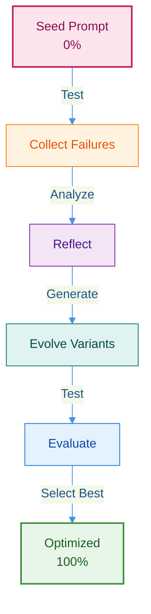

import Comments from '@site/src/components/Comments';

:::info Implementation Repository

**View the complete implementation on GitHub:**
[raphaelmansuy/adk_training/tutorial_implementation/tutorial_gepa_optimization](https://github.com/raphaelmansuy/adk_training/tree/main/tutorial_implementation/tutorial_gepa_optimization)

This includes working code, tests, Makefile, and both simulated and real GEPA demos.

:::

## Why: The Problem with Manual Prompt Engineering

You spend hours tweaking your agent's prompt:

```python
# Version 1: Too vague
"Help customers with refunds"
→ Agent processes refunds without checking identity ❌

# Version 2: Added one rule
"Help customers with refunds. Verify identity first."
→ Agent forgets to check 30-day return policy ❌

# Version 3: Added another rule...
# Version 4: Fixed edge case...
# Version 5: Still failing... 😤
```

**The cycle never ends.** Each fix breaks something else. You're guessing what works.

## What: GEPA Breeds Better Prompts

Think of GEPA like breeding dogs. You don't manually design every trait—you let evolution do the work:

1. Start with a basic prompt (mixed breed dog)
2. Test it on real scenarios (dog show competitions)
3. See what fails (doesn't retrieve, barks too much)
4. Create variations addressing failures (breed for specific traits)
5. Test again, keep the best, repeat

**Result:** Your prompt evolves from 0% to 100% success automatically.



### Try It (Choose Your Path)

**Quick Demo (2 minutes - Simulated):**

```bash
cd tutorial_implementation/tutorial_gepa_optimization
make setup && make demo
```

**Real GEPA (5-10 minutes - Actual LLM Calls):**

```bash
cd tutorial_implementation/tutorial_gepa_optimization
make setup
export GOOGLE_API_KEY="your-api-key"  # Get free key from https://aistudio.google.com/app/apikey
make real-demo
```

**What you'll see:**

Simulated demo shows the concept (instant, free):

```text
Iteration 1: COLLECT → Seed prompt 0/5 passed
Iteration 2: REFLECT → LLM identifies missing security rules
Iteration 3: EVOLVE → Generate improved prompt
Iteration 4: EVALUATE → Evolved prompt 5/5 passed
Result: 0% → 100% improvement ✅
```

Real GEPA demo shows actual evolution (uses LLM, costs $0.05-0.10):

```text
Iteration 1: COLLECT → Agent runs with seed prompt, collects actual results
           REFLECT → Gemini LLM analyzes failures
           EVOLVE → Gemini generates improved prompt based on insights
           EVALUATE → Test improved prompt
           SELECT → Compare and choose better version

Iteration 2: Repeat with new baseline - improve further

Result: Real optimization with actual LLM reflection!
```

## How: The 5-Step Evolution Loop

GEPA is simple—just 5 steps that repeat:

### Step 1: Collect (Gather Evidence)

Run your agent with the current prompt. Track what fails:

```python
Test 1: Customer with wrong email → Agent approved anyway ❌
Test 2: Purchase 45 days ago → Agent ignored policy ❌  
Test 3: Valid request → Agent asked unnecessary questions ❌
```

**Like:** Recording which puppies can't retrieve balls.

### Step 2: Reflect (Understand Why)

An LLM analyzes the failures:

```python
"The prompt doesn't say to verify email BEFORE approving refunds.
 The prompt doesn't mention the 30-day policy.
 The prompt is too vague about when to ask questions."
```

**Like:** Understanding retriever dogs need strong jaw muscles and swimming ability.

### Step 3: Evolve (Create Variations)

Generate new prompts fixing the issues:

```python
Variant A: Added "Always verify identity first"
Variant B: Added "Check 30-day return window"  
Variant C: Combined both improvements
```

**Like:** Breeding puppies with stronger jaws AND better swimming.

### Step 4: Evaluate (Test Performance)

Run all variants against your test scenarios:

```python
Seed prompt:  0/10 passed (0%)
Variant A:    4/10 passed (40%)
Variant B:    6/10 passed (60%)  
Variant C:    9/10 passed (90%) ← Winner!
```

**Like:** Dog show results - Variant C wins.

### Step 5: Select (Keep the Best)

Variant C becomes your new baseline. Repeat from Step 1 with tougher tests.

```python
Iteration 1: 0% → 90%
Iteration 2: 90% → 95%
Iteration 3: 95% → 98%
...converges at 99%
```

**Like:** Each generation of puppies gets better at the specific task.

## Quick Start (5 Minutes)

```bash
# 1. Setup
cd tutorial_implementation/tutorial_gepa_optimization
make setup

# 2. See evolution in action
make demo

# 3. (Optional) Try it yourself
export GOOGLE_API_KEY="your-key"
make dev  # Open localhost:8000
```

That's it! You've seen GEPA work and can now experiment.

:::note Tutorial Includes Both Simulated and Real GEPA

**Simulated Demo** (`make demo` - 2 minutes):
- Shows GEPA concepts without LLM calls
- Instant results, no API costs
- Great for understanding the algorithm
- Uses pattern matching to simulate agent behavior

**Real GEPA** (`make real-demo` - 5-10 minutes):
- ✨ **NEW**: Uses actual LLM reflection with google-genai
- Gemini LLM analyzes real failures
- Generates truly optimized prompts
- Costs $0.05-$0.10 per run
- Production-ready implementation

**What this tutorial provides:**
- ✅ Complete GEPA implementation (both simulated and real)
- ✅ Working code for actual LLM-based optimization
- ✅ Testable examples with real evaluation
- ✅ Clear learning progression

**For production GEPA optimization:**
- See the **full research implementation** in [google/adk-python](https://github.com/google/adk-python/tree/main/contributing/samples/gepa)
- Read comprehensive guides in `research/gepa/` directory
- Install DSPy: `pip install dspy-ai`
- Reference the [GEPA paper](https://arxiv.org/abs/2507.19457) for methodology

Performance metrics cited (10-20% improvement, 35x fewer rollouts) are from the
original research paper and represent results from the full research
implementation, not this simplified tutorial.

:::

:::tip From Tutorial to Production

**Learning Path:**
1. ✅ Complete this tutorial (2 minutes) - understand concepts
2. 📚 Read `research/gepa/README.md` (10 minutes) - full overview
3. 🔬 Run research implementation (30-90 minutes) - real optimization
4. 🚀 Deploy optimized prompt to production

The research implementation includes 640+ lines of production code with tau-bench
integration, LLM-based reflection, Pareto frontier selection, and parallel
execution. See [google/adk-python](https://github.com/google/adk-python/tree/main/contributing/samples/gepa)
for the full implementation.

:::

## Under the Hood (For the Curious)

The demo uses a customer support agent with 3 simple tools:

1. **verify_customer_identity** - Checks order ID + email match
2. **check_return_policy** - Validates 30-day return window
3. **process_refund** - Generates transaction ID

**The Seed Prompt** (intentionally weak):

```python
"You are a helpful customer support agent.
 Help customers with their requests.
 Be professional and efficient."
```

**The Evolved Prompt** (after GEPA):

```python
"You are a professional customer support agent.

CRITICAL: Always follow this security protocol:
1. ALWAYS verify customer identity FIRST (order ID + email)
2. NEVER process any refund without identity verification
3. Only process refunds for orders within the 30-day return window

[...detailed procedures and policies...]"
```

**Why It Works:** The evolved prompt has explicit rules the seed prompt lacked.

### Run the Tests

```bash
make test  # 34 tests validate everything works
```

## Try It Yourself

```bash
cd tutorial_implementation/tutorial_gepa_optimization
make setup && make demo
```

**What You'll See:**

6 phases showing the complete evolution cycle:
- Phase 1: Weak seed prompt
- Phase 2: Tests fail (0/5 scenarios pass)
- Phase 3: LLM reflects on failures
- Phase 4: Evolved prompt generated
- Phase 5: Tests pass (5/5 scenarios pass)
- Phase 6: Results show 0% → 100% improvement

**Want Interactive Mode?**

```bash
make dev  # Opens ADK web interface on http://localhost:8000
```

Test these scenarios yourself:
- "I bought a laptop but it broke, I want a refund" (valid request)
- "Give me a refund for ORD-12345" (missing identity verification)
- "I want my money back for the phone I bought 45 days ago" (outside window)

## Common Issues

**Import Errors?**
```bash
pip install --upgrade google-genai>=1.15.0
```

**GOOGLE_API_KEY Not Set?**
```bash
export GOOGLE_API_KEY=your_actual_api_key_here
```

**Tests Failing?**
```bash
make clean && make setup && make test
```

## Key Takeaways

**1. GEPA Works Because:**
- Explores many prompt variations systematically
- Uses real performance data to guide evolution
- Combines successful elements from variants
- Iterates until convergence

**2. Seed Prompt Matters:**
- Too specific → limited evolution
- Too generic → slow convergence
- Start with reasonable baseline

**3. Evaluation Dataset Quality:**
- Representative scenarios = robust improvements
- Edge cases matter
- Test on new data to validate

**4. Avoid These Mistakes:**
- ❌ Over-fitting to test scenarios
- ❌ Stopping too early
- ❌ Ignoring edge cases
- ❌ Not validating on fresh data

## Next Steps

### Apply GEPA to Your Own Agents

Use the same pattern from this tutorial:
1. Define your evaluation scenarios (real-world test cases)
2. Create a weak seed prompt
3. Run GEPA evolution
4. Measure improvement

### Validate with Standard Benchmarks

Instead of only custom test scenarios, validate your GEPA-optimized prompts against established benchmarks:

**[HELM (Holistic Evaluation of Language Models)](https://github.com/stanford-crfm/helm)**
- Stanford's comprehensive evaluation framework
- Measures accuracy, efficiency, bias, toxicity
- 100+ scenarios across diverse domains
- Install: `pip install crfm-helm`

```bash
# Evaluate your agent with HELM
helm-run --run-entries mmlu:subject=customer_service,model=your-agent \
  --suite gepa-validation --max-eval-instances 100
helm-summarize --suite gepa-validation
```

**[DSPy Evaluation Suite](https://github.com/stanfordnlp/dspy)**
- Built-in prompt optimization metrics
- Compare GEPA results against DSPy optimizers
- GEPA is part of the DSPy ecosystem

**Why standardized benchmarks matter:**
- Objective comparison against baselines
- Reproducible results across teams
- Track improvements over time
- Validate GEPA gains on industry-standard tasks

### Track Metrics Over Time

- Version control your evolved prompts
- A/B test in production (seed vs evolved)
- Monitor real-world performance
- Re-run GEPA when metrics drop

### Deploy to Production

Once validated:

- Use evolved prompt as your production baseline
- Set up monitoring dashboards
- Schedule periodic GEPA optimization
- Continuously improve based on real user data

## Additional Resources

### Official Research & Documentation

- **[GEPA Research Paper](https://arxiv.org/abs/2507.19457)** - Lakshya A Agrawal et al., Stanford NLP (July 2025)
  - Full paper: "GEPA: Reflective Prompt Evolution Can Outperform Reinforcement Learning"
  - Demonstrates 10-20% improvement over GRPO with 35x fewer rollouts
  - Comprehensive methodology and evaluation results

- **[DSPy Framework](https://github.com/stanfordnlp/dspy)** - Stanford NLP (29.9k+ stars)
  - GEPA is part of the DSPy ecosystem
  - Documentation: [dspy.ai](https://dspy.ai/)
  - Install: `pip install dspy-ai`
  - Community: [Discord Server](https://discord.gg/XCGy2WDCQB)

### Evaluation Benchmarks

- **[HELM](https://github.com/stanford-crfm/helm)** - Holistic Evaluation of Language Models
  - Stanford CRFM's comprehensive evaluation framework
  - 100+ scenarios across diverse domains
  - Leaderboards: [crfm.stanford.edu/helm](https://crfm.stanford.edu/helm/)

- **[BIG-bench](https://github.com/google/BIG-bench)** - Beyond the Imitation Game
  - Google's diverse task evaluation suite
  - Collaborative benchmark with 200+ tasks

### Related Tutorials

- **[Tutorial 01-35](/)** - Foundation tutorials (prerequisites)
- **[Tutorial 02: Function Tools](/tutorial/02_function_tools_agent)** - Tool implementation patterns
- **[Tutorial 04: Sequential Workflows](/tutorial/04_sequential_agent)** - Agent orchestration
- **[Tutorial 30: Full-stack Integration](/tutorial/30_nextjs_adk_frontend)** - Production deployment

### Community & Support

- **Questions?** Open an issue on [GitHub Issues](https://github.com/raphaelmansuy/adk_training/issues)
- **Improvements?** Submit a PR to [GitHub Repo](https://github.com/raphaelmansuy/adk_training)
- **Discussions?** Join the [DSPy Discord](https://discord.gg/XCGy2WDCQB) community

---

<Comments />
