import Comments from '@site/src/components/Comments';

## TIL: Pause and Resume Invocations - Resilient Agent Workflows

### Why Pause/Resume Invocations Matter

**The Problem**: Long-running agent tasks need to be interrupted gracefully or paused for human feedback without losing progress. System failures can interrupt execution mid-task, causing work to be lost.

**In one sentence**: Pause and Resume Invocations let agents checkpoint their state at key points and resume execution later without losing context.

### Why Should You Care?

**Problems it solves:**

- 🛡️ **Fault tolerance** - System failures don't cause work loss; resume from checkpoint
- 👤 **Human-in-the-loop** - Agent pauses to request feedback, then continues
- ⏱️ **Long-running tasks** - Complex workflows can pause at natural break points
- 🔄 **Multi-agent handoff** - State is preserved when handing off between agents
- 💾 **State persistence** - Complete execution context is saved automatically

**Perfect for:**

- Data processing pipelines (batch jobs with checkpoints)
- Customer support escalations (pause for supervisor review)
- Research workflows (save progress between analysis steps)
- Approval workflows (pause for human decision-making)
- Resilient production systems (automatic recovery from failures)

### Quick Example

```python
from google.adk.apps import App, ResumabilityConfig
from google.adk.agents import Agent

# Create agent as usual
agent = Agent(
    name="long_task_agent",
    model="gemini-2.0-flash",
    description="Agent for long-running tasks",
    instruction="Complete tasks with checkpoints."
)

# Enable pause/resume support
app = App(
    name="resumable_app",
    root_agent=agent,
    resumability_config=ResumabilityConfig(is_resumable=True)
)

# Initial invocation - creates checkpoint on agent completion
async for event in runner.run_async(session=session, new_message=user_input):
    last_invocation_id = event.invocation_id
    # Event includes: end_of_agent=True, agent_state={...}

# [Later] Resume from checkpoint with new input
async for event in runner.run_async(
    session=session,
    new_message=new_input,
    invocation_id=last_invocation_id  # Resume from here!
):
    # Execution continues from saved checkpoint
    pass
```

### How It Works (3 Key Concepts)

#### 1. State Checkpointing

When an agent completes, it emits an event with its state:

```python
event = Event(
    invocation_id='inv_1',
    author='agent_name',
    actions=EventActions(
        end_of_agent=True,           # Marks completion
        agent_state={'data': '...'}  # Persisted state
    ),
    content=response
)
```

The state is:

- **Automatic**: Framework handles it transparently
- **Serialized**: Converted to JSON for storage
- **Complete**: Includes all agent execution context

#### 2. State Restoration

When resuming, the framework restores the previous state:


The restoration process:

1. **Find** previous invocation events in session
2. **Extract** agent_state from checkpoint events
3. **Restore** to InvocationContext
4. **Continue** agent execution with saved state

#### 3. Configuration

Three simple settings to enable pause/resume:

```python
from google.adk.apps import ResumabilityConfig, App

# 1. Create config
config = ResumabilityConfig(is_resumable=True)

# 2. Attach to app
app = App(root_agent=agent, resumability_config=config)

# 3. That's it! Framework handles checkpointing automatically
```

### Use Cases

#### 1. Long-Running Data Processing

**Scenario**: Processing a large dataset in multiple stages

```
Stage 1: Validate Input     [CHECKPOINT 1]
              ↓
Stage 2: Process Data       [CHECKPOINT 2]
              ↓
Stage 3: Analyze Results    [CHECKPOINT 3]
              ↓
Stage 4: Generate Report    [CHECKPOINT 4]
              ↓
         Complete
```

If the system crashes after Stage 2, just resume with `invocation_id` from Stage 2's checkpoint.

#### 2. Human-in-the-Loop Approval

**Scenario**: Agent prepares decision, waits for human approval


#### 3. Fault Tolerance

**Scenario**: Production system with failures


#### 4. Multi-Agent Workflows

**Scenario**: Sequential agent handoff with state preservation

```mermaid
flowchart TD
    subgraph inv1["Invocation 1"]
        direction LR
        root["🚀 root_agent<br/>START"]
        sub1["📋 sub_agent1<br/>Processing"]
        chk1["💾 Checkpoint<br/>State Saved"]
        pause["⏸️ PAUSE<br/>Handoff Point"]
        root --> sub1 --> chk1 --> pause
    end

    subgraph inv2["Invocation 2 Resume"]
        direction LR
        resume["▶️ RESUME<br/>Load State"]
        sub1r["📋 sub_agent1<br/>Continued"]
        sub2["🔄 sub_agent2<br/>Next Stage"]
        done["✅ COMPLETE"]
        resume --> sub1r --> sub2 --> done
    end

    pause -.->|State Restored| resume

    style inv1 fill:#e8f4f8
    style inv2 fill:#f0f8e8
    style chk1 fill:#fff4e6
    style pause fill:#ffe6e6
    style resume fill:#f0e6ff
    style done fill:#e6ffe6
```



Each agent checkpoint includes full state for potential resumption.

### Key Features

#### ResumabilityConfig

```python
config = ResumabilityConfig(
    is_resumable=True  # Enable pause/resume support
)
```

**That's all!** The framework handles:

- State serialization
- Checkpoint creation
- State restoration on resume
- Event history management

#### Agent State Types

Different agent types have specialized states:

- **LoopAgent**: `current_sub_agent`, `times_looped`
- **SequentialAgent**: `completed_agents`, `current_index`
- **ParallelAgent**: `agent_states`, `completion_status`

Custom agents can implement their own state via:

```python
class MyAgent(BaseAgent):
    def get_current_state(self) -> dict:
        return {
            'progress': self.progress,
            'data': self.accumulated_data,
            'timestamp': datetime.now()
        }
```

#### Resumption with Optional New Input

Resume with new user input:

```python
await runner.run_async(
    session=session,
    new_message="New feedback",           # Optional
    invocation_id=previous_invocation_id  # Required
)
```

Or resume with previous input:

```python
await runner.run_async(
    session=session,
    new_message=None,                     # None = reuse
    invocation_id=previous_invocation_id
)
```

### Event Flow Example

Events flow through the session with checkpoints marked for potential resumption:

```mermaid
graph LR
    A["👤 User Message<br/>author: user<br/>content: input"] --> B["🤖 Agent Processing<br/>author: agent<br/>content: ..."]
    B --> C["✅ Checkpoint 1<br/>end_of_agent: True<br/>agent_state: {...}"]
    C --> D["⏸️ PAUSE<br/>State Saved"]
    D --> E["💾 Session Storage<br/>Events Persisted"]

    E --> F["⏳ Later...<br/>Resume Request<br/>+ invocation_id"]

    F --> G["📥 Restore State<br/>Load agent_state<br/>from Event 3"]

    G --> H["🔄 Resume Agent<br/>Execute from<br/>Checkpoint"]

    H --> I["✅ Checkpoint 2<br/>end_of_agent: True<br/>agent_state: {...}"]

    I --> J["✓ Complete"]

    style C fill:#fff4e6
    style D fill:#ffe6e6
    style E fill:#e8f4f8
    style F fill:#f0e6ff
    style G fill:#f0e6ff
    style I fill:#e6ffe6
    style J fill:#e6ffe6
```



Timeline visualization:

```
Session.events = [
  Event 1: User Message (author: 'user')
    content: { text: "Process this data" }
    agent_state: None
    |
    |
  Event 2: Agent Processing
    |    author: 'agent'
    |    content: { text: "Processing..." }
    |
    v
  Event 3: Agent Complete [CHECKPOINT]
    author: 'agent'
    actions: { end_of_agent: True }
    agent_state: { "state_key": "state_value" }
    ---> SAVED IN SESSION STORAGE <---
    |
    | [PAUSE - Can Resume Here]
    |
    v
  Event 4: Resume Point
    [Later] Resumption with invocation_id
    |
    v
  Event 5: Agent Continues
    author: 'agent'
    agent_state: RESTORED from Event 3
    |
    v
  Event 6: Agent Complete [CHECKPOINT]
    author: 'agent'
    actions: { end_of_agent: True }
    agent_state: { "agent2_state": "..." }
    ---> SAVED IN SESSION STORAGE <---
]
```

### Architecture Overview

**New Components**:

- `ResumabilityConfig`: Configuration class
- `BaseAgentState`: Abstract state base class
- `LoopAgentState`, `SequentialAgentState`, `ParallelAgentState`: Specialized states
- `Runner._setup_context_for_resumed_invocation()`: Resumption logic

**Enhanced Components**:

- `App`: Now accepts `resumability_config`
- `InvocationContext`: Populates agent states from events
- `EventActions`: Includes `agent_state` field
- `Event`: Can carry agent state information

### Testing Your Implementation

The implementation includes comprehensive tests:

```bash
# Run all tests
pytest tests/ -v

# Run specific test
pytest tests/test_agent.py::TestAgentConfiguration -v

# With coverage
pytest tests/ --cov=pause_resume_agent
```

Expected test patterns:

```python
# Test both resumable and non-resumable modes
@pytest.mark.parametrize('resumable', [True, False])
async def test_pause_resume(resumable: bool):
    config = ResumabilityConfig(is_resumable=resumable)
    app = App(root_agent=agent, resumability_config=config)
    # Test execution and checkpoint handling
```

### Best Practices

1. **Always enable ResumabilityConfig if you need pause/resume**

   ```python
   config = ResumabilityConfig(is_resumable=True)
   ```

2. **Understand your checkpoint points** - Know where your agent naturally completes and saves state

3. **Test resumption scenarios** - Test both:

   - Normal execution from start
   - Resumption from checkpoint

4. **Handle state errors gracefully**

   ```python
   try:
       await runner.run_async(session, invocation_id=prev_id)
   except StateRestorationError:
       # Fallback: start fresh
       await runner.run_async(session, new_message=original_input)
   ```

5. **Clean up old sessions** - Archive sessions to avoid accumulation over time

### State Lifecycle

Understanding the state transition flow is crucial for building reliable pause/resume workflows:


### Common Patterns

#### Pattern 1: Simple Pause/Resume

```python
# Initial execution
async for event in runner.run_async(session, new_message=user_input):
    invocation_id = event.invocation_id

# Later: Resume
async for event in runner.run_async(
    session=session,
    new_message=new_input,
    invocation_id=invocation_id
):
    pass
```

#### Pattern 2: Human-in-the-Loop

```python
# Agent pauses for feedback
await runner.run_async(session, new_message="Start process")

# Human reviews and provides input
human_feedback = request_human_input()

# Resume with feedback
await runner.run_async(
    session=session,
    new_message=human_feedback,
    invocation_id=paused_invocation_id
)
```

#### Pattern 3: Fault-Tolerant Processing

```python
try:
    invocation_id = None
    async for event in runner.run_async(session, new_message=data):
        invocation_id = event.invocation_id
except Exception as e:
    logger.error(f"Failed, resuming from {invocation_id}")
    # Resume from checkpoint after fix
    async for event in runner.run_async(
        session=session,
        invocation_id=invocation_id
    ):
        pass
```

### Limitations & Considerations

1. **App Configuration Required** - Must explicitly set `is_resumable=True`

2. **JSON Serialization** - Agent state must be JSON-serializable

3. **Session Storage** - Resuming requires session events from original invocation

4. **Sub-Agent Resumption** - Current limitation for resuming mid-sub-agent (documented in ADK)

### Related Features

- **Context Caching** (v1.15.0): Complement with context preservation
- **Session Management**: VertexAiSessionService, DatabaseSessionService
- **Event Streaming**: Observe checkpoint events in real-time

### Implementation Example

See the companion implementation: [til_pause_resume_20251020](https://github.com/raphaelmansuy/adk_training/tree/main/til_implementation/til_pause_resume_20251020)

**Features:**

- ✅ Full agent implementation with checkpoint-aware tools
- ✅ 19 comprehensive tests
- ✅ Make commands for setup, test, dev, demo
- ✅ Example tools: data processing, checkpoint validation, resumption hints
- ✅ Complete documentation in README

### Quick Start with Example

```bash
# Clone/enter the example
cd til_implementation/til_pause_resume_20251020

# Setup
make setup

# Add API key
echo "GOOGLE_API_KEY=your_key" >> pause_resume_agent/.env

# Run tests
make test

# Launch web interface
make dev
```

### References

- **ADK GitHub**: https://github.com/google/adk-python
- **v1.16.0 Release**: https://github.com/google/adk-python/compare/v1.15.1...v1.16.0
- **Related Commits**: ce9c39f, 2f1040f, 1ee01cc, f005414, fbf7576

---

## Summary

Pause and Resume Invocations in ADK v1.16.0 enable building **resilient, interactive agent systems** by:

- ✅ Checkpointing agent state automatically at completion points
- ✅ Enabling graceful pauses for human feedback or system recovery
- ✅ Restoring full execution context on resumption
- ✅ Supporting long-running workflows without state loss
- ✅ Providing fault tolerance through state persistence

This feature is essential for production agents that need reliability, human oversight, or multi-step processing workflows.

---

## See Also

### Related TILs

- **[TIL: Context Compaction](til_context_compaction_20250119)** -
  Perfect combo! Use Pause/Resume to checkpoint at milestones, then apply
  Context Compaction to reduce token growth across resumed sessions. Essential
  for long-running workflows that span multiple invocations.

- **[TIL: Evaluating Tool Use Quality](til_rubric_based_tool_use_quality_20251021)** -
  After implementing pause/resume workflows, measure if your paused agents
  maintain tool quality across resumptions. Validates state restoration doesn't
  degrade agent behavior.

- **[Back to TIL Index](til_index)** - Browse all quick-learn guides

### Related ADK Tutorials

- **[Tutorial 01: Hello World Agent](hello_world_agent)** -
  Foundation for all agent patterns; resumability works with all agent types

- **[Tutorial 08: State & Memory](state_memory)** -
  Comprehensive state management patterns including resumable state patterns

- **[Tutorial 13: Events & Observability](events_observability)** -
  Understand how events persist checkpoints and enable resumption

### ADK Official Documentation

- **[Pause & Resume Invocations](https://github.com/google/adk-python/blob/main/docs/pause_resume.md)** -
  Official ADK documentation with API reference

- **[State Management](https://github.com/google/adk-python/blob/main/docs/state_management.md)** -
  Complete state management patterns and best practices

- **[ResumabilityConfig](https://github.com/google/adk-python/blob/main/google/adk/apps/app.py)** -
  Source code and implementation details

### Related Resources & Patterns

- **[Deploy AI Agents: Production Strategies](/blog/deploy-ai-agents)** -
  Understand resilience and fault tolerance in production systems

- **[The Multi-Agent Pattern: Managing Complexity](/blog/multi-agent-pattern-complexity-management)** -
  Understand state management across complex workflows and agent handoffs

---

<Comments />
