import Comments from '@site/src/components/Comments';

## TIL: Evaluating Tool Use Quality - Does Your Agent Pick the Right Tools?

### The Problem

**Scenario**: Your agent gets the final answer right, but did it get
there the right way?

Imagine you have a data analysis agent that:

- ✅ Produces the correct report (final answer is good)
- ❌ But uses the wrong data query tool (inefficient)
- ❌ Calls tools in the wrong order (wasteful)
- ❌ Misses tool combinations that would be better (suboptimal)

**The Gap**: Evaluating just the final answer misses these critical
problems. You need to assess how well the agent used its tools.

**In one sentence**: Tool Use Quality Metric evaluates whether agents
selected the right tools and used them appropriately to solve problems,
separate from final answer quality.

### Why Should You Care?

**Problems it solves:**

- 🎯 **Catches tool selection mistakes** - Agent picks wrong tool even though correct one exists
- 🔄 **Prevents tool misuse** - Ensures tools are called in logical sequence
- ⚡ **Identifies inefficiency** - Spots unnecessary tool calls or missing combinations
- 📊 **Separates concerns** - Different metrics for tool quality vs answer quality
- 🔍 **Improves agent training** - Gives precise feedback on tool-related failures

**Real-world impact:**

A customer support agent that:

- Calls `get_customer_info()` AFTER `process_refund()` (wrong order)
- Gets the refund processed correctly (final answer looks good)
- But violates business logic (should verify customer first)

**Without Tool Use Quality metrics**: You miss this bug. Final answer was "correct."

**With Tool Use Quality metrics**: You catch it immediately. The tool sequence evaluation fails.

### Quick Example: Running Real Evaluation

The ADK provides `AgentEvaluator.evaluate()` to run real RUBRIC_BASED_TOOL_USE_QUALITY_V1 evaluation:

```python
import asyncio
from google.adk.evaluation.agent_evaluator import AgentEvaluator

async def run_evaluation():
    # Evaluation automatically:
    # 1. Loads your agent module
    # 2. Runs it against test cases in evalset.json
    # 3. LLM judge evaluates tool sequences against rubrics
    # 4. Reports pass/fail with scores

    results = await AgentEvaluator.evaluate(
        agent_module="tool_use_evaluator",
        eval_dataset_file_path_or_dir="tool_use_quality.evalset.json",
    )

    # Results include:
    # - Overall score (0.0-1.0)
    # - Per-rubric scores
    # - Expected vs actual tool calls (side-by-side)
    # - Pass/fail status vs threshold
    print(results)

asyncio.run(run_evaluation())
```

**What this does:**

1. ✅ Loads `tool_use_evaluator` agent
2. ✅ Reads test cases from evalset (good/bad tool sequences)
3. ✅ Runs evaluation config with 4 rubrics
4. ✅ Calls Gemini model as judge (3 samples per rubric)
5. ✅ Returns scores and detailed comparison

**Expected output:**

```
Summary: `EvalStatus.FAILED` for Metric: `rubric_based_tool_use_quality_v1`.
Expected threshold: `0.7`, actual value: `0.25`.

[Detailed table showing:]
- eval_status: FAILED/PASSED
- score: 0.25 (failed threshold of 0.7)
- prompt: "Analyze and prepare the dataset..."
- expected_response: "Dataset analyzed..."
- actual_response: "Okay, I will analyze the dataset..."
- expected_tool_calls: analyze_data → extract_features → validate_quality
- actual_tool_calls: [empty if not invoked, or list of actual calls]
```

**Key insight:** The evaluation shows exactly where agents deviate from expected tool sequences, making it easy to identify and fix tool usage problems.

### How It Works (3 Key Concepts)

#### 1. Separating Tool Quality from Answer Quality

Unlike final response evaluation, tool use quality focuses specifically
on tool-related decisions:


**Key insight**: A correct answer from the wrong tool sequence = lower tool use quality, even with high final answer quality.

#### 2. Rubric-Based Evaluation Framework

The metric uses a rubric that checks:

```
TOOL USE QUALITY RUBRIC:

1. Tool Selection Appropriateness (40%)
   ✓ Were the selected tools suitable for the task?
   ✗ Did agent use wrong tool when better option existed?
   ✗ Did agent use deprecated/inefficient tool?

2. Tool Sequencing Logic (35%)
   ✓ Were tools called in logical order?
   ✗ Tool 3 depends on Tool 2 output (backwards)?
   ✗ Unnecessary context switches between tools?

3. Tool Combination Efficiency (15%)
   ✓ Did agent combine tools effectively?
   ✗ Missing obvious tool combinations?
   ✗ Over-using tools when one would suffice?

4. Error Recovery (10%)
   ✓ If tool failed, did agent retry/alternate?
   ✗ Gave up after first tool failure?
   ✗ Repeated same failing tool call?

TOTAL QUALITY SCORE = Weighted average of above
```

**Visual breakdown of how rubrics combine into final score:**

```mermaid
graph TB
    R1["🎯 Tool Selection<br/>40% Weight"] -->|Scores 0.0-1.0| Calc["⚙️ Score<br/>Calculation"]
    R2["🔄 Tool Sequencing<br/>35% Weight"] -->|Scores 0.0-1.0| Calc
    R3["⚡ Combination Efficiency<br/>15% Weight"] -->|Scores 0.0-1.0| Calc
    R4["🔧 Error Recovery<br/>10% Weight"] -->|Scores 0.0-1.0| Calc

    Calc -->|Weighted Average| Final["📊 Final Score<br/>0.0 - 1.0"]

    Final -->|≥ 0.8| Pass["✅ EXCELLENT<br/>Tool Quality"]
    Final -->|0.6 - 0.8| Fair["⚠️ GOOD<br/>Some Issues"]
    Final -->|< 0.6| Fail["❌ POOR<br/>Major Issues"]

    style R1 fill:#d4f1f4,stroke:#76b8d4,color:#000
    style R2 fill:#d4f1f4,stroke:#76b8d4,color:#000
    style R3 fill:#d4f1f4,stroke:#76b8d4,color:#000
    style R4 fill:#d4f1f4,stroke:#76b8d4,color:#000
    style Calc fill:#ffe6cc,stroke:#ffb347,color:#000
    style Final fill:#fff4e6,stroke:#ffa500,color:#000
    style Pass fill:#a8e6a8,stroke:#6bbf6b,color:#000
    style Fair fill:#fff5b3,stroke:#ffeb99,color:#000
    style Fail fill:#ffb3b3,stroke:#ff6b6b,color:#000
```



#### 3. Distinction from Other Metrics

| Metric                     | Evaluates                 | Example                               |
| -------------------------- | ------------------------- | ------------------------------------- |
| **Final Response Quality** | Is the answer correct?    | "Is the report accurate?"             |
| **Tool Use Quality**       | Did agent use tools well? | "Did agent query the right database?" |
| **Safety Evaluator**       | Is it safe/compliant?     | "Did agent violate guardrails?"       |
| **Trajectory**             | Full execution path       | "Was the entire reasoning solid?"     |

**Key difference**: Tool use is about **PROCESS**, not RESULT.

```
Example Query: "Get customer's last 3 orders and calculate refund"

AGENT A:
1. Calls: get_customer() → Returns customer info
2. Calls: get_orders() → Returns last 3 orders
3. Calls: calculate_refund() → Correct answer!

AGENT B:
1. Calls: calculate_refund() → Error (no customer context)
2. Calls: get_customer() → Returns customer info
3. Calls: get_orders() → Correct answer finally!

Final Response Quality:
  Agent A: ✅ High (correct answer)
  Agent B: ✅ High (correct answer)

Tool Use Quality:
  Agent A: ✅ High (logical sequence, right tools)
  Agent B: ❌ Low (wrong order, wasted call)
```

### Use Case 1: Data Analytics Agent

```python
# Evaluate a data analysis agent's tool usage
criterion = Criterion(
    name="data_pipeline_quality",
    description="Agent uses correct data tools in optimal order",
    metric=PrebuiltMetrics.RUBRIC_BASED_TOOL_USE_QUALITY_V1,
    threshold=0.8,
)

# Good tool sequence: Extract → Transform → Aggregate
# Bad tool sequence: Aggregate → Transform → Extract (wrong order!)
# Or: Extract → Extract → Extract (missing Transform step)
```

**What it catches**:

- ✅ Correct tool order (Extract before Transform)
- ❌ Skipping necessary transformation steps
- ❌ Using wrong data source tool
- ❌ Missing joins between datasets

### Use Case 2: Customer Support Agent

```python
# Evaluate support agent's tool usage
criterion = Criterion(
    name="support_workflow_quality",
    description="Agent follows proper support workflow",
    metric=PrebuiltMetrics.RUBRIC_BASED_TOOL_USE_QUALITY_V1,
    threshold=0.75,
)

# Proper workflow: Verify → Assess → Resolve
# Bad workflow: Resolve → Verify (backwards!)
# Or: Verify → Verify → Assess (redundant)
```

**What it catches**:

- ✅ Verification before refund processing
- ❌ Processing refund without checking customer status
- ❌ Checking same condition twice
- ❌ Missing authorization step

### Use Case 3: Research Agent

```python
# Evaluate research agent's tool usage
criterion = Criterion(
    name="research_methodology",
    description="Agent uses research tools methodically",
    metric=PrebuiltMetrics.RUBRIC_BASED_TOOL_USE_QUALITY_V1,
    threshold=0.85,
)

# Good sequence: Search → Retrieve → Cross-reference → Synthesize
# Bad sequence: Search → Synthesize (missing verification)
# Or: Search → Cross-reference → Retrieve (wrong order)
```

**What it catches**:

- ✅ Proper research flow
- ❌ Synthesizing before verifying sources
- ❌ Missing comparative analysis steps
- ❌ Not cross-checking information

### Configuration Reference

```python
from google.adk.evaluation import (
    Criterion,
    PrebuiltMetrics,
    LlmAsJudge,
)

# Define evaluation criterion with tool use metric
criterion = Criterion(
    name="tool_use_quality",
    description="Evaluates quality of tool selection and usage",
    metric=PrebuiltMetrics.RUBRIC_BASED_TOOL_USE_QUALITY_V1,
    threshold=0.7,  # Require 70% tool use quality
)

# Create evaluator
evaluator = LlmAsJudge(
    model="gemini-2.0-flash",  # LLM for evaluation
    criteria=[criterion],
)

# Evaluate agent execution
result = evaluator.evaluate(
    invocation=agent_result,
)
```

| Parameter     | Type  | Purpose                                                   |
| ------------- | ----- | --------------------------------------------------------- |
| `metric`      | Enum  | Set to `PrebuiltMetrics.RUBRIC_BASED_TOOL_USE_QUALITY_V1` |
| `threshold`   | float | Min score (0-1) for pass/fail                             |
| `name`        | str   | Human-readable criterion name                             |
| `description` | str   | What you're evaluating                                    |

### Pro Tips

💡 **Tip 1 - Combine metrics**: Use tool use quality + final response quality for complete evaluation.

```python
criteria = [
    Criterion(
        name="final_answer_quality",
        metric=PrebuiltMetrics.RUBRIC_BASED_FINAL_RESPONSE_QUALITY_V1,
        threshold=0.8,
    ),
    Criterion(
        name="tool_use_quality",
        metric=PrebuiltMetrics.RUBRIC_BASED_TOOL_USE_QUALITY_V1,
        threshold=0.7,
    ),
]

# Now you catch both:
# - Agents that get lucky with right answer, wrong method
# - Agents that use tools perfectly but get wrong answer
```

💡 **Tip 2 - Set realistic thresholds**: Tool use is complex; be generous with initial thresholds.

```python
# Too strict - rarely passes
threshold=0.95  # ❌ Unrealistic

# Realistic baseline
threshold=0.7   # ✅ Allows some inefficiency

# Focus on improvements
threshold=0.8   # ✅ After you've optimized
```

💡 **Tip 3 - Log tool sequences for debugging**: When tool use quality is low, inspect the actual sequence.

```python
# In your agent callback/logging
print("Tool sequence used:", [
    tool_call.name for tool_call in invocation.tool_calls
])

# Compare with optimal:
print("Optimal sequence:", expected_tools)

# Visualize differences to identify patterns
```

### When NOT to Use It

⚠️ **Avoid when**:

- Simple agents with only one tool (no sequencing to evaluate)
- Toolless workflows (e.g., pure reasoning agents)
- Tool usage is non-deterministic (truly no "right" order)
- Testing final answer correctness only (use Response Quality instead)

⚠️ **Combine with**:

- **Final Response Quality**: Check answer correctness independently
- **Safety Evaluator**: Ensure tool usage is compliant
- **Trajectory Evaluator**: Full execution path analysis

### Complete Working Implementation

The full implementation includes:

- Agent with multiple tools demonstrating different usage patterns
- Evaluation framework setup with criteria
- Comprehensive test suite validating evaluations
- Real example invocations to evaluate
- Development and testing utilities

```bash
cd til_implementation/til_rubric_based_tool_use_quality_20250121/
make setup       # Install dependencies
make test        # Run evaluation tests
make evaluate    # ⭐ RUN REAL EVALUATION (NEW!)
make dev         # Launch interactive evaluation UI
make demo        # Quick validation
```

**The `make evaluate` Command (Real Evaluation):**

```bash
$ make evaluate

📝 TEST CASES SUMMARY
Test Case 1: good_sequence_complete_pipeline
  Description: Complete 4-step pipeline (analyze → extract → validate → apply)
  Expected Score: 0.95-1.0 (excellent)

Test Case 2: bad_sequence_skipped_validation
  Description: Missing steps (extract → apply, no analyze or validate)
  Expected Score: 0.25-0.4 (poor)

Test Case 3: good_sequence_proper_analysis
  Description: Good analysis pipeline (analyze → extract → validate)
  Expected Score: 0.8-0.9 (good)

🔍 RUNNING EVALUATION
📋 EVALUATION CONFIGURATION
Threshold: 0.7
Judge Model: gemini-2.5-flash
Rubrics: 4
  • proper_tool_order: Agent calls analyze_data BEFORE extract_features...
  • complete_pipeline: All 4 tools called in sequence...
  • validation_before_model: Quality validated before modeling...
  • no_tool_failures: All tool calls succeed with proper parameters...

[LLM Judge evaluates each test case against rubrics...]

⚠️ Evaluation ran but test cases failed scoring threshold:
   Expected threshold: 0.7, actual value: 0.25

This means the evaluation framework is working correctly!
The test agent didn't match expected tool sequences.

In a real scenario, you would:
1. Review the expected vs actual tool calls above
2. Adjust agent instructions to match expected behavior
3. Re-run the evaluation to see if scores improve
```

**What's happening under the hood:**

```python
# evaluate_tool_use.py creates:
evalset = {
    "eval_cases": [
        {
            "eval_id": "good_sequence_complete_pipeline",
            "intermediate_data": {
                "tool_uses": [
                    {"name": "analyze_data", ...},
                    {"name": "extract_features", ...},
                    {"name": "validate_quality", ...},
                    {"name": "apply_model", ...}
                ]
            }
        },
        # ... bad and partial sequences
    ]
}

# Then calls:
results = await AgentEvaluator.evaluate(
    agent_module="tool_use_evaluator",
    eval_dataset_file_path_or_dir="tool_use_quality.evalset.json",
)

# Which internally:
# 1. Loads your agent
# 2. Compares actual tool calls vs expected
# 3. Uses Gemini as judge to evaluate against rubrics
# 4. Returns scores (0.0-1.0)
# 5. Shows pass/fail vs threshold
```

**Complete evaluation workflow visualization:**

```mermaid
graph TD
    Start["🚀 Start<br/>make evaluate"] -->|Create Test Cases| Step1["📝 Step 1<br/>Generate<br/>evalset.json"]

    Step1 -->|3 test cases| Step2["⚙️ Step 2<br/>Load Test<br/>Configuration"]

    Step2 -->|Rubric rules| Step3["🔍 Step 3<br/>Initialize<br/>AgentEvaluator"]

    Step3 -->|Gemini Judge| Step4["⚡ Step 4<br/>Run Tests &<br/>Compare Sequences"]

    Step4 -->|Tool calls| Step5["📊 Step 5<br/>Score Using<br/>Rubrics"]

    Step5 -->|0.0-1.0 scores| Judge{"Score ≥<br/>Threshold?"}

    Judge -->|✅ Yes| Result_Pass["✅ PASS<br/>Good Tool Usage"]
    Judge -->|❌ No| Result_Fail["❌ FAIL<br/>Needs Work"]

    Result_Pass -->|Report| End["📈 End<br/>Review Results"]
    Result_Fail -->|Report| End

    style Start fill:#e8f5e9,stroke:#4caf50,color:#000
    style Step1 fill:#d4f1f4,stroke:#76b8d4,color:#000
    style Step2 fill:#d4f1f4,stroke:#76b8d4,color:#000
    style Step3 fill:#d4f1f4,stroke:#76b8d4,color:#000
    style Step4 fill:#fff3e0,stroke:#ffb74d,color:#000
    style Step5 fill:#fff3e0,stroke:#ffb74d,color:#000
    style Judge fill:#f3e5f5,stroke:#ce93d8,color:#000
    style Result_Pass fill:#a8e6a8,stroke:#6bbf6b,color:#000
    style Result_Fail fill:#ffb3b3,stroke:#ff6b6b,color:#000
    style End fill:#e8f5e9,stroke:#4caf50,color:#000
```



**Test the implementation:**

```bash
# Run from implementation directory
pytest tests/ -v

# Expected output:
# test_agent.py::TestAgentConfiguration::test_agent_name PASSED
# test_agent.py::TestAgentConfiguration::test_agent_has_tools PASSED
# test_agent.py::TestToolFunctionality::test_analyze_data_success PASSED
# test_tool_use_evaluator.py::test_evaluation_framework PASSED
#
# 23 passed in 0.42s
```

### Real-World Example: Multi-Step Query

Here's how tool use quality reveals hidden problems:

```python
# SCENARIO: Customer requests refund analysis

# AGENT EXECUTION:
def agent_workflow():
    # Step 1: Verify customer exists
    result1 = get_customer(customer_id="12345")

    # Step 2: Check order history
    result2 = get_orders(customer_id="12345")

    # Step 3: Calculate eligible refund
    result3 = calculate_refund(orders=result2.data)

    # Step 4: Process refund
    result4 = process_refund(customer_id="12345", amount=result3.amount)

    return result4

# EVALUATION RESULTS:

Final Response Quality: ✅ PASS (0.9)
  - Correct refund amount
  - Right customer ID
  - Proper documentation

Tool Use Quality: ❌ FAIL (0.45)
  - ❌ Called get_customer() but never used the result
  - ✅ Correct sequence: Verify → Check Orders → Calculate → Process
  - ❌ Could have combined verify + order check into single call
  - ❌ get_customer() returned sensitive data not needed (security issue)

IMPROVEMENT NEEDED: Optimize tool usage, not answer correctness
```

**Visual comparison: Good vs Bad tool sequencing:**

```mermaid
graph TD
    subgraph Good["✅ GOOD Tool Sequence (Score: 0.9)"]
        G1["1️⃣ get_customer<br/>customer_id"]
        G2["2️⃣ get_orders<br/>customer_id"]
        G3["3️⃣ calculate_refund<br/>orders data"]
        G4["4️⃣ process_refund<br/>amount"]

        G1 -->|result| G2
        G2 -->|orders| G3
        G3 -->|amount| G4
        G4 -->|Refund Processed| G_Result["✅ Success<br/>Correct Flow"]
    end

    subgraph Bad["❌ BAD Tool Sequence (Score: 0.35)"]
        B1["1️⃣ calculate_refund<br/>❌ No data yet!"]
        B2["2️⃣ get_customer<br/>customer_id"]
        B3["3️⃣ get_orders<br/>customer_id"]
        B4["4️⃣ process_refund<br/>wrong amount"]

        B1 -->|Error| B2
        B2 -->|retry| B3
        B3 -->|orders| B4
        B4 -->|Refund Failed| B_Result["❌ Wrong Order<br/>Extra Calls"]
    end

    style Good fill:#f0f9f0,stroke:#a8e6a8,color:#000
    style Bad fill:#fef5f5,stroke:#ffb3b3,color:#000
    style G_Result fill:#a8e6a8,stroke:#6bbf6b,color:#000
    style B_Result fill:#ffb3b3,stroke:#ff6b6b,color:#000
    style G1 fill:#d4f1f4,stroke:#76b8d4,color:#000
    style G2 fill:#d4f1f4,stroke:#76b8d4,color:#000
    style G3 fill:#d4f1f4,stroke:#76b8d4,color:#000
    style G4 fill:#d4f1f4,stroke:#76b8d4,color:#000
    style B1 fill:#ffe6e6,stroke:#ff9999,color:#000
    style B2 fill:#ffe6e6,stroke:#ff9999,color:#000
    style B3 fill:#ffe6e6,stroke:#ff9999,color:#000
    style B4 fill:#ffe6e6,stroke:#ff9999,color:#000
```



### Understanding Rubric Scoring

Tool Use Quality produces a **single score 0.0-1.0**:

```
1.0 = Perfect tool usage
  - Right tools for task
  - Optimal sequence
  - No waste or errors
  - Perfect recovery

0.8 = Very good
  - Right tools, minor inefficiency
  - One unnecessary call
  - Good error handling

0.5 = Adequate
  - Correct answer but poor tool choices
  - Some wrong tool uses
  - Backwards sequencing

0.0 = Failed
  - Wrong tools entirely
  - Tools called in wrong order
  - Unnecessary tool combinations
```

### Next Steps After Learning

1. 📖 **Read related evaluation tutorial**: Tutorial on ADK evaluation framework for comprehensive understanding
2. 🚀 **Implement in your agent**: Use tool use quality criteria in your evaluation pipeline
3. 🔧 **Combine with other metrics**: Build comprehensive evaluation combining multiple criteria
4. 📊 **Track metrics over time**: Monitor tool use quality as you improve agents

## Key Takeaway

**Tool Use Quality evaluation catches the hidden problems that final answer metrics miss.**

Your agent might be getting the right answer through the wrong process. Tool Use Quality Metric forces you to care about HOW agents solve problems, not just IF they solve them.

Perfect for production agents where efficiency, compliance, and proper workflows matter as much as correctness.

Catch tool misuse before production. ✨

---

## See Also

### Related TILs

- **[TIL: Pause and Resume Invocations](til_pause_resume_20251020)** -
  Use pause/resume to implement human-in-the-loop workflows that verify tool
  quality before proceeding. Perfect for evaluating agent decisions at
  checkpoints.

- **[TIL: Context Compaction](til_context_compaction_20250119)** -
  Ensure context compaction doesn't degrade tool selection quality. Monitor
  tool use quality metrics as context becomes more compressed.

- **[Back to TIL Index](til_index)** - Browse all quick-learn guides

### Related ADK Tutorials

- **[Tutorial 01: Hello World Agent](/01_hello_world_agent)** -
  Foundation for understanding agents that will be evaluated for tool
  quality

- **[Tutorial 02: Function Tools](/02_function_tools)** -
  Learn how to design tools that agents will be evaluated on; crucial for
  tool use quality metrics

- **[Tutorial 06: Multi-Agent Systems](/06_multi_agent_systems)** -
  Learn about combining agents efficiently; relevant to tool use quality
  in larger systems

- **[Tutorial 09: Evaluation & Testing](/09_evaluation_testing)** -
  Comprehensive guide to all evaluation metrics and frameworks

### ADK Official Documentation

- **[Evaluation Framework](https://github.com/google/adk-python/blob/main/docs/evaluation.md)** -
  Official ADK evaluation documentation

- **[Tool Use Quality Metric](https://github.com/google/adk-python/blob/main/google/adk/evaluation/metrics.py)** -
  Source code and implementation details

- **[Agent Evaluator API](https://github.com/google/adk-python/blob/main/google/adk/evaluation/agent_evaluator.py)** -
  Complete API reference for running evaluations

### Related Resources & Patterns

- **[Deploy AI Agents: Production Strategies](/blog/deploy-ai-agents-5-minutes)** -
  Understand quality assurance and evaluation in production systems

## Questions?

- 💬 Comment below with your evaluation questions
- 🐛 Found an issue? Check the implementation tests
- 🚀 Ready to evaluate your agent? See the implementation

<Comments />
