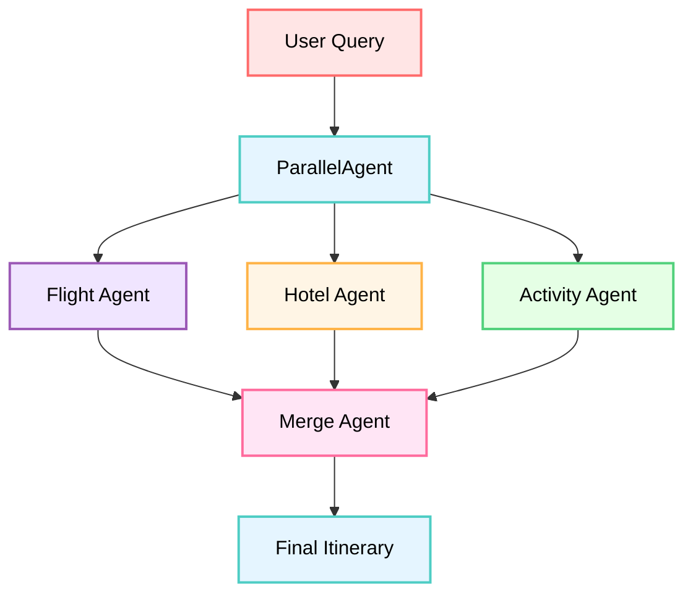

# Tutorial 05: Parallel Processing - Run Multiple Agents Simultaneously

## Overview

Learn how to execute multiple agents concurrently to dramatically speed up your workflows! This tutorial teaches you the **`ParallelAgent`** pattern and the powerful **fan-out/gather** technique - essential for any real-world agent system that needs performance.

**🎯 Working Implementation Available**: A complete, tested travel planning system is available at [`tutorial_implementation/tutorial05/`](https://github.com/raphaelmansuy/adk_training/tree/main/tutorial_implementation/tutorial05/). The implementation includes comprehensive tests, documentation, and a user-friendly setup process.

## Prerequisites

- **Completed Tutorials 01-04** - Understanding of agents, tools, and sequential workflows
- **Installed ADK** - `pip install google-adk`  
- **API key configured** - From Tutorial 01

## Core Concepts

### ParallelAgent

The **`ParallelAgent`** executes multiple sub-agents **concurrently** (at the same time), not sequentially. This is perfect when:
- Tasks are **independent** (don't depend on each other)
- You want **speed** (faster than running one-by-one)
- You're gathering information from **multiple sources**

**Key Characteristics:**
- All sub-agents start at the same time
- Agents run independently (no shared data during execution)
- ParallelAgent waits for ALL to complete
- Returns when the slowest agent finishes

### When to Use Parallel vs Sequential

**Use `ParallelAgent` when:**
- ✅ Tasks are independent (can run in any order)
- ✅ Speed matters (want results faster)
- ✅ Gathering data from multiple sources
- ✅ Tasks don't need each other's outputs

**Use `SequentialAgent` when:**
- ✅ Tasks MUST happen in specific order
- ✅ Each step needs previous step's output
- ✅ Building a pipeline (output flows between agents)

### Fan-Out/Gather Pattern

This is THE killer pattern for real-world agents:

1. **Fan-Out** (Parallel) → Run multiple agents concurrently to gather data
2. **Gather** (Sequential) → Merge all results with a final agent

```
        ┌──── Agent 1 (flights) ────┐
User ───┼──── Agent 2 (hotels) ─────┼──→ Merger Agent → Final Result
        └──── Agent 3 (activities) ─┘
        
      ParallelAgent (fast!)       SequentialAgent (combine)
```

This gives you both **speed** (parallel data gathering) and **synthesis** (merging results).

## Use Case

We're building a **Smart Travel Planner** that helps users plan trips by:
1. **Searching flights** (concurrent)
2. **Searching hotels** (concurrent)
3. **Finding activities** (concurrent)
4. **Merging everything** into a complete itinerary (sequential)

This demonstrates the fan-out/gather pattern - parallel data gathering + sequential synthesis!

## Step 1: Get the Working Implementation

A complete, tested implementation is available in the repository:

```bash
# Navigate to the working implementation
cd tutorial_implementation/tutorial05/

# Install dependencies
make setup

# Copy environment template and add your API key
cp travel_planner/.env.example travel_planner/.env
# Edit travel_planner/.env and add your GOOGLE_API_KEY
```

**Alternative**: Follow the step-by-step build instructions below to create your own implementation.

## Step 2: Create Project Structure (Optional - Skip if using working implementation)

If you prefer to build from scratch, create this structure:

```bash
mkdir travel_planner
cd travel_planner
touch __init__.py agent.py .env
```

Copy your `.env` file from previous tutorials.

## Project Structure

The working implementation follows this structure:

```
tutorial05/
├── travel_planner/           # Agent implementation
│   ├── __init__.py          # Package initialization
│   ├── agent.py             # Agent definitions and pipeline
│   └── .env.example         # Environment template
├── tests/                   # Comprehensive test suite
│   ├── __init__.py
│   ├── test_agent.py        # Agent and pipeline tests
│   ├── test_imports.py      # Import validation tests
│   └── test_structure.py    # Project structure tests
├── requirements.txt         # Python dependencies
├── Makefile                # Development commands
└── README.md               # Implementation documentation
```

**Key Components:**
- **`travel_planner/agent.py`**: Complete ParallelAgent + SequentialAgent pipeline
- **`tests/test_agent.py`**: 57 tests covering all functionality
- **`Makefile`**: `make setup`, `make test`, `make dev`, `make demo` commands
- **`.env.example`**: Template for API key configuration

## Step 2: Set Up Package Import

**travel_planner/__init__.py**
```python
from . import agent
```

## Step 3: Define the Travel Planning Agents

**travel_planner/agent.py**
```python
from __future__ import annotations

from google.adk.agents import Agent, ParallelAgent, SequentialAgent

# ============================================================================
# PARALLEL SEARCH AGENTS
# ============================================================================

# ===== Parallel Branch 1: Flight Finder =====
flight_finder = Agent(
    name="flight_finder",
    model="gemini-2.0-flash",
    description="Searches for available flights",
    instruction=(
        "You are a flight search specialist. Based on the user's travel request, "
        "search for available flights.\n"
        "\n"
        "Provide 2-3 flight options with:\n"
        "- Airline name\n"
        "- Departure and arrival times\n"
        "- Price range\n"
        "- Flight duration\n"
        "\n"
        "Format as a bulleted list. Be specific and realistic."
    ),
    output_key="flight_options"  # Saves to state
)

# ===== Parallel Branch 2: Hotel Finder =====
hotel_finder = Agent(
    name="hotel_finder",
    model="gemini-2.0-flash",
    description="Searches for available hotels",
    instruction=(
        "You are a hotel search specialist. Based on the user's travel request, "
        "find suitable hotels.\n"
        "\n"
        "Provide 2-3 hotel options with:\n"
        "- Hotel name and rating\n"
        "- Location (district/area)\n"
        "- Price per night\n"
        "- Key amenities\n"
        "\n"
        "Format as a bulleted list. Be specific and realistic."
    ),
    output_key="hotel_options"  # Saves to state
)

# ===== Parallel Branch 3: Activity Finder =====
activity_finder = Agent(
    name="activity_finder",
    model="gemini-2.0-flash",
    description="Finds activities and attractions",
    instruction=(
        "You are a local activities expert. Based on the user's travel request, "
        "recommend activities and attractions.\n"
        "\n"
        "Provide 4-5 activity suggestions with:\n"
        "- Activity name\n"
        "- Description (1 sentence)\n"
        "- Estimated duration\n"
        "- Estimated cost\n"
        "\n"
        "Format as a bulleted list. Include mix of paid/free activities."
    ),
    output_key="activity_options"  # Saves to state
)

# ============================================================================
# FAN-OUT: PARALLEL DATA GATHERING
# ============================================================================

# Create the ParallelAgent for concurrent search
parallel_search = ParallelAgent(
    name="ParallelSearch",
    sub_agents=[
        flight_finder,
        hotel_finder,
        activity_finder
    ],  # All run AT THE SAME TIME!
    description="Searches flights, hotels, and activities concurrently"
)

# ============================================================================
# GATHER: SEQUENTIAL RESULT MERGING
# ============================================================================

# ===== Gather: Merge Results into Itinerary =====
itinerary_builder = Agent(
    name="itinerary_builder",
    model="gemini-2.0-flash",
    description="Combines all search results into a complete travel itinerary",
    instruction=(
        "You are a travel planner. Create a complete, well-organized itinerary "
        "by combining the search results below.\n"
        "\n"
        "**Available Flights:**\n"
        "{flight_options}\n"  # Reads from state!
        "\n"
        "**Available Hotels:**\n"
        "{hotel_options}\n"  # Reads from state!
        "\n"
        "**Recommended Activities:**\n"
        "{activity_options}\n"  # Reads from state!
        "\n"
        "Create a formatted itinerary that:\n"
        "1. Recommends the BEST option from each category (flights, hotel)\n"
        "2. Organizes activities into a day-by-day plan\n"
        "3. Includes estimated total cost\n"
        "4. Adds helpful travel tips\n"
        "\n"
        "Format beautifully with clear sections and markdown."
    ),
    output_key="final_itinerary"
)

# ============================================================================
# COMPLETE FAN-OUT/GATHER PIPELINE
# ============================================================================

# Combine parallel search with sequential merge
travel_planning_system = SequentialAgent(
    name="TravelPlanningSystem",
    sub_agents=[
        parallel_search,     # Step 1: Gather data in parallel (FAST!)
        itinerary_builder    # Step 2: Merge results (synthesis)
    ],
    description="Complete travel planning system with parallel search and itinerary building"
)

# MUST be named root_agent for ADK discovery
root_agent = travel_planning_system
```

### Code Breakdown

**Fan-Out/Gather Flow:**
```
User: "Plan a trip to Tokyo for 5 days"
    ↓
ParallelAgent starts (3 agents run AT SAME TIME):
    ├─ flight_finder → searches flights → state['flight_options']
    ├─ hotel_finder → searches hotels → state['hotel_options']  
    └─ activity_finder → finds activities → state['activity_options']
    ↓ (waits for ALL to complete)
ParallelAgent completes
    ↓
itinerary_builder runs (reads all 3 keys from state)
    ↓
Final Output: complete travel itinerary
```

**Why This Pattern Works:**
1. **Parallel search is FAST** - 3 agents run concurrently (not one-by-one)
2. **Independent tasks** - Flight search doesn't need hotel data
3. **Sequential merge** - Itinerary builder needs ALL search results
4. **Best of both worlds** - Speed (parallel) + synthesis (sequential)

**Key Design Decisions:**
- Each search agent has focused responsibility
- All search agents save to state with `output_key`
- Itinerary builder reads all state keys with `{key}` syntax
- Outer `SequentialAgent` ensures parallel → sequential flow

## Step 4: Run the Travel Planner

### Using the Working Implementation

```bash
# From tutorial_implementation/tutorial05/
make dev
```

Open `http://localhost:8000` and select "travel_planner".

### Manual Setup (if building from scratch)

Navigate to parent directory and launch:

```bash
cd ..  # Go to parent of travel_planner/
adk web
```

Open `http://localhost:8000` and select "travel_planner".

### Try These Prompts

**Basic Trip:**
```
Plan a 3-day trip to Paris
```

**Detailed Request:**
```
I need a 5-day Tokyo trip for 2 people. Budget-friendly options preferred.
```

**Specific Requirements:**
```
Weekend getaway to New York. Looking for cultural activities and good restaurants.
```

**Beach Vacation:**
```
Plan a relaxing week in Bali with beach activities
```

## Understanding Parallel Execution

Open the **Events tab** and watch the magic:

1. **Event**: ParallelAgent starts
2. **Events (ALL AT ONCE)**:
   - Flight finder starts
   - Hotel finder starts  
   - Activity finder starts
3. **Events (AS THEY COMPLETE)**:
   - Flight finder completes → saves to state
   - Hotel finder completes → saves to state
   - Activity finder completes → saves to state
4. **Event**: ParallelAgent completes (when ALL done)
5. **Event**: Itinerary builder starts (with all 3 keys injected)
6. **Event**: Itinerary builder completes → final output!

**Notice**: The 3 search agents don't run in order - they all start together and finish whenever they're done!

## Testing Your Implementation

The working implementation includes comprehensive tests to validate your understanding:

```bash
# From tutorial_implementation/tutorial05/
make test
```

**Test Coverage:**
- ✅ Agent configurations and instructions (57 tests total)
- ✅ ParallelAgent structure and concurrent execution
- ✅ SequentialAgent pipeline flow and state management
- ✅ Data injection between parallel and sequential agents
- ✅ Import validation and module structure
- ✅ Project organization and file structure

**Quick Demo:**
```bash
# Test basic functionality without full ADK setup
make demo
```

This validates that your agents load correctly and the pipeline structure is sound.

## Expected Behavior

**Example: "Plan a 3-day trip to Paris"**

```
User: Plan a 3-day trip to Paris

[All 3 agents run in parallel - you'll see them in Events]

Flight Options Found:
• Air France AF1234: NYC → CDG, 7:00am-8:30pm, $650, 7h 30m
• Delta DL456: NYC → CDG, 10:00am-11:45pm, $720, 7h 45m

Hotel Options Found:
• Hotel Le Marais (4★): Central Paris, $180/night, WiFi + Breakfast
• Montmartre Boutique (3★): Artistic district, $130/night, Rooftop view

Activity Options Found:
• Eiffel Tower: Iconic landmark, 2-3 hours, €25
• Louvre Museum: World-famous art, 3-4 hours, €17
• Seine River Cruise: Scenic evening cruise, 1 hour, €15
• Montmartre Walk: Historic neighborhood, 2 hours, Free
• French Cooking Class: Learn local cuisine, 3 hours, €85

[Itinerary builder merges everything]

Final Itinerary:
# Your 3-Day Paris Adventure

## Recommended Flight
✈️ **Air France AF1234** - Best balance of price and timing
- Departs 7:00am, arrives 8:30pm local time
- Price: $650 per person

## Accommodation
🏨 **Hotel Le Marais (4★)** - Perfect central location
- $180/night × 3 nights = $540
- Includes breakfast and WiFi

## Day-by-Day Plan
...
```

## How It Works (Behind the Scenes)

**Parallel Execution:**
1. `ParallelAgent.sub_agents` = [flight, hotel, activity]
2. ADK calls `.run()` on ALL agents simultaneously (async)
3. Each agent executes independently (no shared state during run)
4. ADK waits for ALL to complete
5. Each agent's output saved to its `output_key` in state

**Sequential Merge:**
1. After parallel completes, next agent in sequence runs
2. Itinerary builder's instruction has `{flight_options}`, `{hotel_options}`, `{activity_options}`
3. ADK injects values from state into instruction
4. Builder creates final output using all gathered data

**Performance:**
- Sequential: ~30 seconds (3 agents × 10 seconds each)
- Parallel: ~10 seconds (all 3 run together, limited by slowest)
- **3x faster!**

**Visual Flow:**



## Key Takeaways

✅ **ParallelAgent runs sub-agents concurrently** - Major speed boost

✅ **Perfect for independent tasks** - Flight search doesn't need hotel data

✅ **All agents must complete** - ParallelAgent waits for slowest agent

✅ **Fan-out/gather is the pattern** - Parallel for speed, Sequential for synthesis

✅ **Combine with SequentialAgent** - Best of both worlds

✅ **Watch Events tab** - See agents starting simultaneously

✅ **Real performance gains** - 3-10x faster than sequential for I/O-bound tasks

## Best Practices

**DO:**
- Use for I/O-bound tasks (API calls, web searches, database queries)
- Keep sub-agents independent (no dependencies between them)
- Combine with Sequential for merge/synthesis step
- Use descriptive output_keys for each parallel agent
- Monitor Events tab to verify parallel execution

**DON'T:**
- Use when agents need each other's outputs (use Sequential instead)
- Assume specific execution order within parallel block
- Forget the merge step (parallel gives you data, need synthesis)
- Use for CPU-bound tasks without threading consideration
- Expect perfect linear speedup (limited by slowest agent)

## Common Issues

**Problem**: "Parallel agents seem to run sequentially"
- **Solution**: Check Events tab - they should show same start times
- **Solution**: Might be model API rate limiting

**Problem**: "Itinerary builder missing some data"
- **Solution**: Verify each search agent has `output_key` defined
- **Solution**: Check `{key}` names match exactly in itinerary instruction

**Problem**: "One agent fails, whole system stops"
- **Solution**: ParallelAgent waits for ALL - one failure blocks
- **Solution**: Consider error handling in individual agents

**Problem**: "Not seeing speed improvements"
- **Solution**: Speed gain depends on task type (I/O vs CPU)
- **Solution**: Check if you're being rate-limited by APIs

## What We Built

You now have a production-quality travel planner that:
- Searches multiple sources concurrently (3x faster!)
- Gathers comprehensive travel information
- Synthesizes everything into a complete itinerary
- Demonstrates the fan-out/gather pattern

And you understand when/how to use parallel execution!

## Real-World Applications

**Parallel Execution Is Perfect For:**
- **Data Gathering**: Search multiple APIs/databases simultaneously
- **Content Creation**: Generate multiple variations concurrently
- **Analysis**: Run different analyses on same data in parallel
- **Validation**: Check multiple conditions simultaneously
- **Multi-Source Research**: Academic, news, social media, patents
- **Comparison Shopping**: Prices, reviews, availability from different sources

## Next Steps

🚀 **Tutorial 06: Multi-Agent Systems** - Combine Sequential and Parallel patterns for sophisticated workflows

📖 **Further Reading**:
- [Parallel Agents Documentation](https://google.github.io/adk-docs/agents/workflow-agents/parallel-agents/)
- [Workflow Agents Overview](https://google.github.io/adk-docs/agents/workflow-agents/)
- [Performance Optimization Guide](https://google.github.io/adk-docs/performance/)

## Exercises (Try On Your Own!)

1. **Add more parallel branches** - Include weather, currency exchange, travel advisories
2. **Error handling** - Handle case where one search fails
3. **User preferences** - Add a preferences agent that customizes recommendations
4. **Nested parallel** - Have each search agent spawn its own parallel sub-searches
5. **Benchmarking** - Measure actual speedup comparing sequential vs parallel

## Complete Code Reference

**Working Implementation**: See [`tutorial_implementation/tutorial05/`](https://github.com/raphaelmansuy/adk_training/tree/main/tutorial_implementation/tutorial05/) for a complete, tested version with comprehensive documentation.

**Key Files:**
- [`travel_planner/agent.py`](https://github.com/raphaelmansuy/adk_training/tree/main/tutorial_implementation/tutorial05/travel_planner/agent.py) - Complete agent implementation
- [`tests/test_agent.py`](https://github.com/raphaelmansuy/adk_training/tree/main/tutorial_implementation/tutorial05/tests/test_agent.py) - 57 comprehensive tests
- [`README.md`](https://github.com/raphaelmansuy/adk_training/tree/main/tutorial_implementation/tutorial05/README.md) - Detailed implementation guide
- [`Makefile`](https://github.com/raphaelmansuy/adk_training/tree/main/tutorial_implementation/tutorial05/Makefile) - Development commands

**Quick Start with Working Code:**
```bash
cd tutorial_implementation/tutorial05/
make setup  # Install dependencies
make test   # Run all tests (57 passing)
make dev    # Start development server
```

**Manual Implementation:**

**travel_planner/__init__.py**
```python
from . import agent
```

**travel_planner/.env**
```bash
GOOGLE_GENAI_USE_VERTEXAI=FALSE
GOOGLE_API_KEY=your-api-key-here
```

**travel_planner/agent.py**
```python
# See Step 3 above for complete code
```

Congratulations! You've mastered parallel processing and the fan-out/gather pattern! 🚀✈️
