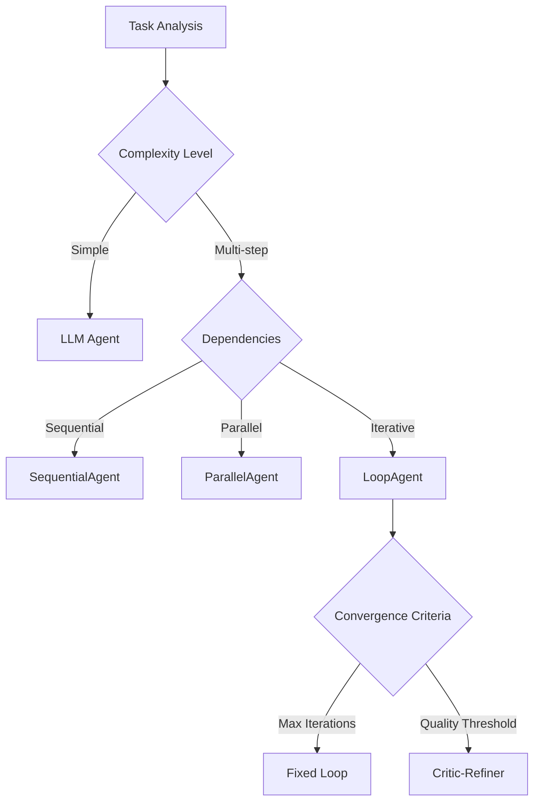
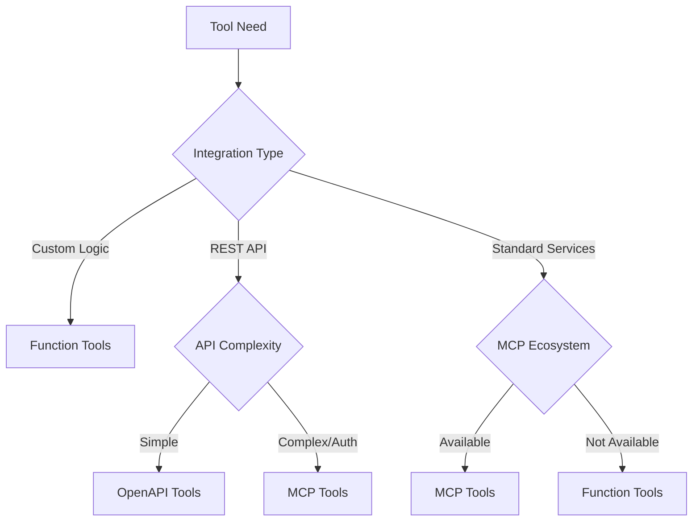
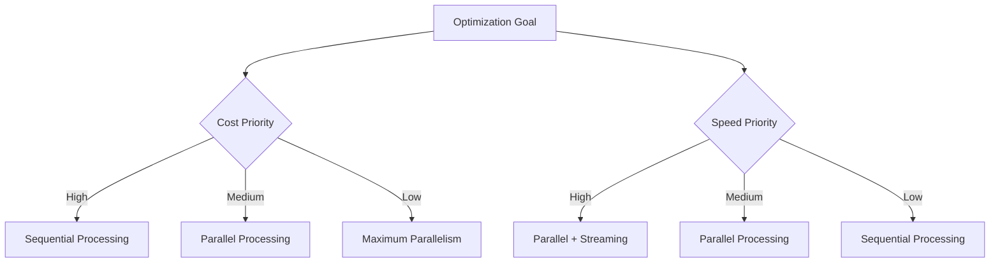
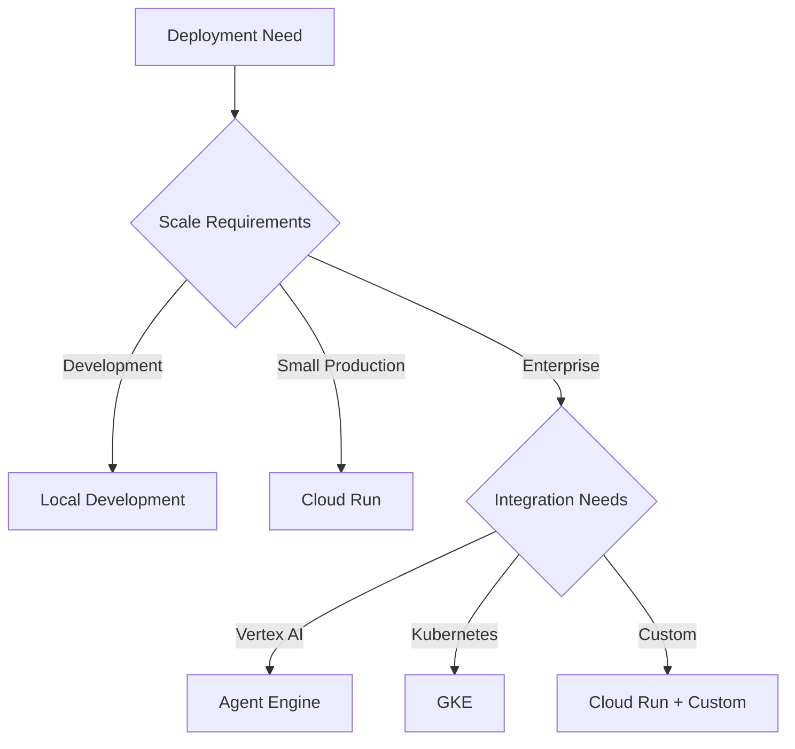
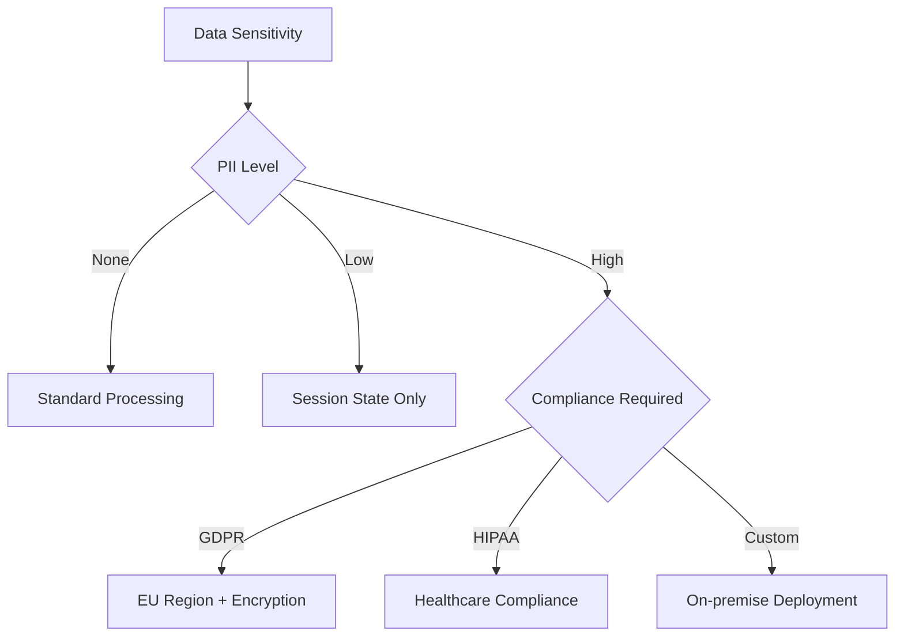
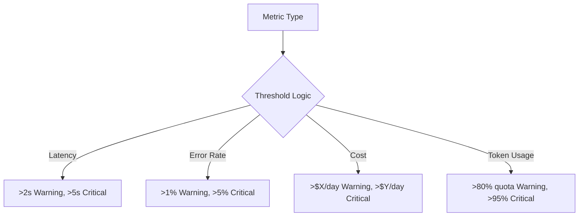

**🎯 Purpose**: Master strategic decision-making for ADK implementation - when to use which patterns, tools, and deployment strategies.

**📚 Source of Truth**: `research/adk-python/src/google/adk/` + production case studies

---

## 🧠 Pattern Selection Framework

### Agent Type Decision Tree

### When to Use Each Agent Type

| Agent Type | When to Use | Example Use Cases |
|------------|-------------|-------------------|
| **LLM Agent** | Single-step tasks, pure reasoning | Q&A, analysis, simple classification |
| **SequentialAgent** | Ordered dependencies, pipeline workflows | Data processing → analysis → reporting |
| **ParallelAgent** | Independent tasks, speed optimization | Multi-source data collection, parallel analysis |
| **LoopAgent** | Iterative refinement, quality improvement | Code review, content editing, optimization |

---

## 🔧 Tool Selection Matrix

### Function Tools vs OpenAPI vs MCP

### Tool Decision Criteria

| Criteria | Function Tools | OpenAPI Tools | MCP Tools |
|----------|----------------|----------------|-----------|
| **Development Speed** | Fastest | Medium | Slowest |
| **Maintenance** | Highest | Medium | Lowest |
| **Flexibility** | Maximum | Limited | Medium |
| **Interoperability** | None | Limited | Maximum |
| **Security** | Custom | API Keys | Built-in |

---

## ⚡ Performance Optimization

### Cost vs Speed Trade-offs

### Model Selection Guide

| Use Case | Recommended Model | Reasoning |
|----------|-------------------|-----------|
| **Fast Responses** | `gemini-2.0-flash` | Speed optimized, cost effective |
| **Complex Reasoning** | `gemini-2.0-flash-thinking` | Built-in chain-of-thought |
| **Code Generation** | `gemini-2.0-flash` | Strong coding capabilities |
| **Multimodal** | `gemini-2.0-flash` | Vision, audio, video support |
| **Live Interaction** | `gemini-2.0-flash-live` | Real-time streaming |

---

## 🚀 Deployment Strategy Matrix

### Environment Selection

### Deployment Decision Factors

| Factor | Local | Cloud Run | Agent Engine | GKE |
|--------|-------|-----------|--------------|-----|
| **Setup Time** | Fastest | Fast | Medium | Slowest |
| **Scaling** | Manual | Automatic | Automatic | Automatic |
| **Cost** | Free | Pay-per-use | Pay-per-use | Infrastructure |
| **Customization** | Maximum | Limited | Limited | Maximum |
| **Monitoring** | Basic | Basic | Advanced | Advanced |

---

## 🔒 Security & Compliance

### Data Handling Strategy

### State Scope Guidelines

| Data Type | Recommended Scope | Retention | Encryption |
|-----------|-------------------|-----------|------------|
| **User Preferences** | `user:` | Permanent | Always |
| **Session Context** | `session:` | Session | Optional |
| **Temporary Data** | `temp:` | Request | Optional |
| **Application Config** | `app:` | Permanent | Always |
| **Sensitive PII** | `user:` | Permanent | Required |

---

## 📊 Monitoring & Observability

### Alert Thresholds

### Key Metrics to Monitor

- **Performance**: Latency, throughput, error rates
- **Cost**: Token usage, API costs, infrastructure costs
- **Quality**: Task completion rates, user satisfaction
- **Reliability**: Uptime, error recovery, fallback success

---

## 🎯 Implementation Checklist

### Pre-Production Validation

- [ ] Agent configuration tested with realistic data
- [ ] Tool integrations verified end-to-end
- [ ] Error handling covers all failure modes
- [ ] Performance benchmarks meet requirements
- [ ] Security review completed
- [ ] Cost estimates validated
- [ ] Monitoring and alerting configured
- [ ] Rollback plan documented

### Production Readiness

- [ ] Load testing completed
- [ ] Disaster recovery tested
- [ ] Documentation updated
- [ ] Team training completed
- [ ] Support processes established
- [ ] Compliance requirements met

---

## 🎯 Key Takeaways

1. **Pattern Selection**: Match agent types to task complexity and dependencies
2. **Tool Choice**: Balance development speed vs long-term maintenance
3. **Performance**: Optimize for cost, speed, or quality based on priorities
4. **Deployment**: Choose environment based on scale and customization needs
5. **Security**: Use appropriate state scopes and encryption for data sensitivity
6. **Monitoring**: Establish clear thresholds and comprehensive observability

**🔗 Next**: Follow structured [Learning Paths](learning-paths.md) to master ADK development.
