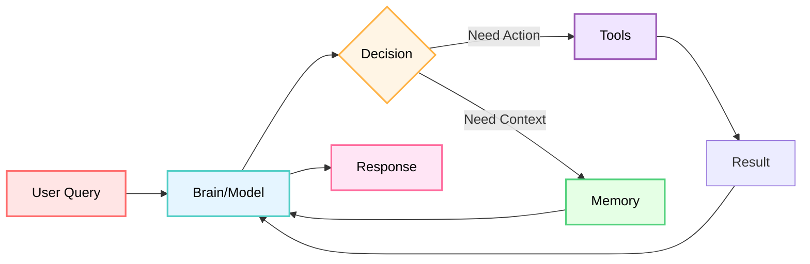

**🎯 Purpose**: A comprehensive mental framework for understanding Google Agent Development Kit (ADK) and Generative AI concepts from first principles.

**📚 Source of Truth**: [google/adk-python](https://github.com/google/adk-python) (ADK 1.15) + Official Google Documentation + 28 Tutorials

**🎓 Status**: Complete mental model synthesis covering all ADK patterns and Generative AI fundamentals

---

## [BRAIN] Core Mental Model: The Agent as a System

### The Agent = Human Worker Analogy

Think of an AI agent like a **human office worker**:

```text
┌───────────────────────────────────────────────────────────────┐
│                        AI AGENT                               │
│                                                               │
│  [BRAIN] BRAIN (Model)        [MEM] MEMORY (Context)          │
│  - Reasoning             - Short-term: Session State          │
│  - Decision making       - Long-term: Memory Service          │
│  - Language understanding - Working memory: temp: state       │
│                                                               │
│  [TOOLS] TOOLS (Capabilities) [INSTR] INSTRUCTIONS (Behavior) │
│  - Search web            - Personality                        │
│  - Execute code          - Rules & constraints                │
│  - Call APIs             - Task guidance                      │
│  - File operations       - Examples                           │
│                                                               │
│  [FLOW] WORKFLOWS (Process)   [CALLB] CALLBACKS (Supervision) │
│  - Sequential steps      - Before/after hooks                 │
│  - Parallel tasks        - Guardrails                         │
│  - Iterative loops       - Logging                            │
│  - Dynamic routing       - Policy enforcement                 │
│                                                               │
└───────────────────────────────────────────────────────────────┘
```

**Key Insight**: An agent is NOT just an LLM. It's a **complete system** with:

- **Brain** (LLM model) for reasoning
- **Hands** (tools) for taking actions
- **Memory** (state + memory service) for context
- **Instructions** (prompts) for guidance
- **Process** (workflows) for structured execution
- **Supervision** (callbacks) for control



**Source**: `research/adk-python/src/google/adk/agents/base_agent.py`

---

## 🏗️ Foundational Concepts

### The Three Types of Agents

**Mental Model**: Agents are like workers with different thinking styles:

```text
┌──────────────────────────────────────────────────────────────┐
│                      AGENT TYPES                             │
├──────────────────────────────────────────────────────────────┤
│                                                              │
│ [BRAIN] LLM AGENT (Thinker)                                  │
│    "I reason and decide dynamically"                         │
│    - Powered by language model                               │
│    - Flexible, creative, adaptive                            │
│    - Uses: Conversations, analysis, creative tasks           │
│    Source: agents/llm_agent.py                               │
│                                                              │
│ [FLOW] WORKFLOW AGENT (Manager)                              │
│    "I follow a strict process"                               │
│    - Deterministic execution                                 │
│    - Orchestrates other agents                               │
│    - Types: Sequential, Parallel, Loop                       │
│    Uses: Pipelines, coordination, iteration                  │
│    Source: agents/workflow_agents/                           │
│                                                              │
│ [REMOTE] REMOTE AGENT (External Expert)                      │
│    "I'm a specialist from another service"                   │
│    - HTTP-based agent communication                          │
│    - A2A protocol                                            │
│    - Uses: Microservices, specialized domains                │
│    Source: agents/remote_a2a_agent.py                        │
│                                                              │
└──────────────────────────────────────────────────────────────┘
```

**Rule of Thumb**:

- **Use LLM Agent when**: Need reasoning, flexibility, natural language
- **Use Workflow Agent when**: Need predictable, ordered execution
- **Use Remote Agent when**: Need to call external services

---

## 📚 Learning Navigation

This mental models guide is organized into focused sections for optimal learning:

### [Agent Architecture →](agent-architecture.md)

- Agent hierarchy and composition patterns
- State vs memory management
- Session and user context handling

### [Tools & Capabilities →](tools-capabilities.md)

- Tool ecosystem (Function, OpenAPI, MCP, Built-in)
- Tool selection and implementation patterns
- Parallel tool execution

### [Workflows & Orchestration →](workflows-orchestration.md)

- Sequential, parallel, and loop workflow patterns
- Complex pipeline construction
- Performance optimization

### [LLM Integration →](llm-integration.md)

- Prompt engineering and instruction patterns
- Grounding and real-world connection
- Thinking and reasoning frameworks

### [Production & Deployment →](production-deployment.md)

- Deployment environments and strategies
- Observability and monitoring
- Service configuration

### [Advanced Patterns →](advanced-patterns.md)

- Streaming and real-time interaction
- MCP protocol and standardization
- Agent-to-agent communication

### [Decision Frameworks →](decision-frameworks.md)

- When to use each pattern
- Cost optimization strategies
- Pattern selection guides

### [Learning Paths →](learning-paths.md)

- Structured learning approaches
- Tutorial sequences
- Skill progression

### [Reference Guide →](reference-guide.md)

- Source code navigation
- Quick reference tables
- API and configuration guides

---

## 🎯 Key Principles & Rules of Thumb

### The 10 Commandments of ADK Development

1. **Agent = System, Not Just LLM**
   - Always think: Model + Tools + State + Instructions + Workflows

2. **State for Short-term, Memory for Long-term**
   - Session state = this conversation
   - Memory service = all conversations

3. **Sequential When Order Matters, Parallel When Speed Matters**
   - Dependencies → Sequential
   - Independent → Parallel

4. **Loop for Quality, Not for Logic**
   - Use LoopAgent for refinement
   - Use SequentialAgent for ordered steps

5. **Ground Everything That Needs to Be True**
   - Facts → google_search
   - Data → database tools
   - Locations → google_maps

6. **Tools Are Capabilities, Not Afterthoughts**
   - Design tools with agents in mind
   - Return structured data (dicts)
   - Include clear docstrings

7. **Callbacks for Control, Not Core Logic**
   - Use for guardrails, logging, monitoring
   - Don't put business logic in callbacks

8. **Start Simple, Add Complexity When Needed**
   - Single agent → Multi-agent
   - Sequential → Add parallel
   - No thinking → Add planner

9. **Evaluate Early, Evaluate Often**
   - Create test sets from day one
   - Run evals with every major change
   - Use Trace view for debugging

10. **Production ≠ Development**
    - Local: InMemory services
    - Production: Persistent services (PostgreSQL, GCS, Vertex)

---

## 🎓 Getting Started

**Recommended Path**: Start with this overview, then follow the [Foundation Learning Path](learning-paths.md#path-1-foundation-start-here) for a structured approach to mastering ADK.

**Quick Start**: If you're new to ADK, begin with [Tutorial 01: Hello World Agent](../tutorial/01_hello_world_agent.md) after reading this overview.

**Source Code**: All mental models are derived from the official ADK source code in `research/adk-python/`. When in doubt, refer to the source code for truth.

---

## 📖 Document Metadata

**Created**: 2025-01-26
**Version**: 1.0
**Source**: Research from `research/adk-python/` + 28 comprehensive tutorials
**Purpose**: Mental models for mastering Google ADK and Generative AI
**Audience**: Developers learning ADK from beginner to advanced
**Maintenance**: Update as ADK evolves (weekly releases)

**🏆 You now have the foundation to build exceptional AI agents with Google ADK!**
