# TIL: Support for Pause and Resume an Invocation in ADK (v1.16.0)

**Date**: October 20, 2025  
**ADK Version**: 1.16.0 (Released 2025-10-08)  
**Related Commits**: ce9c39f, 2f1040f, 1ee01cc, f005414, fbf7576

## Overview

ADK now supports **pausing and resuming agent invocations**, allowing agents to save their state at checkpoint points and resume execution later. This is a powerful feature for building long-running agent workflows, human-in-the-loop scenarios, and resilient applications that need to persist agent execution state.

### Pause/Resume Invocation Flow

```
    Initial Invocation                    Resume Invocation
    ==================                    ==================

User Request                           User Request or Timer
    |                                       |
    v                                       v
+------------------+                 +------------------+
| Create App with  |                 | Load Session &   |
| Resumability     |                 | Previous State   |
| Config           |                 |                  |
+------------------+                 +------------------+
    |                                       |
    v                                       v
+------------------+                 +------------------+
| Invoke Agent     |                 | Restore Agent    |
| Process Events   |                 | States from      |
|                  |                 | Checkpoints      |
+------------------+                 +------------------+
    |                                       |
    v                                       v
+------------------+                 +------------------+
| Agent Reaches    |                 | Resume at Last   |
| Checkpoint       |                 | Checkpoint       |
| (end_of_agent)   |                 |                  |
+------------------+                 +------------------+
    |                                       |
    v                                       v
+------------------+                 +------------------+
| Emit Event with  |                 | Continue         |
| Serialized State |                 | Execution from   |
| [PAUSE]          |                 | Saved State      |
+------------------+                 +------------------+
    |                                       |
    v                                       v
+------------------+                 +------------------+
| Save to          |                 | Complete or      |
| Session Storage  |                 | Pause Again      |
+------------------+                 +------------------+
```

## Key Features

### 1. Invocation Resumability Configuration

Applications can now declare whether they support resumable invocations through the `ResumabilityConfig`:

```python
from google.adk.apps import ResumabilityConfig

# Configure app to support resumable invocations
app = App(
    root_agent=my_agent,
    resumability_config=ResumabilityConfig(is_resumable=True)
)
```

### 2. Agent State Checkpointing

Agents now emit and manage state checkpoints through the new `BaseAgentState` mechanism:

- **LoopAgentState**: Captures loop-specific state (e.g., `current_sub_agent`, `times_looped`)
- **SequentialAgentState**: Captures sequential workflow state
- **ParallelAgentState**: Captures parallel execution state

#### Agent State Hierarchy

```
BaseAgentState (Abstract Base)
        |
        +---> LoopAgentState
        |     - current_sub_agent: str
        |     - times_looped: int
        |
        +---> SequentialAgentState
        |     - completed_agents: List[str]
        |     - current_index: int
        |
        +---> ParallelAgentState
              - agent_states: Dict[str, Any]
              - completion_status: Dict[str, bool]
```

When an agent completes (marked with `end_of_agent=True`), it includes its state in the event:

```python
from google.adk.agents.base_agent import BaseAgentState

event = Event(
    invocation_id='inv_1',
    author='agent_name',
    actions=EventActions(
        end_of_agent=True,
        agent_state=agent_state_dict  # Serialized agent state
    ),
    content=response_content
)
```

### 3. Resuming Invocations

The `Runner` class now supports resuming paused invocations through the `_setup_context_for_resumed_invocation` method:

#### Resumption Process Flow

```
Resumption Request
  |
  v
Retrieve Session      Load Previous      Validate App
& Invocation ID   +   Invocation Events  + Resumability
  |                       |                    |
  +-------+-------+-------+
          |
          v
  Find Agent States
  in Event History
          |
          v
  Determine User Message
  (New or Previous)
          |
          v
  Restore Agent States
  to InvocationContext
          |
          v
  Create Invocation
  Context for Resume
          |
          v
  Resume Agent Execution
  from Last Checkpoint
          |
          v
  Continue Event Stream
```

```python
# Resume an invocation with optional new message
invocation_context = await runner._setup_context_for_resumed_invocation(
    session=session,
    new_message=optional_user_input,  # Can provide new message or None
    invocation_id=previous_invocation_id,
    run_config=run_config,
    state_delta=state_delta
)
```

**Key behaviors**:
- Retrieves the previous invocation's state from session events
- Restores agent states at checkpoint points
- Allows providing a new user message or reusing the previous one
- Validates that the app supports resumability

## Implementation Details

### Agent State Management in InvocationContext

The `InvocationContext` now includes:

```python
def populate_invocation_agent_states(self) -> None:
    """
    Restores agent states from previous invocation events.
    Only works if the app is configured as resumable.
    
    Processes events to extract and restore:
    - Agent states marked with end_of_agent=True
    - Preserves state hierarchy for nested agents
    """
```

#### Event Lifecycle with State Checkpointing

```
Session.events = [
  Event 1: User Message (author: 'user')
    content: { text: "Process this data" }
    agent_state: None
    |
    |
  Event 2: Agent1 Processing
    |    author: 'agent1'
    |    content: { text: "Processing..." }
    |
    v
  Event 3: Agent1 Complete [CHECKPOINT]
    author: 'agent1'
    actions: { end_of_agent: True }
    agent_state: { "state_key": "state_value" }
    ---> SAVED IN SESSION STORAGE <---
    |
    | [PAUSE - Can Resume Here]
    |
    v
  Event 4: Agent2 Start
    author: 'agent2'
    agent_state: RESTORED from Event 3
    |
    v
  Event 5: Agent2 Complete [CHECKPOINT]
    author: 'agent2'
    actions: { end_of_agent: True }
    agent_state: { "agent2_state": "..." }
    ---> SAVED IN SESSION STORAGE <---
]
```

### Loop Agent Checkpoint Support

`LoopAgent` now implements checkpoint logic:

```python
class LoopAgent(BaseAgent):
    def get_current_state(self) -> LoopAgentState:
        """Returns current loop state for checkpointing"""
        return LoopAgentState(
            current_sub_agent=self._current_sub_agent.name,
            times_looped=self._loop_count
        )
```

### Event Actions with State

Events can now carry agent state information:

```python
from google.adk.events.event_actions import EventActions

actions = EventActions(
    end_of_agent=True,  # Marks agent completion
    agent_state=state_dict  # Serialized state for resumption
)
```

## Use Cases

### 1. Long-Running Workflows

Pause complex multi-step processes at natural break points and resume later without losing context.

#### Long-Running Workflow Example


### 2. Human-in-the-Loop Scenarios

Agents can pause to request human input, store their state, and resume once feedback is received:

#### Human-in-the-Loop Flow


```python
# Agent pauses and waits for human input
invocation_paused = True  # Mark as paused

# Later, after human provides input:
await runner.run_async(
    session=session,
    new_message=human_feedback,
    invocation_id=previous_invocation_id,
    resumability_config=config
)
```

### 3. Fault Tolerance

If an agent execution is interrupted, the state is preserved and can be resumed:

#### Fault Tolerance Timeline


```python
try:
    events = runner.run_async(session=session, new_message=user_input)
    # If interrupted here, state is saved
except Exception:
    # Later recovery:
    await runner.run_async(
        session=session,
        invocation_id=last_invocation_id  # Resume from checkpoint
    )
```

### 4. Multi-Agent Handoff with State Preservation

When agents hand off work to other agents, state is checkpointed and restored:

#### Multi-Agent Handoff with Checkpoints

```mermaid
flowchart TD
    subgraph inv1["Invocation 1"]
        direction LR
        root["🚀 root_agent<br/>START"]
        sub1["📋 sub_agent1<br/>Processing"]
        chk1["💾 Checkpoint<br/>State Saved"]
        pause["⏸️ PAUSE<br/>Handoff Point"]
        root --> sub1 --> chk1 --> pause
    end
    
    subgraph inv2["Invocation 2 (Resume)"]
        direction LR
        resume["▶️ RESUME<br/>Load State"]
        sub1r["📋 sub_agent1<br/>Continued"]
        sub2["🔄 sub_agent2<br/>Next Stage"]
        done["✅ COMPLETE"]
        resume --> sub1r --> sub2 --> done
    end
    
    pause -.->|State Restored| resume
    
    style inv1 fill:#e8f4f8
    style inv2 fill:#f0f8e8
    style chk1 fill:#fff4e6
    style pause fill:#ffe6e6
    style resume fill:#f0e6ff
    style done fill:#e6ffe6
```



## Testing

The feature includes comprehensive test coverage:

- `test_pause_invocation.py`: Tests pause/resume functionality
- `test_loop_agent.py`: Tests LoopAgent with resumability (parametrized for both resumable and non-resumable modes)
- `test_invocation_context.py`: Tests agent state population and restoration

#### Test Coverage Matrix

```
Test File                   | Resumable | Non-Resumable | State Pop. | State Restore
-----------------------------|-----------|---------------|------------|---------------
test_pause_invocation.py     |     X     |       X       |      X     |       X
test_loop_agent.py           |     X     |       X       |            |
test_invocation_context.py   |     X     |               |      X     |       X
test_agent_transfer.py       |     X     |               |            |       X
```

Example test pattern:

```python
@pytest.mark.parametrize('resumable', [True, False])
async def test_run_async_with_escalate_action(
    request: pytest.FixtureRequest, 
    resumable: bool
):
    # Test both resumable and non-resumable invocations
    loop_agent = LoopAgent(
        name="test_loop",
        sub_agents=[agent1, agent2, agent3],
    )
    parent_ctx = await _create_parent_invocation_context(
        request.function.__name__, 
        loop_agent,
        resumable=resumable
    )
```

## Limitations and Considerations

1. **App Configuration Required**: The app must explicitly enable resumability through `ResumabilityConfig(is_resumable=True)`

2. **State Serialization**: Agent state must be JSON-serializable to persist in the event store

3. **Sub-Agent Resumption**: Current limitation - requires careful handling when resumption starts from a sub-agent (documented as TODO in fbf7576)

4. **Session Events Required**: Resuming invocation requires the session to have events from the original invocation

## Architecture Changes

### Files Modified

| File | Changes |
|------|---------|
| `src/google/adk/agents/loop_agent.py` | Added checkpoint and resume logic for LoopAgent |
| `src/google/adk/agents/base_agent.py` | Added `BaseAgentState` base class |
| `src/google/adk/runners.py` | Added `_setup_context_for_resumed_invocation` method |
| `src/google/adk/agents/invocation_context.py` | Added `populate_invocation_agent_states` method |
| `src/google/adk/events/event_actions.py` | Added `agent_state` field to `EventActions` |
| `src/google/adk/apps.py` | Added `ResumabilityConfig` class |

#### Architecture Component Diagram

```
User/Application Layer
        |
        |  runner.run_async(
        |    session,
        |    invocation_id,    <-- NEW: Resume param
        |    new_message
        |  )
        v
+-----------------------+
| Runner                |  <-- MODIFIED
| - run_async()         |
| - _setup_context_for_ |
|   resumed_invocation()|  <-- NEW METHOD
+---------+-------------+
          |
          v
+-----------------------+
|InvocationContext      |  <-- MODIFIED
| - populate_invocation_|
|   agent_states()      |  <-- NEW METHOD
| - agent_states{}      |  <-- NEW FIELD
| - session_events[]    |
+---------+-------------+
          |
          v
+-----------------------+
| BaseAgent             |  <-- MODIFIED
| - BaseAgentState (new)|  <-- NEW
+---------+-------------+
          |
     +----+----+----+
     |    |    |    |
     v    v    v    v
   Loop  Seq  Par  Custom
   Agent Agent Agent Agents
   (LoopAgentState)
```

### New Classes

- `ResumabilityConfig`: Configuration for resumable invocations
- `BaseAgentState`: Base class for agent-specific state
- `LoopAgentState`: State for LoopAgent checkpoints
- `SequentialAgentState`: State for SequentialAgent
- `ParallelAgentState`: State for ParallelAgent

## Commit References

1. **ce9c39f**: Implement checkpoint and resume logic for LoopAgent
   - Introduces LoopAgentState
   - Parametrizes tests for resumable/non-resumable modes
   
2. **2f1040f**: Updates to agent transfer logic for resumable invocations
   
3. **1ee01cc**: Agent state population and restoration logic
   
4. **f005414**: Invocation context modifications for state handling
   
5. **fbf7576**: Runner modifications to support resuming invocations
   - Implements `_setup_context_for_resumed_invocation`
   - Handles resumption with optional new messages

## Best Practices

### State Transition Diagram

```
App Initialization
        |
        v
   Set is_resumable
    in config
        |
        v
   Agent Execution
   Begins
        |
        +-----> Agent Processing
        |          |
        |          v
        |      Checkpoint Reached
        |      (end_of_agent=True)
        |          |
        |          v
        |      Emit Event with
        |      Serialized State
        |          |
        |          v
        |      Save to Session
        |      Storage
        |          |
        |    +-----+-----+
        |    |           |
   Continue? |       [PAUSE]
    |YES     |           |
    v        |      State Persisted
   More      |      (Can Recover)
   Agents    |           |
             |      [LATER] Resume
             |      Request
             |           |
             |           v
             |      Load Session &
             |      Previous Events
             |           |
             |           v
             |      Restore Agent
             |      States
             |           |
             |    +------+------+
             |    |             |
             |   Agent Execution
             |   Continues from
             |   Last Checkpoint
             |
        +----+
        |
        v
    Completion
```

### 1. Always Configure ResumabilityConfig

Explicitly set `is_resumable=True` if you plan to use pause/resume

2. **Understand Your Agent States**: Ensure all custom agents properly implement state serialization

3. **Test Resumption Scenarios**: Test both normal execution and resumption paths

4. **Handle State Restoration Errors**: Implement error handling for cases where state cannot be restored

5. **Clean Up Old Sessions**: Regularly archive or clean up old session data to avoid accumulation

## Related Features

- **Context Caching** (v1.15.0): Works complementary with resumable invocations for context preservation
- **Static Instructions** (v1.15.0): Can be combined with resumable invocations for consistent context
- **Session Management**: VertexAiSessionService and DatabaseSessionService support state persistence

## Future Enhancements

- Improved handling of sub-agent resumption scenarios
- State compression for large agent states
- Automatic state cleanup policies
- Web UI support for resuming paused invocations

## Example: Complete Pause/Resume Flow

```python
from google.adk import App, Runner
from google.adk.apps import ResumabilityConfig
from google.adk.sessions import InMemorySessionService

# 1. Configure app for resumability
config = ResumabilityConfig(is_resumable=True)
app = App(root_agent=my_agent, resumability_config=config)

# 2. Create session and runner
session_service = InMemorySessionService()
runner = Runner(app=app, session_service=session_service)

# 3. Initial invocation - creates checkpoint
session = await session_service.create_session(user_id="user1", app_name="my_app")
events = []
async for event in runner.run_async(
    session=session,
    new_message=user_input
):
    events.append(event)
    # Store invocation_id for later
    last_invocation_id = event.invocation_id

# 4. [Later] Resume invocation with new input
resumed_events = []
async for event in runner.run_async(
    session=session,
    new_message=new_user_input,
    invocation_id=last_invocation_id,  # Resume from this point
):
    resumed_events.append(event)

# 5. Agent continues from the checkpoint with restored state
```

## References

- ADK GitHub: https://github.com/google/adk-python
- v1.16.0 Release: https://github.com/google/adk-python/compare/v1.15.1...v1.16.0
- Commit ce9c39f: https://github.com/google/adk-python/commit/ce9c39f5a85ed12c22009693b5e6bc65f4641633
- Commit fbf7576: https://github.com/google/adk-python/commit/fbf75761bb8d89a70b32c43bbd3fa2f48b81d67c

---

## Summary

The pause/resume invocation feature in ADK v1.16.0 brings significant capabilities for building resilient, interactive agent systems. By implementing agent state checkpointing and providing resumption mechanisms, this feature enables:

- **Fault tolerance** through automatic state preservation
- **Human-in-the-loop workflows** with graceful pause points
- **Long-running operations** with clear state management
- **Multi-agent orchestration** with seamless hand-offs

This is a foundational capability that opens up new possibilities for production-grade agent applications.
