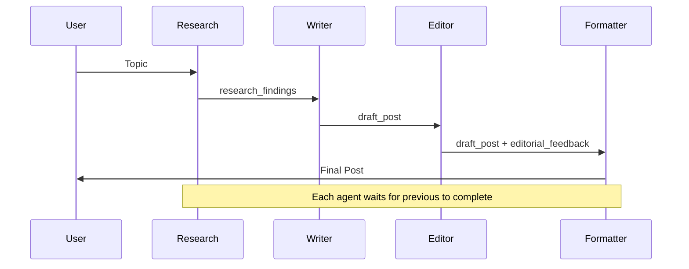

# Tutorial 04: Sequential Workflows - Build Agent Pipelines

## Overview

Connect your agents to create sophisticated multi-step workflows! Learn how to chain multiple agents in a strict sequence where each agent's output feeds into the next - perfect for content creation, data processing, or quality control pipelines.

**What You'll Build**: A Blog Post Generator Pipeline with 4 stages:

1. **Research Agent** - Gathers information about the topic
2. **Writer Agent** - Creates a draft blog post from research
3. **Editor Agent** - Reviews and suggests improvements
4. **Formatter Agent** - Converts to final markdown format

**Implementation**: [tutorial_implementation/tutorial04](../tutorial_implementation/tutorial04/) - Complete working blog creation pipeline with tests

Each agent's output feeds into the next, creating a complete content creation pipeline!

## Prerequisites

- **Completed Tutorials 01-03** - Understanding of agents, tools, and OpenAPI
- **Installed ADK** - `pip install google-adk`  
- **API key configured** - From Tutorial 01

## Core Concepts

### SequentialAgent
The **`SequentialAgent`** is a workflow orchestrator that executes sub-agents in strict order. Unlike a regular agent, it's NOT powered by an LLM - it's deterministic and always runs agents in the exact sequence you define.

**Key Characteristics:**
- Executes sub-agents one at a time, in order
- Each agent completes before the next starts
- All agents share the same `InvocationContext` (shared state)
- Perfect for pipelines where order matters

### Data Flow with output_key
Agents pass data to each other using **session state**:
1. Agent defines `output_key="my_result"` 
2. ADK automatically saves agent's response to `state['my_result']`
3. Next agent reads it using `{my_result}` in its instruction

This creates a data pipeline!

### When to Use Sequential Workflows
Use `SequentialAgent` when:
- ✅ Tasks MUST happen in specific order
- ✅ Each step depends on previous step's output
- ✅ You want predictable, deterministic execution
- ✅ Building pipelines (ETL, content creation, review processes)

Don't use when:
- ❌ Tasks are independent (use `ParallelAgent` instead)
- ❌ Need dynamic routing (use LLM-driven agent with sub-agents)

## Use Case

We're building a **Blog Post Generator Pipeline** with 4 stages:

1. **Research Agent** - Gathers information about the topic
2. **Writer Agent** - Creates a draft blog post from research
3. **Editor Agent** - Reviews and suggests improvements
4. **Formatter Agent** - Converts to final markdown format

Each agent's output feeds into the next, creating a complete content creation pipeline!

## Step 1: Create Project Structure

```bash
mkdir blog_pipeline
cd blog_pipeline
touch __init__.py agent.py .env
```

Copy your `.env` file from previous tutorials.

## Step 2: Set Up Package Import

**blog_pipeline/__init__.py**
```python
from . import agent
```

## Step 3: Define the Pipeline Agents

**blog_pipeline/agent.py**
```python
from __future__ import annotations

from google.adk.agents import Agent, SequentialAgent

# ===== Agent 1: Research Agent =====
# Gathers key facts about the topic
research_agent = Agent(
    name="researcher",
    model="gemini-2.0-flash",
    description="Researches a topic and gathers key information",
    instruction=(
        "You are a research assistant. Your task is to gather key facts and information "
        "about the topic requested by the user.\n"
        "\n"
        "Output a bulleted list of 5-7 key facts or insights about the topic. "
        "Focus on interesting, specific information that would make a blog post engaging.\n"
        "\n"
        "Format:\n"
        "• Fact 1\n"
        "• Fact 2\n"
        "• etc.\n"
        "\n"
        "Output ONLY the bulleted list, nothing else."
    ),
    output_key="research_findings"  # Saves to state['research_findings']
)

# ===== Agent 2: Writer Agent =====
# Writes blog post draft from research
writer_agent = Agent(
    name="writer",
    model="gemini-2.0-flash",
    description="Writes a blog post draft based on research findings",
    instruction=(
        "You are a creative blog writer. Write an engaging blog post based on "
        "the research findings below.\n"
        "\n"
        "**Research Findings:**\n"
        "{research_findings}\n"  # Reads from state!
        "\n"
        "Write a 3-4 paragraph blog post that:\n"
        "- Has an engaging introduction\n"
        "- Incorporates the key facts naturally\n"
        "- Has a conclusion that wraps up the topic\n"
        "- Uses a friendly, conversational tone\n"
        "\n"
        "Output ONLY the blog post text, no meta-commentary."
    ),
    output_key="draft_post"  # Saves to state['draft_post']
)

# ===== Agent 3: Editor Agent =====
# Reviews the draft and suggests improvements
editor_agent = Agent(
    name="editor",
    model="gemini-2.0-flash",
    description="Reviews blog post draft and provides editorial feedback",
    instruction=(
        "You are an experienced editor. Review the blog post draft below and provide "
        "constructive feedback.\n"
        "\n"
        "**Draft Blog Post:**\n"
        "{draft_post}\n"  # Reads from state!
        "\n"
        "Analyze the post for:\n"
        "1. Clarity and flow\n"
        "2. Grammar and style\n"
        "3. Engagement and reader interest\n"
        "4. Structure and organization\n"
        "\n"
        "Provide your feedback as a short list of specific improvements. "
        "If the post is excellent, simply say: 'No revisions needed - post is ready.'\n"
        "\n"
        "Output ONLY the feedback, nothing else."
    ),
    output_key="editorial_feedback"  # Saves to state['editorial_feedback']
)

# ===== Agent 4: Formatter Agent =====
# Applies edits and formats as markdown
formatter_agent = Agent(
    name="formatter",
    model="gemini-2.0-flash",
    description="Applies editorial feedback and formats the final blog post",
    instruction=(
        "You are a formatter. Create the final version of the blog post by applying "
        "the editorial feedback to improve the draft.\n"
        "\n"
        "**Original Draft:**\n"
        "{draft_post}\n"  # Reads from state!
        "\n"
        "**Editorial Feedback:**\n"
        "{editorial_feedback}\n"  # Reads from state!
        "\n"
        "Create the final blog post by:\n"
        "1. Applying the suggested improvements\n"
        "2. Formatting as proper markdown with:\n"
        "   - A compelling title (# heading)\n"
        "   - Section headings if appropriate (## subheadings)\n"
        "   - Proper paragraph breaks\n"
        "   - Bold/italic for emphasis where appropriate\n"
        "\n"
        "If feedback said 'No revisions needed', just format the original draft nicely.\n"
        "\n"
        "Output ONLY the final formatted blog post in markdown."
    ),
    output_key="final_post"  # Saves to state['final_post']
)

# ===== Create the Sequential Pipeline =====
blog_creation_pipeline = SequentialAgent(
    name="BlogCreationPipeline",
    sub_agents=[
        research_agent,
        writer_agent,
        editor_agent,
        formatter_agent
    ],  # Executes in this EXACT order!
    description="Complete blog post creation pipeline from research to publication"
)

# MUST be named root_agent for ADK
root_agent = blog_creation_pipeline
```

### Code Breakdown

**State Flow Visualization:**
```
User Input: "Write about quantum computing"
    ↓
Research Agent → state['research_findings'] = "• Quantum bits..."
    ↓
Writer Agent (reads {research_findings}) → state['draft_post'] = "Quantum computing is..."
    ↓  
Editor Agent (reads {draft_post}) → state['editorial_feedback'] = "Add more examples..."
    ↓
Formatter Agent (reads {draft_post}, {editorial_feedback}) → state['final_post'] = "# Quantum Computing\n\n..."
    ↓
Final Output: formatted blog post
```

**Key Pattern:**
1. **Define `output_key`** on each agent → saves response to state
2. **Use `{state_key}` in instructions** → reads from state
3. **Chain agents in `SequentialAgent`** → strict execution order

**Why This Works:**
- All agents share the same `InvocationContext`
- State persists between agents in the sequence
- `{key}` syntax auto-injects values into instructions

## Step 4: Run the Pipeline

Navigate to parent directory and launch:

```bash
cd ..  # Go to parent of blog_pipeline/
adk web
```

Open `http://localhost:8000` and select "blog_pipeline".

### Try These Prompts

**Basic Usage:**
```
Write a blog post about artificial intelligence
```

**Specific Topic:**
```
Create a blog post explaining how solar panels work
```

**Technical Topic:**
```
Write about the history of the Internet
```

**Trending Topic:**
```
Blog post about electric vehicles and their impact on climate
```

## Understanding Pipeline Execution

Open the **Events tab** to see the magic! You'll see:

1. **Event**: Research agent starts
2. **Event**: Research agent completes → saves findings to state
3. **Event**: Writer agent starts (with research_findings injected)
4. **Event**: Writer agent completes → saves draft to state
5. **Event**: Editor agent starts (with draft_post injected)
6. **Event**: Editor agent completes → saves feedback to state
7. **Event**: Formatter agent starts (with draft_post + feedback injected)
8. **Event**: Formatter agent completes → final output!

Watch how each agent's output becomes the next agent's input!

## Expected Behavior

**Example: "Write a blog post about quantum computing"**

```
User: Write a blog post about quantum computing

[Agent 1: Researcher runs]
Research findings:
• Quantum computers use qubits that can be 0, 1, or both simultaneously
• IBM and Google are leading quantum computing research
• Potential applications include cryptography and drug discovery
• Current quantum computers require extremely cold temperatures
• Quantum supremacy was demonstrated in 2019

[Agent 2: Writer runs with research findings]
Draft: "Quantum computing represents one of the most exciting frontiers in 
technology today..."

[Agent 3: Editor runs with draft]
Feedback: "Add a specific example of quantum supremacy. Clarify the temperature 
requirements. Consider adding a future outlook section."

[Agent 4: Formatter runs with draft + feedback]
Final output:
# The Quantum Leap: Understanding Quantum Computing

Quantum computing represents one of the most exciting frontiers in technology today...

## How Quantum Computers Work

Unlike traditional computers that use bits (0 or 1), quantum computers use qubits...

## Real-World Applications

...
```

## How It Works (Behind the Scenes)

1. **User message arrives** → ADK starts pipeline
2. **SequentialAgent begins**:
   - Calls research_agent.run()
   - Waits for completion
   - Saves output to `state['research_findings']`
3. **Next agent in sequence**:
   - ADK injects `{research_findings}` into writer instruction
   - Calls writer_agent.run()
   - Waits for completion
   - Saves output to `state['draft_post']`
4. **Continue down the chain**:
   - Editor reads `{draft_post}`
   - Formatter reads `{draft_post}` AND `{editorial_feedback}`
5. **Pipeline complete** → Returns final agent's output

**Deterministic & Reliable:**
- Always same order
- No LLM deciding order
- Predictable behavior

**Visual Flow:**



## Key Takeaways

✅ **SequentialAgent chains agents in strict order** - Perfect for pipelines

✅ **output_key saves to state** - Each agent stores its result

✅ **{key} syntax reads from state** - Next agent accesses previous results

✅ **Shared InvocationContext** - All agents in sequence share state

✅ **Deterministic execution** - No LLM, always same order

✅ **Perfect for workflows** - Research → Write → Review → Format

✅ **State flow is explicit** - Easy to debug and understand

## Best Practices

**DO:**
- Give each agent a specific, focused task
- Use descriptive `output_key` names
- Be explicit in instructions about what to output
- Use state injection `{key}` for data flow
- Keep agents stateless (rely on state, not internal memory)

**DON'T:**
- Make agents try to do too much
- Forget to set `output_key` (data won't flow!)
- Use generic state keys like `result` or `data`
- Mix sequential with parallel without planning
- Assume agents remember across separate runs

## Common Issues

**Problem**: "Next agent doesn't see previous agent's output"
- **Solution**: Check that previous agent has `output_key` defined
- **Solution**: Verify you're using `{correct_key_name}` in instruction

**Problem**: "Pipeline seems to skip agents"
- **Solution**: All agents run, check Events tab to see their outputs
- **Solution**: Agent might be outputting empty response

**Problem**: "State values not injecting"
- **Solution**: Use exact `{key_name}` matching the `output_key`
- **Solution**: Keys are case-sensitive!

**Problem**: "Pipeline takes too long"
- **Solution**: This is normal - agents run sequentially (one at a time)
- **Solution**: Consider if some steps could be parallel instead

## What We Built

You now have a complete content creation pipeline that:
- Automatically researches topics
- Writes engaging blog posts
- Reviews for quality
- Formats for publication

And you understand how to build ANY sequential workflow!

## Real-World Applications

**Sequential Workflows Are Perfect For:**
- **Content Pipelines**: Research → Write → Edit → Publish
- **Data Processing**: Extract → Transform → Validate → Load (ETL)
- **Quality Control**: Create → Review → Fix → Approve
- **Analysis Pipelines**: Gather Data → Analyze → Visualize → Report
- **Code Workflows**: Write → Review → Refactor → Test
- **Customer Service**: Classify → Route → Respond → Follow-up

## Next Steps

🚀 **Tutorial 05: Parallel Processing** - Learn when and how to run agents concurrently for speed

📖 **Further Reading**:
- [Sequential Agents Documentation](https://google.github.io/adk-docs/agents/workflow-agents/sequential-agents/)
- [State Management Guide](https://google.github.io/adk-docs/sessions/state/)
- [Workflow Agents Overview](https://google.github.io/adk-docs/agents/workflow-agents/)

## Exercises (Try On Your Own!)

1. **Add more agents** - Add a "fact-checker" between writer and editor
2. **Different domain** - Create a recipe pipeline (ingredients → instructions → nutrition → formatting)
3. **Code pipeline** - Implement: write code → review → test → document
4. **Error handling** - Add an agent that validates each step's output
5. **Conditional flow** - Have editor decide if re-writing is needed

## Complete Code Reference

**blog_pipeline/__init__.py**
```python
from . import agent
```

**blog_pipeline/.env**
```bash
GOOGLE_GENAI_USE_VERTEXAI=FALSE
GOOGLE_API_KEY=your-api-key-here
```

**blog_pipeline/agent.py**
```python
# See Step 3 above for complete code
```

Congratulations! You've mastered sequential workflows! 🎯📝
