# Tutorial 11: Built-in Tools & Grounding - Grounding Agent

**Tutorial Link**: [Tutorial 11: Built-in Tools & Grounding](../tutorial/11_built_in_tools_grounding.md)

This implementation demonstrates web grounding capabilities using Google Search and other built-in ADK tools for accessing current information.

## 🚀 Quick Start

```bash
# Install dependencies
make setup

# Start the agent
make dev
```

Then open `http://localhost:8000` and select `research_assistant` from the dropdown.

## 📋 What This Agent Does

This grounding agent provides three different agent configurations with **conditional VertexAI support**:

### 1. Basic Grounding Agent

- Uses `google_search` tool directly
- Simple web search capabilities
- Best for basic current information queries

### 2. Advanced Grounding Agent

- Combines search with custom analysis tools
- Demonstrates tool composition patterns
- Multi-step research workflows

### 3. Research Assistant (Default)

- Production-ready research agent
- Multi-step research workflow
- Search → Analyze → Save pattern
- Comprehensive research capabilities

## 🌍 VertexAI Maps Grounding

When VertexAI is enabled (`GOOGLE_GENAI_USE_VERTEXAI=1`), the agent automatically gains **Google Maps grounding** capabilities:

### Conditional Features

- **Location Queries**: Find nearby places, restaurants, businesses
- **Directions**: Get travel directions and transit information
- **Geographic Context**: Understand locations and distances
- **Local Discovery**: Search for services in specific areas

### Environment Detection

The agent automatically detects your environment:

```bash
# AI Studio (default) - Web search only
export GOOGLE_API_KEY=your_key

# VertexAI - Web search + Maps grounding
export GOOGLE_GENAI_USE_VERTEXAI=1
export GOOGLE_CLOUD_PROJECT=your_project
export GOOGLE_CLOUD_LOCATION=us-central1
```

### Agent Selection Flow


### Maps-Enabled Queries

When VertexAI is active, try these location-based queries:

```bash
"What are the best Italian restaurants within 5 miles of Times Square?"
"How do I get from JFK to Central Park using public transit?"
"Find coffee shops open now near Stanford University"
"What's the distance between Los Angeles and San Diego?"
```

## 🔍 Try These Queries

```bash
"What are the latest developments in AI for 2025?"
"Research quantum computing breakthroughs"
"Find current information about renewable energy trends"
"Analyze recent developments in space exploration"
```

## 🛠️ Available Tools

### Built-in ADK Tools

- **`google_search`**: Web grounding for current information (Gemini 2.0+ only)
- **`google_maps_grounding`**: Location-based queries and geographic information (**VertexAI only**)

### Custom Tools

- **`analyze_search_results`**: Processes and analyzes search content
- **`save_research_findings`**: Saves research as artifacts

### Conditional Tool Loading

The agent automatically loads tools based on your environment:

- **AI Studio**: `google_search` only
- **VertexAI**: `google_search` + `google_maps_grounding`

## 🔧 Setup & Installation

### Prerequisites

- Python 3.9+
- Google Cloud Project (for VertexAI) OR Gemini API key

### Authentication Options

#### Option 1: Gemini API (Free)

```bash
export GOOGLE_API_KEY=your_api_key_here
# Get key at: https://aistudio.google.com/app/apikey
```

#### Option 2: VertexAI (Production)

```bash
export GOOGLE_APPLICATION_CREDENTIALS=/path/to/service-account.json
export GOOGLE_CLOUD_PROJECT=your_project_id
export GOOGLE_CLOUD_LOCATION=us-central1
```

### Installation

```bash
# Clone and navigate to tutorial
cd tutorial_implementation/tutorial11

# Install dependencies
pip install -r requirements.txt
pip install -e .

# Copy environment template
cp grounding_agent/.env.example grounding_agent/.env
# Edit .env with your API keys
```

## 🧪 Testing

```bash
# Run all tests
make test

# Run with coverage
make test-cov

# View coverage report in htmlcov/
```

### Testing VertexAI Conditional Logic

The agent includes comprehensive tests for conditional VertexAI functionality:

```bash
# Test VertexAI detection
pytest tests/test_agent.py::TestVertexAIConditionalLogic::test_is_vertexai_enabled_false_by_default -v
pytest tests/test_agent.py::TestVertexAIConditionalLogic::test_is_vertexai_enabled_with_env_var -v

# Test tool loading based on environment
pytest tests/test_agent.py::TestVertexAIConditionalLogic::test_get_available_grounding_tools_without_vertexai -v
pytest tests/test_agent.py::TestVertexAIConditionalLogic::test_get_available_grounding_tools_with_vertexai -v

# Test capability descriptions
pytest tests/test_agent.py::TestVertexAIConditionalLogic::test_get_agent_capabilities_description_without_vertexai -v
pytest tests/test_agent.py::TestVertexAIConditionalLogic::test_get_agent_capabilities_description_with_vertexai -v
```

### Manual Testing of Conditional Behavior

**Test without VertexAI (default):**
```bash
cd tutorial_implementation/tutorial11
python -c "
from grounding_agent.agent import root_agent, is_vertexai_enabled, get_available_grounding_tools
print('VertexAI enabled:', is_vertexai_enabled())
print('Root agent:', root_agent.name)
print('Available tools:', len(get_available_grounding_tools()))
"
```

**Test with VertexAI enabled:**
```bash
cd tutorial_implementation/tutorial11
GOOGLE_GENAI_USE_VERTEXAI=1 python -c "
from grounding_agent.agent import root_agent, is_vertexai_enabled, get_available_grounding_tools
print('VertexAI enabled:', is_vertexai_enabled())
print('Root agent:', root_agent.name)
print('Available tools:', len(get_available_grounding_tools()))
"
```

## 📁 Project Structure

```text
tutorial11/
├── grounding_agent/           # Agent implementation
│   ├── __init__.py           # Package marker
│   ├── agent.py              # Agent definitions & tools
│   └── .env.example          # Environment template
├── tests/                    # Test suite
│   ├── __init__.py
│   └── test_agent.py         # Comprehensive tests
├── requirements.txt          # Python dependencies
├── pyproject.toml           # Package configuration
├── setup.py                 # Installation script
├── Makefile                 # Development commands
└── README.md                # This file
```

## 🎯 Key Features Demonstrated

### Web Grounding
- Real-time web search integration
- Current information access
- Source citation and verification

### Tool Composition
- Mixing built-in and custom tools
- Multi-step research workflows

### Production Patterns
- Error handling and validation
- Structured tool responses
- Research documentation and saving

## 🔍 Understanding the Code

### Agent Hierarchy & Tool Composition


### Environment Detection Logic

```mermaid
flowchart TD
    START([Start Application]) --> CHECK{os.environ.get<br/>'GOOGLE_GENAI_USE_VERTEXAI'<br/>== '1'?}

    CHECK -->|True| VERTEXAI[VertexAI Mode<br/>✅ Maps Available]
    CHECK -->|False| STUDIO[AI Studio Mode<br/>❌ Maps Unavailable]

    VERTEXAI --> LOAD_ADVANCED[Load advanced_grounding_agent<br/>Tools: search + maps + custom]
    STUDIO --> LOAD_BASIC[Load basic_grounding_agent<br/>Tools: search only]

    LOAD_ADVANCED --> CAPABILITIES_ADV[Capabilities:<br/>• Web search<br/>• Maps grounding<br/>• Content analysis<br/>• Research saving]
    LOAD_BASIC --> CAPABILITIES_BASIC[Capabilities:<br/>• Web search only]

    CAPABILITIES_ADV --> READY_ADV[🚀 Ready for advanced queries]
    CAPABILITIES_BASIC --> READY_BASIC[🔍 Ready for basic research]

    style START fill:#e1f5fe,stroke:#01579b,stroke-width:3px
    style CHECK fill:#fff3e0,stroke:#e65100,stroke-width:2px
    style VERTEXAI fill:#e8f5e8,stroke:#1b5e20,stroke-width:2px
    style STUDIO fill:#fce4ec,stroke:#880e4f,stroke-width:2px
    style LOAD_ADVANCED fill:#f3e5f5,stroke:#4a148c,stroke-width:2px
    style LOAD_BASIC fill:#e0f2f1,stroke:#004d40,stroke-width:2px
    style READY_ADV fill:#e8f5e8,stroke:#2e7d32,stroke-width:2px
    style READY_BASIC fill:#fff8e1,stroke:#f57f17,stroke-width:2px
```



### Agent Hierarchy

```python
# Basic: Direct google_search usage
basic_grounding_agent = Agent(
    tools=[google_search]  # Direct built-in tool
)

# Advanced: Tool mixing with custom tools
advanced_grounding_agent = Agent(
    tools=[google_search, custom_tool1, custom_tool2]
)

# Research: Production-ready with full workflow
research_assistant = Agent(
    tools=[google_search, analyze_tool, save_tool],
    generate_content_config=types.GenerateContentConfig(
        temperature=0.3  # Factual research
    )
)
```

### Tool Implementation

```python
def analyze_search_results(query: str, content: str) -> Dict[str, Any]:
    """Analyze search results and extract insights."""
    # Process content, count words, extract key points
    return {
        'status': 'success',
        'analysis': {...},
        'report': 'Analysis complete'
    }

def save_research_findings(topic: str, findings: str) -> Dict[str, Any]:
    """Save research as artifact."""
    # Create document and save
    return {
        'status': 'success',
        'filename': 'research_topic.md'
    }
```

### Research Workflow

```mermaid
sequenceDiagram
    participant U as User
    participant A as Agent
    participant S as google_search
    participant M as google_maps_grounding
    participant T1 as analyze_search_results
    participant T2 as save_research_findings

    U->>A: Research query
    A->>S: Search web for information
    S-->>A: Search results
    A->>M: Location-based queries (if VertexAI)
    M-->>A: Maps data (if available)
    A->>T1: Analyze search results
    T1-->>A: Analysis insights
    A->>T2: Save research findings
    T2-->>A: Saved artifact confirmation
    A-->>U: Comprehensive research response

    Note over S,M: Built-in tools (automatic)
    Note over T1,T2: Custom tools (manual implementation)

    style U fill:#e3f2fd,stroke:#1565c0
    style A fill:#f3e5f5,stroke:#6a1b9a
    style S fill:#e8f5e8,stroke:#2e7d32
    style M fill:#fff3e0,stroke:#ef6c00
    style T1 fill:#fce4ec,stroke:#c2185b
    style T2 fill:#e0f2f1,stroke:#00695c
```

## 🚨 Important Notes

### Model Requirements
- **Gemini 2.0+ required** for `google_search` tool
- Older models (1.5, 1.0) will raise errors
- Use `gemini-2.0-flash` for best performance/cost balance

### Tool Limitations
- Built-in tools cannot be mixed directly with custom tools
- Use separate agents for different tool combinations

### Security
- Never commit `.env` files with real API keys
- Use `.env.example` as template
- Rotate keys regularly in production

## 🐛 Troubleshooting

### "google_search requires Gemini 2.0+"
```bash
# Fix: Use correct model
agent = Agent(model='gemini-2.0-flash', tools=[google_search])
```

### Authentication Errors
```bash
# Check your .env file or environment variables
# Ensure GOOGLE_API_KEY or GOOGLE_APPLICATION_CREDENTIALS is set
```

## 📚 Learn More

- **Tutorial**: [Tutorial 11: Built-in Tools & Grounding](../tutorial/11_built_in_tools_grounding.md)
- **ADK Docs**: [Built-in Tools](https://google.github.io/adk-docs/tools/built-in-tools/)
- **Grounding**: [Web Grounding Enterprise](https://cloud.google.com/vertex-ai/generative-ai/docs/grounding/web-grounding-enterprise)

## 🤝 Contributing

This is part of the ADK Training repository. See the main [README](../../README.md) for contribution guidelines.

## 📊 Visual Architecture Overview

The diagrams above illustrate the sophisticated conditional architecture of this grounding agent:

### 🎯 Agent Selection Flow
Shows how the system automatically chooses between basic and advanced agents based on VertexAI availability, ensuring optimal tool combinations for each environment.

### 🏗️ Agent Hierarchy & Tool Composition  
Visualizes the relationship between agent types and their tool capabilities, making it clear how built-in tools (automatic) combine with custom tools (manual implementation).

### 🔄 Environment Detection Logic
Demonstrates the decision-making process that determines which tools and capabilities are available, helping users understand the conditional logic behind the scenes.

### 🔄 Research Workflow
Illustrates the complete research pipeline from user query through multiple tool interactions to final response, showing both the sequence and the different types of tools involved.

### 🎨 Design Philosophy
- **Pastel Colors**: Professional yet pleasant color scheme with excellent contrast
- **Clear Hierarchy**: Visual distinction between different components and states  
- **Logical Flow**: Easy-to-follow progression through complex decision trees
- **Accessibility**: High contrast ratios ensure readability for all users

These visual aids transform complex conditional logic into intuitive, memorable concepts that accelerate understanding and implementation.

---

**🎉 Happy Grounding!** Your agent can now access current web information and perform comprehensive research.
